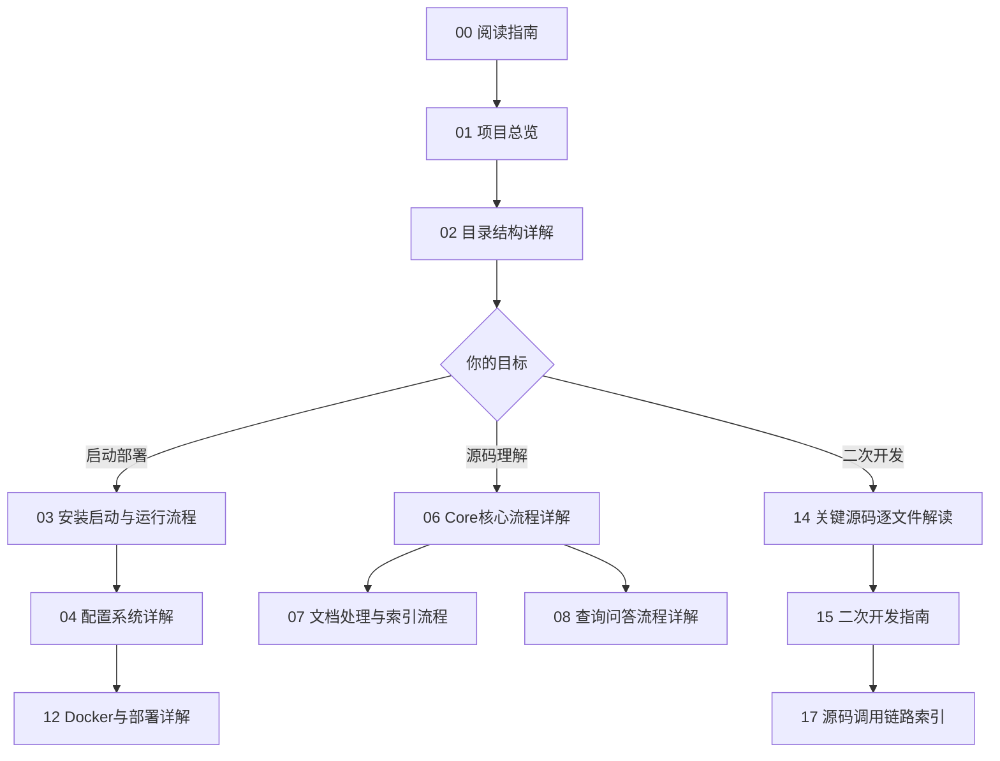

# 00 阅读指南

## 这套文档适合怎么阅读

这套文档适合三类目标：

| 目标 | 推荐文档 |
|---|---|
| 快速了解 LightRAG 是什么 | `01_项目总览.md`、`02_目录结构详解.md` |
| 本地启动或 Docker 部署 | `03_安装启动与运行流程.md`、`04_配置系统详解.md`、`12_Docker与部署详解.md`、`16_常见问题与排查.md` |
| 基于 LightRAG 二次开发 | `05_API_Server架构详解.md`、`06_Core核心流程详解.md`、`07_文档处理与索引流程.md`、`08_查询问答流程详解.md`、`14_关键源码逐文件解读.md`、`15_二次开发指南.md`、`17_源码调用链路索引.md` |

阅读时建议一边打开源码对照路径，例如 `lightrag/lightrag.py`、`lightrag/pipeline.py`、`lightrag/operate.py`、`lightrag/api/lightrag_server.py`。文档尽量写清楚调用链，但 LightRAG 的实际行为仍以当前源码为准。

## 推荐阅读顺序

## 第一次接触 LightRAG 应该先看哪些文件

| 优先级 | 文件 | 为什么先看 |
|---|---|---|
| 1 | `README.md` / `README-zh.md` | 项目定位、快速开始、核心 API 示例。 |
| 2 | `docs/LightRAG-API-Server-zh.md` | API Server 的启动、配置、接口使用。 |
| 3 | `docs/ProgramingWithCore.md` | 直接嵌入 Core 的编程方式。 |
| 4 | `lightrag/lightrag.py` | 核心 `LightRAG` 类、存储初始化、插入和查询入口。 |
| 5 | `lightrag/base.py` | `QueryParam`、存储抽象、核心数据结构。 |
| 6 | `examples/lightrag_openai_demo.py` | 最小可运行示例，展示 `initialize_storages()`、`ainsert()`、`aquery()`。 |

初学者最容易漏掉的是：实例化 `LightRAG` 后必须调用 `await rag.initialize_storages()`。这个要求在 `lightrag/lightrag.py::initialize_storages` 和多个 example 中都能看到。

## 如果我要二次开发，应该重点看哪些文件

| 二次开发方向 | 重点文件 |
|---|---|
| 新增 REST API | `lightrag/api/lightrag_server.py`、`lightrag/api/routers/*.py` |
| 修改文档上传、扫描、状态机 | `lightrag/api/routers/document_routes.py`、`lightrag/pipeline.py`、`lightrag/utils_pipeline.py` |
| 修改索引逻辑 | `lightrag/pipeline.py`、`lightrag/operate.py`、`lightrag/chunker/*` |
| 修改查询逻辑 | `lightrag/operate.py`、`lightrag/base.py::QueryParam`、`lightrag/prompt.py` |
| 新增存储后端 | `lightrag/base.py`、`lightrag/kg/__init__.py`、`lightrag/kg/factory.py`、`lightrag/kg/*_impl.py` |
| 新增 LLM/Embedding Provider | `lightrag/llm/*`、`lightrag/api/lightrag_server.py`、`lightrag/api/config.py`、`lightrag/llm/binding_options.py` |
| 修改 WebUI | `lightrag_webui/src/App.tsx`、`lightrag_webui/src/features/*`、`lightrag_webui/src/api/lightrag.ts` |

## 如果我要部署运行，应该重点看哪些文件

| 文件 | 作用 |
|---|---|
| `env.example` | 所有主要环境变量模板。不要把真实 `.env` 提交或写入文档。 |
| `Makefile` | `make dev`、`make env-base`、`make env-*` 的入口。 |
| `docker-compose.yml` | 单容器部署入口，挂载 `./data/rag_storage`、`./data/inputs`、`./data/prompts`、`./.env`。 |
| `docker-compose-full.yml` | 带 vLLM、PostgreSQL、Neo4j、Milvus、MinIO、etcd 的完整组合。 |
| `Dockerfile` / `Dockerfile.lite` | 前端构建、Python 依赖安装、Server 镜像入口。 |
| `lightrag/api/config.py` | Server CLI/env 配置解析和默认值。 |

## 每篇文档的作用说明

| 文档 | 适合解决的问题 |
|---|---|
| `01_项目总览.md` | “这个项目整体怎么运转？” |
| `02_目录结构详解.md` | “我应该去哪个目录找代码？” |
| `03_安装启动与运行流程.md` | “我怎么在 WSL、本机或容器里启动？” |
| `04_配置系统详解.md` | “模型、Embedding、存储、Server、Rerank 怎么配？” |
| `05_API_Server架构详解.md` | “HTTP 请求怎么进入 LightRAG？” |
| `06_Core核心流程详解.md` | “Core 里 insert/query 怎么实现？” |
| `07_文档处理与索引流程.md` | “上传文件后为什么会 pending/processing/failed？” |
| `08_查询问答流程详解.md` | “问答时关键词、检索、rerank、上下文、LLM 如何串起来？” |
| `09_存储层详解.md` | “默认数据文件在哪里，换数据库怎么做？” |
| `10_LLM_Embedding_Reranker集成详解.md` | “怎么接千问、Ollama、Azure、Gemini、Bedrock、Reranker？” |
| `11_WebUI前端结构详解.md` | “前端页面和 API 封装在哪里？” |
| `12_Docker与部署详解.md` | “容器部署时端口、卷、环境变量怎么工作？” |
| `13_Examples示例代码解读.md` | “应该跑哪个示例，示例参数代表什么？” |
| `14_关键源码逐文件解读.md` | “核心源码逐文件怎么读？” |
| `15_二次开发指南.md` | “新增功能该改哪里，哪些模块别乱改？” |
| `16_常见问题与排查.md` | “启动和运行问题怎么定位？” |
| `17_源码调用链路索引.md` | “给我一条从入口到核心函数的链路。” |

