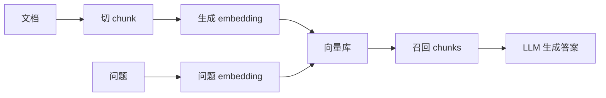
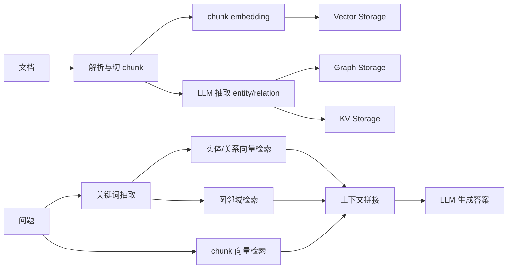
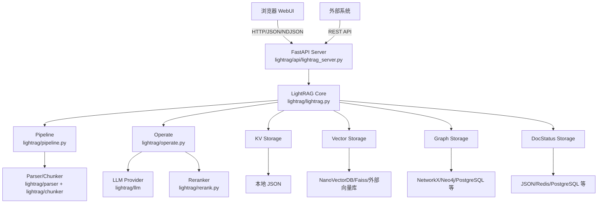
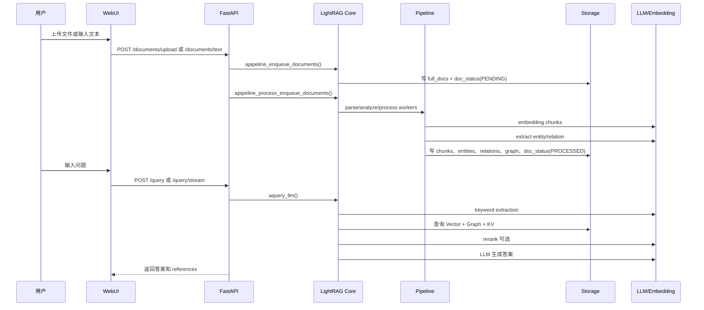

# 01 项目总览

## LightRAG 是什么

LightRAG 是一个面向检索增强生成（Retrieval-Augmented Generation, RAG）的框架。它不仅把文档切成 chunks 做向量检索，还会从文本中抽取实体（entity）和关系（relation），构建知识图谱，并在查询时结合图检索、向量检索、关键词抽取、reranker 和 LLM 生成答案。

当前源码中，核心包位于 `lightrag/`，API Server 位于 `lightrag/api/`，React WebUI 位于 `lightrag_webui/`，存储后端位于 `lightrag/kg/`，模型 Provider 位于 `lightrag/llm/`。

## 项目解决什么问题

普通 RAG 常见问题：

| 问题 | 普通向量 RAG 的表现 | LightRAG 的做法 |
|---|---|---|
| 只靠语义相似度容易漏掉结构关系 | 查询命中相似 chunk，但实体关系不完整 | 抽取 entity/relation，构建 `chunk_entity_relation_graph` |
| 跨文档关系难以归纳 | 需要 LLM 从零读上下文 | 写入 Graph Storage，查询时从实体和关系扩展上下文 |
| 查询模式单一 | 通常只有向量相似检索 | 支持 `local`、`global`、`hybrid`、`mix`、`naive`、`bypass` |
| 难以替换模型和存储 | Provider 与业务耦合 | LLM、Embedding、Reranker、KV、Vector、Graph、DocStatus 都有抽象层 |
| 部署使用门槛 | 需要自己拼 API 和前端 | 提供 FastAPI Server、Swagger、WebUI、Docker Compose |

## 和普通 RAG 的区别

普通 RAG 主链路通常是：

LightRAG 在索引阶段额外抽取结构化知识，在查询阶段按模式组合检索：

## 核心能力

| 能力 | 源码位置 | 说明 |
|---|---|---|
| Core API | `lightrag/lightrag.py::LightRAG` | 对外提供 `ainsert()`、`aquery()`、`aquery_llm()`、`aquery_data()`、删除/编辑图谱等入口。 |
| 文档处理流水线 | `lightrag/pipeline.py::_PipelineMixin` | 负责 enqueue、parse、analyze、process、状态更新和并发控制。 |
| 实体关系抽取 | `lightrag/operate.py::extract_entities` | 调用 `role_llm_funcs["extract"]` 抽取实体/关系。 |
| 合并与写图 | `lightrag/operate.py::merge_nodes_and_edges` | 合并 entity/relation，写 Graph、Vector、KV。 |
| 查询流程 | `lightrag/operate.py::kg_query`、`naive_query` | 多模式检索、上下文构建、LLM 调用。 |
| API Server | `lightrag/api/lightrag_server.py::create_app` | 初始化 FastAPI、构造 `LightRAG`、注册路由和 WebUI。 |
| WebUI | `lightrag_webui/src/App.tsx` | 文档管理、图谱、检索测试、API 页面。 |
| 存储后端 | `lightrag/kg/__init__.py` | 注册 KV/Vector/Graph/DocStatus 后端实现。 |
| 模型 Provider | `lightrag/llm/` | OpenAI-compatible、Ollama、Azure、Gemini、Bedrock 等。 |
| Reranker | `lightrag/rerank.py` | Cohere、Jina、Aliyun/DashScope 风格 rerank API。 |

## Server / Core / WebUI / Storage / LLM Provider 的关系

API Server 是 WebUI 和外部系统进入 Core 的主要入口；Core 不依赖 WebUI，可以被 Python 代码直接嵌入。Storage 与 LLM Provider 通过抽象和配置注入，避免把模型/数据库写死在业务流程里。

## 用户从上传文档到问答的整体流程

## 初学者容易误解的点

| 误解 | 正确理解 |
|---|---|
| WebUI 是必须的 | 不是。可以直接用 `LightRAG` Core，也可以用 REST API。 |
| `ainsert()` 只是写向量库 | 不是。默认会走 pipeline，写 full docs、doc status、chunks、vector、entity、relation、graph。 |
| 所有查询都走知识图谱 | 不是。`naive` 是纯向量检索，`bypass` 直接调用 LLM，`mix` 才组合 KG 与 chunk 向量检索。 |
| 更换 Embedding 模型后可以继续用旧数据 | 不建议。旧向量和新模型空间不一致，必须清空向量/索引数据后重建。 |
| `busy=True` 就拒绝上传 | 当前 pipeline 合约允许普通处理期间并发 enqueue；只有 `destructive_busy` 或 `scanning_exclusive` 会阻塞 enqueue。 |

