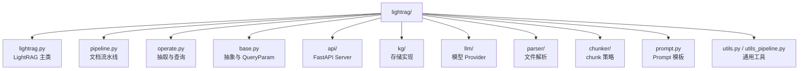
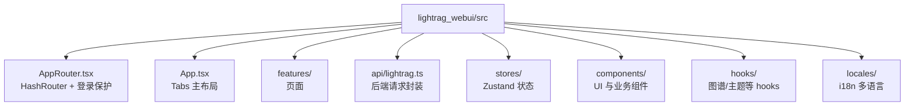

# 02 目录结构详解

## 根目录重要文件和目录

| 路径 | 类型 | 作用 |
|---|---|---|
| `lightrag/` | 源码 | Python 核心包，包含 Core、API Server、Storage、LLM Provider、Parser、Chunker。 |
| `lightrag_webui/` | 源码 | React 19 + TypeScript + Vite + Bun 前端项目。 |
| `docs/` | 文档 | 官方功能文档，包括 API Server、文件处理流水线、角色 LLM、Docker、离线部署等。 |
| `examples/` | 示例 | 直接使用 Core、不同模型 Provider、不同存储后端、rerank、自定义 KG 等示例。 |
| `tests/` | 测试 | Pytest 测试，覆盖 API 配置、Parser、Storage、Pipeline、LLM、Workspace、Rerank 等。 |
| `scripts/` | 脚本 | 测试脚本 `scripts/test.sh`、环境向导 `scripts/setup/`、发布脚本等。 |
| `env.example` | 配置模板 | Server、LLM、Embedding、Rerank、Storage、Parser、Auth 的环境变量模板。 |
| `pyproject.toml` | 项目配置 | Python 包信息、依赖、extras、console scripts、pytest/ruff 配置。 |
| `Makefile` | 开发入口 | `make dev`、`make env-base`、`make env-*`。 |
| `docker-compose.yml` | 部署 | 单容器 LightRAG 服务。 |
| `docker-compose-full.yml` | 部署 | 带 vLLM、PostgreSQL、Neo4j、Milvus 等依赖的完整组合。 |
| `Dockerfile` | 镜像 | 构建完整 API/offline 镜像，并打包 WebUI。 |
| `Dockerfile.lite` | 镜像 | 构建较轻 API 镜像。 |
| `uv.lock` | 依赖锁 | Python `uv` 锁文件，不应在普通文档任务中修改。 |

## Python 后端目录结构

### `lightrag/` 核心文件

| 文件 | 作用 |
|---|---|
| `lightrag/lightrag.py` | `LightRAG` dataclass，组合 `_RoleLLMMixin`、`_StorageMigrationMixin`、`_PipelineMixin`，负责存储实例化、初始化、插入、查询、删除、图谱编辑。 |
| `lightrag/pipeline.py` | 文档处理流水线：enqueue、parse worker、analyze worker、process worker、状态机、并发控制。 |
| `lightrag/operate.py` | 抽取实体关系、合并节点边、构建查询上下文、执行 `kg_query` 和 `naive_query`。 |
| `lightrag/base.py` | `QueryParam`、`QueryResult`、`BaseKVStorage`、`BaseVectorStorage`、`BaseGraphStorage`、`DocStatusStorage` 等抽象。 |
| `lightrag/llm_roles.py` | 角色 LLM：`extract`、`keyword`、`query`、`vlm` 的配置、包装、热更新、队列状态。 |
| `lightrag/addon_params.py` | `ObservableAddonParams`、默认 addon 参数、Prompt/Chunker 运行时参数。 |
| `lightrag/storage_migrations.py` | 存储迁移 mixin。 |
| `lightrag/utils_pipeline.py` | 文档状态字段、源路径、内容 hash、解析产物路径、multimodal 辅助。 |
| `lightrag/prompt.py` | 实体抽取、关键词抽取、RAG 回答、摘要等 Prompt 模板和 Prompt profile 加载。 |

### `lightrag/api/`

| 文件 | 作用 |
|---|---|
| `lightrag/api/lightrag_server.py` | `lightrag-server` 入口，解析配置、创建 `FastAPI`、构造 `LightRAG`、注册路由、挂载 WebUI。 |
| `lightrag/api/config.py` | CLI/env 配置解析，默认存储、Provider、Auth、Parser、Chunk、Rerank 配置。 |
| `lightrag/api/routers/document_routes.py` | 文档上传、文本插入、扫描、删除、状态、分页、pipeline 控制。 |
| `lightrag/api/routers/query_routes.py` | `/query`、`/query/stream`、`/query/data`。 |
| `lightrag/api/routers/graph_routes.py` | 图谱查询、标签、实体/关系编辑、创建、合并。 |
| `lightrag/api/routers/ollama_api.py` | `/api/generate`、`/api/chat` 等 Ollama-compatible 接口。 |
| `lightrag/api/auth.py` | JWT、密码校验、认证逻辑。 |
| `lightrag/api/run_with_gunicorn.py` | `lightrag-gunicorn` 入口。 |
| `lightrag/api/webui/` | 前端构建产物输出目录，源码扫描中属于构建结果目录。 |

### `lightrag/kg/`

| 文件 | 后端 |
|---|---|
| `json_kv_impl.py` | `JsonKVStorage` |
| `json_doc_status_impl.py` | `JsonDocStatusStorage` |
| `nano_vector_db_impl.py` | `NanoVectorDBStorage` |
| `networkx_impl.py` | `NetworkXStorage` |
| `postgres_impl.py` | PostgreSQL KV/Vector/Graph/DocStatus |
| `mongo_impl.py` | MongoDB KV/Vector/Graph/DocStatus |
| `redis_impl.py` | Redis KV/DocStatus |
| `neo4j_impl.py` | Neo4j Graph |
| `memgraph_impl.py` | Memgraph Graph |
| `opensearch_impl.py` | OpenSearch KV/Vector/Graph/DocStatus |
| `milvus_impl.py` | Milvus Vector |
| `qdrant_impl.py` | Qdrant Vector |
| `faiss_impl.py` | Faiss Vector |
| `factory.py` | 根据配置名称加载存储类。 |
| `__init__.py` | `STORAGE_IMPLEMENTATIONS`、`STORAGES`、环境变量依赖注册。 |

### `lightrag/llm/`

| 文件 | 说明 |
|---|---|
| `openai.py` | OpenAI-compatible LLM/Embedding，包括 `openai_complete_if_cache`、`openai_embed`、Azure wrapper。 |
| `azure_openai.py` | 从 `openai.py` 重导出 Azure 相关函数。 |
| `ollama.py` | Ollama LLM/Embedding。 |
| `gemini.py` | Gemini LLM/Embedding。 |
| `bedrock.py` | AWS Bedrock LLM/Embedding。 |
| `jina.py` | Jina Embedding。 |
| `voyageai.py` | VoyageAI Embedding。 |
| `lollms.py` | Lollms LLM/Embedding。 |
| `binding_options.py` | Provider 参数类，例如 `OpenAILLMOptions`、`OllamaLLMOptions`、`GeminiEmbeddingOptions`。 |
| `hf.py`、`zhipu.py`、`nvidia_openai.py`、`lmdeploy.py`、`llama_index_impl.py` | 其他集成或示例使用 Provider。Server 是否直接暴露取决于 `lightrag/api/config.py` 的 binding choices。 |

## 前端目录结构

| 路径 | 作用 |
|---|---|
| `lightrag_webui/package.json` | Bun scripts、React 19、Vite、Tailwind、Sigma/Graphology、Zustand、i18next 等依赖。 |
| `lightrag_webui/vite.config.ts` | 构建输出到 `../lightrag/api/webui`，开发代理，运行时 prefix 注入。 |
| `src/AppRouter.tsx` | 登录状态初始化、`HashRouter`、`/login` 路由。 |
| `src/App.tsx` | 主 UI tabs：documents、knowledge-graph、retrieval、api。 |
| `src/features/DocumentManager.tsx` | 文档列表、扫描、上传、分页、状态轮询。 |
| `src/features/RetrievalTesting.tsx` | 查询页面，调用 streaming 或非 streaming query。 |
| `src/features/GraphViewer.tsx` | 知识图谱可视化。 |
| `src/features/ApiSite.tsx` | API 页面入口。 |
| `src/api/lightrag.ts` | Axios 实例、API 类型和所有后端请求函数。 |
| `src/stores/settings.ts` | 查询参数、图谱设置、主题语言、API Key 等持久化设置。 |
| `src/stores/state.ts` | 后端健康状态和认证状态。 |
| `src/lib/runtimeConfig.ts` | 读取后端或 Vite 注入的 `window.__LIGHTRAG_CONFIG__`。 |

## docs 目录结构

| 文档 | 说明 |
|---|---|
| `docs/LightRAG-API-Server.md` / `-zh.md` | API Server 使用说明。 |
| `docs/FileProcessingPipeline.md` / `-zh.md` | 文件处理流水线和 parser/chunk options。 |
| `docs/RoleSpecificLLMConfiguration.md` / `-zh.md` | `EXTRACT`、`KEYWORD`、`QUERY`、`VLM` 角色模型配置。 |
| `docs/ParagraphSemanticChunking.md` / `-zh.md` | 段落语义 chunk 策略。 |
| `docs/ParserDebugCLI.md` / `-zh.md` | Parser CLI 调试。 |
| `docs/LightRAGSidecarFormat.md` / `-zh.md` | LightRAG sidecar 格式。 |
| `docs/DockerDeployment.md`、`OfflineDeployment.md`、`InteractiveSetup.md` | 部署和交互式配置。 |
| `docs/FrontendBuildGuide.md` | 前端构建说明。 |
| `docs/AsymmetricEmbedding.md` | 非对称 embedding 配置。 |
| `docs/MultiSiteDeployment.md` | 多站点/路径前缀部署。 |
| `docs/UV_LOCK_GUIDE.md` | `uv.lock` 维护说明。 |

## examples 目录结构

| 示例 | 场景 |
|---|---|
| `lightrag_openai_demo.py` | OpenAI LLM + OpenAI Embedding 基础示例。 |
| `lightrag_openai_compatible_demo.py` | OpenAI-compatible LLM + Ollama Embedding。 |
| `lightrag_ollama_demo.py` | 本地 Ollama LLM + Embedding。 |
| `lightrag_gemini_demo.py` | Gemini LLM + Embedding。 |
| `lightrag_azure_openai_demo.py` | Azure OpenAI。 |
| `lightrag_vllm_demo.py` | vLLM Embedding + Jina-compatible rerank。 |
| `rerank_example.py` | 自定义 rerank 函数接入。 |
| `insert_custom_kg.py` | 直接插入自定义知识图谱。 |
| `graph_visual_with_*.py` | 图谱可视化。 |
| `*_postgres_*`、`*_mongodb_*`、`*_opensearch_*`、`milvus_kwargs_configuration_demo.py` | 外部存储后端示例。 |
| `examples/unofficial-sample/` | 非官方扩展示例，如 Bedrock、HF、Cloudflare、LlamaIndex、NVIDIA、LMDeploy。 |

## tests 目录结构

| 路径/文件 | 作用 |
|---|---|
| `tests/conftest.py` | 注册 pytest markers，默认跳过 integration，提供 `--keep-artifacts`、`--stress-test`、`--test-workers`、`--run-integration`。 |
| `tests/parser/` | DOCX/native/external parser 测试。 |
| `tests/sidecar/` | sidecar writer 测试。 |
| `tests/test_api_config_*.py` | API 配置解析、Provider 相关测试。 |
| `tests/test_document_routes_*.py` | 文档接口、归档、分页测试。 |
| `tests/test_pipeline_*.py` | pipeline 多模态、取消、释放逻辑。 |
| `tests/test_*storage*.py`、`test_postgres_*`、`test_mongo_storage.py`、`test_opensearch_storage.py` | 存储实现测试。 |
| `tests/test_keyword_*.py`、`test_extract_entities.py` | 关键词和实体抽取。 |
| `tests/test_rerank_chunking.py` | rerank 文档切块。 |
| `tests/test_workspace_*.py` | workspace 隔离和迁移。 |

## 配置文件、部署文件、脚本文件

| 路径 | 说明 |
|---|---|
| `env.example` | 复制为 `.env` 后配置。真实 `.env` 不应读取、输出、提交。 |
| `Makefile` | `make dev` 安装依赖并构建 WebUI；`make env-base` 等调用 `scripts/setup/setup.sh`。 |
| `scripts/test.sh` | 首选 pytest runner，按 `PYTHON`、当前 venv、`uv run`、`.venv`、系统 python 的顺序找可用 pytest。 |
| `scripts/setup/` | 交互式环境配置向导，生成 `.env` 和 compose 组合。 |
| `docker-compose.yml` | 简单部署。 |
| `docker-compose-full.yml` | 带外部模型/数据库服务的完整部署。 |

## 源码目录与运行时生成目录

| 类型 | 路径示例 | 说明 |
|---|---|---|
| 源码 | `lightrag/`、`lightrag_webui/src/`、`examples/`、`tests/` | 应该进入版本管理。 |
| 构建产物 | `lightrag/api/webui/`、`dist/`、`build/` | 前端构建或打包产生。 |
| 运行数据 | `rag_storage/`、`working_dir/`、`inputs/`、`outputs/`、`data/`、`logs/` | 索引、上传文件、日志、缓存等运行时数据。 |
| 缓存 | `__pycache__/`、`.pytest_cache/`、`node_modules/`、`.venv/` | 不应提交。 |
| 本次文档 | `md/` | 本次新增中文学习文档目录。 |

当前扫描中看到 `rag_storage/`、`lightrag.log`、`lightrag_hku.egg-info/`、`lightrag/__pycache__/` 等运行或构建痕迹，最终提交前应结合 `.gitignore` 和 `git status` 判断是否需要清理或忽略。

