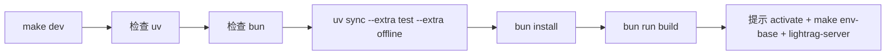
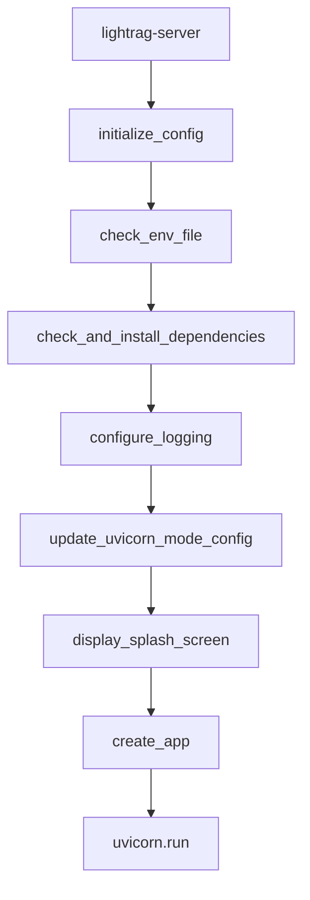

# 03 安装启动与运行流程

## 源码启动流程

源码启动分为后端依赖、前端依赖、环境变量、Server 运行四步。

```bash
uv sync --extra api
source .venv/bin/activate
cp env.example .env
lightrag-server
```

如果要同时准备测试、离线存储和离线 LLM 相关依赖，可以使用：

```bash
uv sync --extra test --extra offline
```

前端开发或构建：

```bash
cd lightrag_webui
bun install --frozen-lockfile
bun run dev
bun run build
```

源码确认：

| 行为 | 源码/配置位置 |
|---|---|
| `lightrag-server` 命令 | `pyproject.toml` 的 `[project.scripts]`，指向 `lightrag.api.lightrag_server:main` |
| Server 配置解析 | `lightrag/api/config.py::parse_args` |
| FastAPI 应用创建 | `lightrag/api/lightrag_server.py::create_app` |
| WebUI 构建输出 | `lightrag_webui/vite.config.ts` 的 `build.outDir = ../lightrag/api/webui` |
| WebUI 挂载 | `lightrag/api/lightrag_server.py` 的 `WEBUI_PATH = "/webui"` 和 `SmartStaticFiles` |

## `uv` 的作用

`uv` 是 Python 依赖和虚拟环境管理工具。本项目使用 `pyproject.toml` 和 `uv.lock` 管理依赖。

| 命令 | 作用 |
|---|---|
| `uv sync` | 根据 `uv.lock` 同步基础依赖。 |
| `uv sync --extra api` | 安装 API Server 相关依赖，例如 FastAPI、Uvicorn、Gunicorn、OpenAI 客户端、文档解析依赖。 |
| `uv sync --extra offline-storage` | 安装 Redis、Neo4j、Milvus、MongoDB、PostgreSQL、Qdrant、OpenSearch 等存储依赖。 |
| `uv sync --extra offline-llm` | 安装 OpenAI、Anthropic、Ollama、Bedrock、Google GenAI、VoyageAI 等模型依赖。 |
| `uv sync --extra test` | 安装 pytest、pytest-asyncio、mock 等测试依赖。 |

`scripts/test.sh` 会优先尝试 `PYTHON`、当前虚拟环境、`uv run python -m pytest`、`.venv/bin/python` 等方式运行 pytest。

## `bun` 的作用

`bun` 用于前端依赖安装、开发服务器、构建、测试。

| 命令 | 作用 |
|---|---|
| `bun install --frozen-lockfile` | 按 `lightrag_webui/bun.lock` 安装前端依赖。 |
| `bun run dev` | 启动 Vite 开发服务器。源码未硬编码端口，Vite 默认通常是 `http://localhost:5173`，被占用时可能自动切换。 |
| `bun run build` | 构建产物输出到 `lightrag/api/webui`，供后端静态挂载。 |
| `bun test` | 使用 Bun 内置测试 runner，非 Vitest/Jest。 |

## `make dev` 做了什么

`Makefile` 中的 `dev` 目标会：

1. 检查 `uv` 是否存在。
2. 检查 `bun` 是否存在。
3. 执行 `uv sync --extra test --extra offline`。
4. 进入 `lightrag_webui/` 执行 `bun install --frozen-lockfile`。
5. 执行 `bun run build`。
6. 输出下一步提示：激活 `.venv`、运行 `make env-base`、运行 `lightrag-server`。



## `make env-base` 做了什么

`Makefile` 中 `env-base` 目标调用：

```bash
scripts/setup/setup.sh --base
```

同类目标还包括：

| Make 目标 | 调用 | 作用 |
|---|---|---|
| `make env-base` | `setup.sh --base` | 基础 `.env` 配置向导。 |
| `make env-storage` | `setup.sh --storage` | 存储后端配置向导。 |
| `make env-server` | `setup.sh --server` | Server 配置向导。 |
| `make env-validate` | `setup.sh --validate` | 校验配置。 |
| `make env-security-check` | `setup.sh --security-check` | 安全检查。 |
| `make env-backup` | `setup.sh --backup` | 备份配置。 |

仓库说明中强调：setup workflow 改动应优先使用 `make env-*`，不要直接调用 `scripts/setup/setup.sh`。

## `lightrag-server` 启动后发生了什么

启动链路来自 `lightrag/api/lightrag_server.py::main`：



`create_app(args)` 内部做的关键事情：

1. 调用 `validate_parser_routing_config()` 校验 `LIGHTRAG_PARSER`。
2. 解析/校验 LLM、Embedding、Rerank、Storage 配置。
3. 创建 `DocumentManager(args.input_dir, workspace=args.workspace)`。
4. 创建 FastAPI 应用，配置 CORS、root path、认证依赖。
5. 创建 `embedding_func`、`rerank_model_func`、角色 LLM 函数。
6. 实例化 `LightRAG(...)`。
7. 在 lifespan 中调用 `await rag.initialize_storages()` 和 `await rag.check_and_migrate_data()`。
8. 注册 document/query/graph/Ollama-compatible routers。
9. 挂载 `/webui` 静态资源和 `/docs` Swagger。

## Docker Compose 启动流程

基础 compose：

```bash
cp env.example .env
docker compose up -d
```

`docker-compose.yml` 中服务名为 `lightrag`：

| 项 | 内容 |
|---|---|
| 镜像 | `ghcr.io/hkuds/lightrag:latest`，也支持从 `Dockerfile` build |
| 容器端口 | `9621` |
| 宿主端口 | `${HOST:-0.0.0.0}:${PORT:-9621}:9621` |
| 数据卷 | `./data/rag_storage:/app/data/rag_storage`、`./data/inputs:/app/data/inputs`、`./data/prompts:/app/data/prompts` |
| 配置卷 | `./.env:/app/.env` |
| 工作目录 env | `WORKING_DIR=/app/data/rag_storage`、`INPUT_DIR=/app/data/inputs`、`PROMPT_DIR=/app/data/prompts` |

完整 compose `docker-compose-full.yml` 额外包含 vLLM embedding/rerank、PostgreSQL、Neo4j、Milvus、etcd、MinIO 等服务，适合完整离线或本地依赖部署。

## 访问地址

默认情况下：

| 入口 | 地址 |
|---|---|
| API Server | `http://localhost:9621` |
| WebUI | `http://localhost:9621/webui/` |
| Swagger UI | `http://localhost:9621/docs` |
| OpenAPI JSON | `http://localhost:9621/openapi.json` |
| 健康检查 | `http://localhost:9621/health` |
| Ollama-compatible | `http://localhost:9621/api/chat`、`http://localhost:9621/api/generate` |

如果配置了 `LIGHTRAG_API_PREFIX`，后端会通过 FastAPI `root_path` 和 WebUI 运行时注入调整 prefix。WebUI 的固定挂载路径是 `/webui`，源码中不作为用户配置项开放。

## 常见启动问题和排查方式

| 问题 | 排查命令 | 说明 |
|---|---|---|
| Python 依赖缺失 | `uv sync --extra api` | API Server 依赖不足会导致 import error。 |
| 前端页面 404 | `find lightrag/api/webui -maxdepth 2 -type f | head` | 需要先 `cd lightrag_webui && bun run build`。 |
| 端口占用 | `ss -ltnp | grep 9621` | 修改 `.env` 中 `PORT` 或停止占用进程。 |
| `.env` 不存在 | `test -f .env && echo ok` | `check_env_file()` 会提示缺失；可复制 `env.example`。 |
| 模型 API 调用失败 | `curl http://localhost:9621/health` | 查看配置快照，不要输出真实 key。 |
| 文档一直 processing | `curl http://localhost:9621/documents/pipeline_status` | 查看 pipeline 状态、busy、request_pending、错误信息。 |
| Docker 服务未启动 | `docker compose ps`、`docker compose logs lightrag` | 看容器状态和日志。 |

## WSL 环境下的注意事项

| 注意事项 | 建议 |
|---|---|
| Windows 与 WSL 端口映射 | 后端监听 `0.0.0.0:9621` 更容易从 Windows 浏览器访问。 |
| 访问地址 | 通常 Windows 浏览器可访问 `http://localhost:9621/webui/`；若失败，查询 WSL IP。 |
| 文件路径 | 项目在 `/home/cjy/LightRAG`，避免在 Windows 盘频繁读写大量索引文件，性能可能较差。 |
| Docker Desktop + WSL | 确认 Docker Desktop WSL integration 已启用。 |
| Ollama 在 Windows 或宿主机 | 容器内访问宿主服务常用 `host.docker.internal`，源码 compose 已配置 `extra_hosts`。 |

## 最小 Core 示例启动逻辑

核心代码的最小结构：

```python
from lightrag import LightRAG, QueryParam
from lightrag.llm.openai import gpt_4o_mini_complete, openai_embed

rag = LightRAG(
    working_dir="./rag_storage",
    llm_model_func=gpt_4o_mini_complete,
    embedding_func=openai_embed,
)

await rag.initialize_storages()
await rag.ainsert("文档内容")
answer = await rag.aquery("问题", param=QueryParam(mode="hybrid"))
await rag.finalize_storages()
```

关键点：`initialize_storages()` 是必须步骤，多个示例文件都显式调用。

