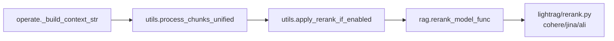
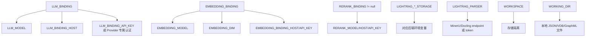

# 04 配置系统详解

## 配置来源和优先级

LightRAG Server 的配置主要来自：

| 来源 | 文件/函数 | 说明 |
|---|---|---|
| `.env` | `lightrag/api/lightrag_server.py`、`lightrag/api/config.py` 使用 `load_dotenv(".env", override=False)` | 本地运行时配置。本文档不读取真实 `.env`。 |
| 环境变量 | `lightrag/api/config.py::parse_args` | 容器和生产部署常用。 |
| CLI 参数 | `parse_args()` 中的 argparse | 可覆盖或补充部分配置。 |
| `env.example` | 配置模板 | 允许阅读，可复制为 `.env` 后修改。 |
| 构造参数 | `LightRAG(...)` | 直接嵌入 Core 时通过 Python 传入。 |

一般部署中，建议使用 `.env` 或容器环境变量；直接调用 Core 时，建议把模型函数和存储参数显式传给 `LightRAG(...)`。

## Server 配置项

| 配置项 | 作用 |
|---|---|
| `HOST` | Server 监听地址，WSL/容器常用 `0.0.0.0`。 |
| `PORT` | Server 端口，默认常见为 `9621`。 |
| `WORKERS` | Gunicorn/多 worker 相关；Uvicorn 开发模式会由 `update_uvicorn_mode_config()` 调整。 |
| `TIMEOUT` | Server/请求超时相关配置。 |
| `CORS_ORIGINS` | 跨域来源。 |
| `LIGHTRAG_API_PREFIX` | API root path，用于反向代理路径前缀。 |
| `WEBUI_TITLE`、`WEBUI_DESCRIPTION` | WebUI 标题和描述，会通过 `/auth-status`、`/health` 返回。 |
| `INPUT_DIR` | 上传文件目录，传入 `DocumentManager(args.input_dir)`。 |
| `WORKING_DIR` | 索引和本地存储目录，传入 `LightRAG(working_dir=...)`。 |
| `PROMPT_DIR` | 自定义 prompt profile 目录。 |
| `LOG_LEVEL`、`LOG_DIR`、`LOG_MAX_BYTES`、`LOG_BACKUP_COUNT` | 日志配置。 |
| `SSL_CERTFILE`、`SSL_KEYFILE` | Uvicorn HTTPS 配置。 |

## 认证和敏感信息配置

| 配置项 | 作用 | 注意 |
|---|---|---|
| `LIGHTRAG_API_KEY` | API Key 认证，HTTP Header 使用 `X-API-Key`。 | 不要提交真实值。 |
| `AUTH_ACCOUNTS` | WebUI 登录账号配置。 | 不要写明文密码；使用项目提供的 hash 工具。 |
| `TOKEN_SECRET` | JWT 签名密钥。 | 生产环境必须自定义。 |
| `JWT_ALGORITHM`、`ACCESS_TOKEN_EXPIRE_MINUTES`、`TOKEN_AUTO_RENEWAL_*` | Token 策略。 | 注意过期与自动续期。 |
| `WHITELIST_PATHS` | 认证白名单路径。 | 生产环境谨慎开放。 |

安全原则：

1. 不要把真实 `.env`、API Key、Token、密码写入文档、Git、镜像。
2. Docker 使用 `./.env:/app/.env` 或运行时 env 注入，不要 `COPY .env` 进镜像。
3. 日志中如果出现密钥片段，先清理再提交 issue 或文档。

## LLM 配置项

Server 端 LLM binding 在 `lightrag/api/config.py` 和 `lightrag/api/lightrag_server.py::create_llm_model_func` 中处理。

| 配置项 | 作用 |
|---|---|
| `LLM_BINDING` | LLM Provider。Server 当前确认支持 `openai`、`ollama`、`lollms`、`azure_openai`、`bedrock`、`gemini`。 |
| `LLM_MODEL` | 主模型名。 |
| `LLM_BINDING_HOST` | Provider base URL。OpenAI-compatible、Ollama、Azure、Gemini、Bedrock endpoint 都会使用。 |
| `LLM_BINDING_API_KEY` | Provider API Key，Bedrock 走 AWS SigV4 时不使用普通 key。 |
| `MAX_ASYNC` | 基础 LLM 最大并发。角色 LLM 可单独覆盖。 |
| `LLM_TIMEOUT` | LLM 超时。 |
| `OPENAI_LLM_TEMPERATURE`、`OPENAI_LLM_MAX_TOKENS`、`OPENAI_LLM_EXTRA_BODY` | OpenAI-compatible 参数，由 `lightrag/llm/binding_options.py::OpenAILLMOptions` 解析。 |
| `OLLAMA_LLM_NUM_CTX` | Ollama 上下文窗口等参数，进入 `OllamaLLMOptions`。 |
| `GEMINI_LLM_*`、`BEDROCK_LLM_*` | Gemini/Bedrock Provider 选项。 |

### Role-specific LLM 配置

角色定义在 `lightrag/llm_roles.py`：

| 角色 | env 前缀 | 用途 |
|---|---|---|
| `extract` | `EXTRACT` | 实体/关系抽取，`operate.extract_entities()` 调用。 |
| `keyword` | `KEYWORD` | 查询关键词抽取，`operate.extract_keywords_only()` 调用。 |
| `query` | `QUERY` | 最终回答生成，`kg_query()`、`naive_query()`、Ollama-compatible chat/generate 使用。 |
| `vlm` | `VLM` | 多模态图像/表格/公式分析，`pipeline.analyze_multimodal()` 相关。 |

每个角色可配置：

```bash
EXTRACT_LLM_BINDING=openai
EXTRACT_LLM_MODEL=<抽取模型名>
EXTRACT_LLM_BINDING_HOST=<base url>
EXTRACT_LLM_BINDING_API_KEY=<密钥占位符>
EXTRACT_MAX_ASYNC_LLM=4
EXTRACT_LLM_TIMEOUT=300
```

`lightrag/api/lightrag_server.py::resolve_role_llm_settings` 会优先读取角色专属配置，否则继承基础 `LLM_*`。

## Embedding 配置项

Embedding binding 在 `create_optimized_embedding_function()` 中构造，最终返回 `lightrag.utils.EmbeddingFunc`。

| 配置项 | 作用 |
|---|---|
| `EMBEDDING_BINDING` | Embedding Provider。Server 当前确认支持 `ollama`、`openai`、`azure_openai`、`jina`、`lollms`、`bedrock`、`gemini`、`voyageai`。 |
| `EMBEDDING_MODEL` | Embedding 模型名。 |
| `EMBEDDING_BINDING_HOST` | Embedding base URL。 |
| `EMBEDDING_BINDING_API_KEY` | Embedding API Key。 |
| `EMBEDDING_DIM` | 向量维度。换自定义模型时通常必须明确设置。 |
| `EMBEDDING_TOKEN_LIMIT` | 单次 embedding token 上限。 |
| `EMBEDDING_FUNC_MAX_ASYNC` | Embedding 并发。 |
| `EMBEDDING_BATCH_NUM` | Embedding batch size。 |
| `EMBEDDING_TIMEOUT` | Embedding 超时。 |
| `EMBEDDING_SEND_DIM` | 是否向 Provider 发送 dimension 参数；Jina/Gemini 在源码中会强制按 API 要求处理。 |
| `EMBEDDING_ASYMMETRIC`、`EMBEDDING_DOCUMENT_PREFIX`、`EMBEDDING_QUERY_PREFIX` | 非对称 embedding 配置。 |

### 为什么更换 Embedding 模型要清空已有向量数据

Embedding 模型决定向量空间。旧模型生成的向量和新模型生成的查询向量不在同一个空间，继续混用会导致：

- 相似度无意义；
- 检索结果质量极差；
- 维度不一致时还可能直接报错。

因此更换 `EMBEDDING_MODEL` 或 `EMBEDDING_DIM` 后，应清空或重建以下默认本地数据：

| 文件 | 说明 |
|---|---|
| `vdb_chunks.json` | chunk 向量 |
| `vdb_entities.json` | entity 向量 |
| `vdb_relationships.json` | relation 向量 |
| `graph_chunk_entity_relation.graphml` | 图谱结构，通常随索引一起重建 |
| `kv_store_text_chunks.json`、`kv_store_full_docs.json`、`kv_store_doc_status.json` | 文档和状态，是否保留取决于是否想完整重跑 |

LLM cache `kv_store_llm_response_cache.json` 可按需要保留，但如果 prompt 或模型行为变化明显，也建议清理。

## Reranker 配置项

Rerank 入口在 `lightrag/rerank.py`，Server 装配在 `lightrag/api/lightrag_server.py` 的 rerank section。

| 配置项 | 作用 |
|---|---|
| `RERANK_BINDING` | `null`、`cohere`、`jina`、`aliyun`。 |
| `RERANK_MODEL` | rerank 模型名。 |
| `RERANK_BINDING_HOST` | rerank API endpoint。 |
| `RERANK_BINDING_API_KEY` | rerank API Key，占位符即可。 |
| `RERANK_BY_DEFAULT` | `QueryParam.enable_rerank` 默认值来源。 |
| `MIN_RERANK_SCORE` | rerank 后过滤阈值，见 `lightrag/utils.py::process_chunks_unified`。 |
| `MAX_ASYNC_RERANK` | rerank 最大并发。 |
| `RERANK_TIMEOUT` | rerank 超时。 |
| `RERANK_ENABLE_CHUNKING`、`RERANK_MAX_TOKENS_PER_DOC` | Cohere binding 下长文档切块参数。 |

Rerank 调用链：



## Storage 配置项

存储类型由四组变量控制：

| 类型 | 配置项 | 默认实现 |
|---|---|---|
| KV | `LIGHTRAG_KV_STORAGE` | `JsonKVStorage` |
| DocStatus | `LIGHTRAG_DOC_STATUS_STORAGE` | `JsonDocStatusStorage` |
| Graph | `LIGHTRAG_GRAPH_STORAGE` | `NetworkXStorage` |
| Vector | `LIGHTRAG_VECTOR_STORAGE` | `NanoVectorDBStorage` |

可选实现注册在 `lightrag/kg/__init__.py::STORAGE_IMPLEMENTATIONS`。

外部存储常见配置：

| 后端 | 典型变量 |
|---|---|
| PostgreSQL | `POSTGRES_HOST`、`POSTGRES_PORT`、`POSTGRES_USER`、`POSTGRES_PASSWORD`、`POSTGRES_DATABASE`、`POSTGRES_WORKSPACE` |
| Neo4j | `NEO4J_URI`、`NEO4J_USERNAME`、`NEO4J_PASSWORD`、`NEO4J_DATABASE` |
| MongoDB | `MONGO_URI`、`MONGO_DATABASE` |
| Redis | `REDIS_URI` |
| Milvus | `MILVUS_URI`、`MILVUS_USER`、`MILVUS_PASSWORD`、`MILVUS_DB_NAME` |
| Qdrant | `QDRANT_URL`、`QDRANT_API_KEY` |
| OpenSearch | `OPENSEARCH_HOST`、`OPENSEARCH_USER`、`OPENSEARCH_PASSWORD` 等 |
| Memgraph | `MEMGRAPH_URI`、`MEMGRAPH_USERNAME`、`MEMGRAPH_PASSWORD` |

## Parser 和 Chunk 配置项

| 配置项 | 作用 |
|---|---|
| `LIGHTRAG_PARSER` | 按后缀指定 parser，例如 `pdf:mineru`。语法校验在 `lightrag/parser/routing.py::validate_parser_routing_config`。 |
| `MINERU_API_MODE`、`MINERU_LOCAL_ENDPOINT`、`MINERU_API_TOKEN` | MinerU 外部解析配置。 |
| `DOCLING_ENDPOINT` | Docling 外部解析配置。 |
| `MAX_UPLOAD_SIZE` | 上传文件大小限制。 |
| `CHUNK_SIZE`、`CHUNK_OVERLAP_SIZE` | legacy/top-level chunk 大小。 |
| `CHUNK_F_*` | fixed token chunker 参数。 |
| `CHUNK_R_*` | recursive character chunker 参数。 |
| `CHUNK_V_*` | semantic vector chunker 参数。 |
| `CHUNK_P_*` | paragraph semantic chunker 参数。 |
| `SUMMARY_LANGUAGE` | 摘要语言，进入 `addon_params`。 |
| `ENTITY_EXTRACTION_USE_JSON` | 是否使用 JSON 方式抽取 entity/relation。 |
| `ENTITY_TYPE_PROMPT_FILE` | 自定义实体类型 prompt profile 文件。 |

处理选项字符在 `lightrag/parser/routing.py::ProcessOptions` 中解析：

| 字符 | 含义 |
|---|---|
| `i` | 处理图片 |
| `t` | 处理表格 |
| `e` | 处理公式 |
| `!` | 跳过知识图谱抽取 |
| `F` | fixed token chunking |
| `R` | recursive character chunking |
| `V` | semantic vector chunking |
| `P` | paragraph semantic chunking |

## WebUI 配置项

WebUI 有两类配置：

| 类型 | 位置 | 说明 |
|---|---|---|
| 后端注入运行时配置 | `lightrag/api/lightrag_server.py::SmartStaticFiles` | 注入 `window.__LIGHTRAG_CONFIG__ = { apiPrefix, webuiPrefix }`。 |
| 前端本地持久化设置 | `lightrag_webui/src/stores/settings.ts` | `settings-storage`，包含查询模式、top_k、chunk_top_k、图谱设置、主题语言等。 |

前端默认查询设置在 `settings.ts`：

```ts
querySettings: {
  mode: 'global',
  top_k: 40,
  chunk_top_k: 20,
  max_entity_tokens: 6000,
  max_relation_tokens: 8000,
  max_total_tokens: 30000,
  stream: true,
  enable_rerank: true
}
```

## 千问 / DashScope OpenAI-compatible 配置说明

千问 OpenAI-compatible 通常走 `openai` binding，因为源码中的 `openai_complete_if_cache` 支持自定义 `base_url`。

示例只保留占位符：

```bash
LLM_BINDING=openai
LLM_MODEL=qwen-plus
LLM_BINDING_HOST=https://dashscope.aliyuncs.com/compatible-mode/v1
LLM_BINDING_API_KEY=<你的 DashScope API Key>

EMBEDDING_BINDING=openai
EMBEDDING_MODEL=text-embedding-v4
EMBEDDING_BINDING_HOST=https://dashscope.aliyuncs.com/compatible-mode/v1
EMBEDDING_BINDING_API_KEY=<你的 DashScope API Key>
EMBEDDING_DIM=<模型对应维度>
```

DashScope/阿里云百炼 rerank 在源码中对应 `lightrag/rerank.py::ali_rerank`：

```bash
RERANK_BINDING=aliyun
RERANK_MODEL=gte-rerank-v2
RERANK_BINDING_HOST=https://dashscope.aliyuncs.com/api/v1/services/rerank/text-rerank/text-rerank
RERANK_BINDING_API_KEY=<你的 DashScope API Key>
```

具体模型名和维度可能随平台更新，当前源码不能确认你的账号可用模型列表，应以 DashScope 控制台和官方文档为准。

## 本地 Ollama 配置说明

Ollama Server 端配置示例：

```bash
LLM_BINDING=ollama
LLM_MODEL=qwen2.5-coder:7b
LLM_BINDING_HOST=http://localhost:11434

EMBEDDING_BINDING=ollama
EMBEDDING_MODEL=bge-m3:latest
EMBEDDING_BINDING_HOST=http://localhost:11434
EMBEDDING_DIM=1024
```

容器中访问宿主机 Ollama 时，常用：

```bash
LLM_BINDING_HOST=http://host.docker.internal:11434
EMBEDDING_BINDING_HOST=http://host.docker.internal:11434
```

`docker-compose.yml` 已设置 `extra_hosts`，把 `host.docker.internal` 指向宿主网关。

## 配置项之间的依赖关系



关键依赖：

- `EMBEDDING_DIM` 必须和实际模型输出维度一致。
- `RERANK_BINDING` 为 `null` 时无需 rerank key/host。
- 外部存储后端需要相应连接变量，否则 `verify_storage_implementation` 或后端初始化会失败。
- `LIGHTRAG_PARSER` 指向外部 parser 时，必须配置对应 endpoint/token。
- `WORKSPACE` 会影响存储隔离；不同存储后端的实现方式不同，本地文件后端会使用 workspace 子目录或命名隔离。

