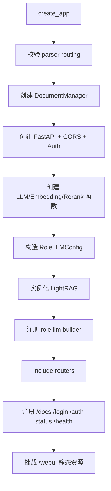
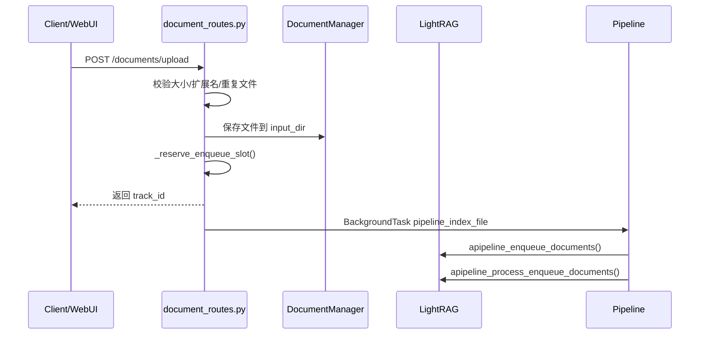
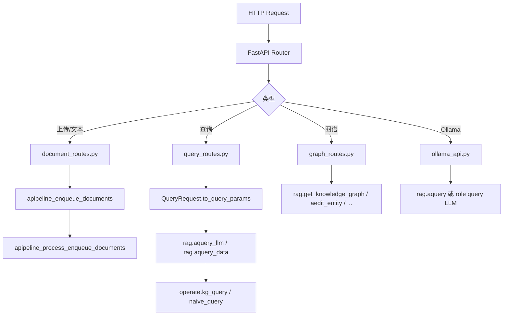

# 05 API Server 架构详解

## LightRAG Server 的入口文件

LightRAG API Server 的命令入口在 `pyproject.toml`：

```toml
[project.scripts]
lightrag-server = "lightrag.api.lightrag_server:main"
lightrag-gunicorn = "lightrag.api.run_with_gunicorn:main"
```

主要源码：

| 路径 | 职责 |
|---|---|
| `lightrag/api/lightrag_server.py::main` | Uvicorn 模式启动入口。 |
| `lightrag/api/lightrag_server.py::create_app` | 创建 FastAPI app、构造 `LightRAG`、注册路由和 WebUI。 |
| `lightrag/api/run_with_gunicorn.py::main` | Gunicorn 多 worker 启动入口。 |
| `lightrag/api/config.py::parse_args` | 读取 CLI/env 配置。 |
| `lightrag/api/utils_api.py::get_combined_auth_dependency` | API Key/JWT/白名单认证依赖。 |

## FastAPI / Uvicorn 如何启动

`lightrag_server.py::main` 的主要步骤：

```mermaid
flowchart TD
  A[lightrag-server] --> B[initialize_config]
  B --> C[check_env_file]
  C --> D[check_and_install_dependencies]
  D --> E[configure_logging]
  E --> F[update_uvicorn_mode_config]
  F --> G[display_splash_screen]
  G --> H[create_app(global_args)]
  H --> I[uvicorn.run(app, host, port, ssl)]
```

关键点：

- `load_dotenv(".env", override=False)` 只会在环境变量不存在时加载 `.env`。
- `update_uvicorn_mode_config()` 会调整 Uvicorn 模式下 worker 行为。
- SSL 参数来自 `SSL_CERTFILE`、`SSL_KEYFILE`。
- Gunicorn 模式由 `lightrag/api/run_with_gunicorn.py` 设置 `LIGHTRAG_GUNICORN_MODE=1` 并使用 `uvicorn.workers.UvicornWorker`。

## `create_app(args)` 内部流程



源码中 `LightRAG(...)` 的关键参数来自 `args`：

| `LightRAG` 参数 | 来源 |
|---|---|
| `working_dir` | `args.working_dir` |
| `workspace` | `args.workspace` |
| `llm_model_func` | `create_llm_model_func(args.llm_binding)` |
| `llm_model_name` | `args.llm_model` |
| `embedding_func` | `create_optimized_embedding_function(...)` |
| `rerank_model_func` | rerank section 中构造的 `server_rerank_func` |
| `kv_storage` | `args.kv_storage` |
| `graph_storage` | `args.graph_storage` |
| `vector_storage` | `args.vector_storage` |
| `doc_status_storage` | `args.doc_status_storage` |
| `role_llm_configs` | 根据 `ROLES` 循环构造 |

## Lifespan：存储初始化和关闭

`create_app` 中定义 FastAPI lifespan，关键逻辑：

```python
await rag.initialize_storages()
await rag.check_and_migrate_data()
yield
await rag.finalize_storages()
```

这意味着：

- Server 启动时会初始化 KV/Vector/Graph/DocStatus 等所有存储。
- 启动时会执行存储迁移检查。
- Server 关闭时会调用每个存储的 `finalize()`。

## API 路由如何注册

路由注册在 `create_app` 尾部：

```python
app.include_router(create_document_routes(rag, doc_manager, api_key))
app.include_router(create_query_routes(rag, api_key, args.top_k))
app.include_router(create_graph_routes(rag, api_key))
ollama_api = OllamaAPI(rag, top_k=args.top_k, api_key=api_key)
app.include_router(ollama_api.router, prefix="/api")
```

| 路由文件 | 注册函数/类 | 主要 endpoint |
|---|---|---|
| `lightrag/api/routers/document_routes.py` | `create_document_routes` | `/documents/*` |
| `lightrag/api/routers/query_routes.py` | `create_query_routes` | `/query`、`/query/stream`、`/query/data` |
| `lightrag/api/routers/graph_routes.py` | `create_graph_routes` | `/graphs`、`/graph/*` |
| `lightrag/api/routers/ollama_api.py` | `OllamaAPI` | `/api/version`、`/api/tags`、`/api/ps`、`/api/generate`、`/api/chat` |

## WebUI 静态资源如何挂载

WebUI 固定挂载路径是：

```python
WEBUI_PATH = "/webui"
```

构建产物来自前端：

| 前端配置 | 说明 |
|---|---|
| `lightrag_webui/vite.config.ts` | `build.outDir = ../lightrag/api/webui` |
| `lightrag_webui/src/lib/runtimeConfig.ts` | 读取 `window.__LIGHTRAG_CONFIG__` |
| `lightrag/api/lightrag_server.py::SmartStaticFiles` | 对 `index.html` 注入 runtime config |

注入内容形态：

```js
window.__LIGHTRAG_CONFIG__ = {
  apiPrefix: "...",
  webuiPrefix: ".../webui/"
}
```

这样一个前端构建产物可以在不同 `LIGHTRAG_API_PREFIX` 下运行。

## 认证相关接口

| Endpoint | 函数 | 说明 |
|---|---|---|
| `GET /auth-status` | `get_auth_status` | 返回是否启用认证；未配置账号时发 guest token。 |
| `POST /login` | `login` | 验证账号密码，返回 JWT。 |
| 受保护接口 | `Depends(combined_auth)` | 由 `get_combined_auth_dependency(api_key)` 处理 JWT、API Key、白名单。 |

如果 `AUTH_ACCOUNTS` 未配置，WebUI 会使用 guest access；如果配置了账号，则需要登录。

## 文档上传接口

核心 endpoint 在 `lightrag/api/routers/document_routes.py`：

| Endpoint | 函数 | 说明 |
|---|---|---|
| `POST /documents/upload` | `upload_to_input_dir` | 上传单文件，保存到 input dir，后台执行 `pipeline_index_file`。 |
| `POST /documents/text` | `insert_text` | 插入单段文本，后台执行 `pipeline_index_texts`。 |
| `POST /documents/texts` | `insert_texts` | 批量插入文本。 |
| `POST /documents/scan` | `scan_for_new_documents` | 扫描 input dir 中新文件，后台执行 `run_scanning_process`。 |
| `GET /documents/pipeline_status` | `get_pipeline_status` | 查看 pipeline 状态。 |
| `POST /documents/paginated` | `get_documents_paginated` | 分页查询文档状态。 |
| `GET /documents/status_counts` | `get_document_status_counts` | 文档状态计数。 |
| `GET /documents/track_status/{track_id}` | `get_track_status` | 按 track_id 查看状态。 |
| `DELETE /documents` | `clear_documents` | 清空文档和存储，使用 destructive busy。 |
| `DELETE /documents/delete_document` | `delete_document` | 删除指定 doc。 |
| `POST /documents/reprocess_failed` | `reprocess_failed_documents` | 重新处理失败文档。 |
| `POST /documents/cancel_pipeline` | `cancel_pipeline` | 请求取消 pipeline。 |

文档上传链路：



## 文本插入接口

`POST /documents/text` 和 `POST /documents/texts` 最终调用：

```python
pipeline_index_texts(
    rag,
    texts=[...],
    file_sources=[...],
    track_id=...
)
```

然后：

```python
await rag.apipeline_enqueue_documents(
    input=texts,
    file_paths=normalized_file_sources,
    process_options=PROCESS_OPTION_CHUNK_FIXED,
)
await rag.apipeline_process_enqueue_documents()
```

## 查询接口

`lightrag/api/routers/query_routes.py` 中定义 `QueryRequest`、`QueryResponse`、`QueryDataResponse`。

| Endpoint | 函数 | 说明 |
|---|---|---|
| `POST /query` | `query_text` | 非流式查询，调用 `rag.aquery_llm()`。 |
| `POST /query/stream` | `query_text_stream` | NDJSON 流式查询，可能先返回 references 再返回 response chunks。 |
| `POST /query/data` | `query_data` | 只返回结构化检索数据，不生成最终 LLM answer。 |

`QueryRequest.to_query_params()` 会构造 `lightrag/base.py::QueryParam`。

## 文档状态接口

文档状态模型在 `document_routes.py`：

| 状态 | 含义 |
|---|---|
| `pending` | 已入队等待处理。 |
| `parsing` | 正在解析文件。 |
| `analyzing` | 正在多模态/内容分析。 |
| `processing` | 正在 chunk、embedding、抽取、写库。 |
| `preprocessed` | 预处理状态，源码中存在该状态类型。具体使用场景以当前 pipeline 实际分支为准。 |
| `processed` | 已处理完成。 |
| `failed` | 处理失败。 |

`/documents/pipeline_status` 返回 pipeline 全局状态，例如 `busy`、`request_pending`、`scanning`、`destructive_busy`、`pending_enqueues` 等。

## 知识图谱接口

| Endpoint | 函数 | Core 调用 |
|---|---|---|
| `GET /graph/label/list` | `get_graph_labels` | `rag.get_graph_labels()` |
| `GET /graph/label/popular` | `get_popular_labels` | `rag.chunk_entity_relation_graph.get_popular_labels()` |
| `GET /graph/label/search` | `search_labels` | graph search labels |
| `GET /graphs` | `get_knowledge_graph` | `rag.get_knowledge_graph(label, max_depth, max_nodes)` |
| `GET /graph/entity/exists` | `check_entity_exists` | `rag.chunk_entity_relation_graph.has_node()` |
| `POST /graph/entity/edit` | `update_entity` | `rag.aedit_entity()` |
| `POST /graph/relation/edit` | `update_relation` | `rag.aedit_relation()` |
| `POST /graph/entity/create` | `create_entity` | `rag.acreate_entity()` |
| `POST /graph/relation/create` | `create_relation` | `rag.acreate_relation()` |
| `POST /graph/entities/merge` | `merge_entities` | `rag.amerge_entities()` |

## 健康检查接口

`GET /health` 在 `lightrag_server.py` 内定义，返回：

- `status`
- `webui_available`
- `working_directory`
- `input_directory`
- `configuration`：LLM、Embedding、Storage、Rerank、Parser、Workspace 等快照
- `pipeline_busy`、`pipeline_active`、`pipeline_scanning`、`pipeline_destructive_busy`
- `llm_queue_status`
- `embedding_queue_status`
- `rerank_queue_status`
- `core_version`、`api_version`
- `webui_title`、`webui_description`

注意：健康检查会返回配置名、host、模型名等，不应在公开环境暴露敏感信息。

## Ollama-compatible 接口

`lightrag/api/routers/ollama_api.py::OllamaAPI` 提供：

| Endpoint | 说明 |
|---|---|
| `GET /api/version` | 返回 Ollama 风格版本。 |
| `GET /api/tags` | 返回模拟模型列表。 |
| `GET /api/ps` | 返回运行模型信息。 |
| `POST /api/generate` | Ollama generate 兼容；源码中直接调用 query 角色 LLM，不走 RAG 检索。 |
| `POST /api/chat` | Ollama chat 兼容；支持 `/local`、`/global`、`/naive`、`/hybrid`、`/mix`、`/bypass`、`/context` 前缀。 |

`/api/chat` 中如果是 RAG 模式，会调用：

```python
self.rag.aquery(cleaned_query, QueryParam(mode=mode, ...))
```

## API 请求到核心逻辑的调用链路图



## 伪代码：非流式 query

```python
async def query_text(request: QueryRequest):
    param = request.to_query_params(is_stream=False)
    result = await rag.aquery_llm(request.query, param=param)
    if result["status"] != "success":
        raise HTTPException(...)
    content = result["llm_response"]["content"]
    return QueryResponse(response=content, references=result.get("references"))
```

源码中实际实现包含错误处理、references、chunk content 可选补充等细节，以 `lightrag/api/routers/query_routes.py` 为准。

