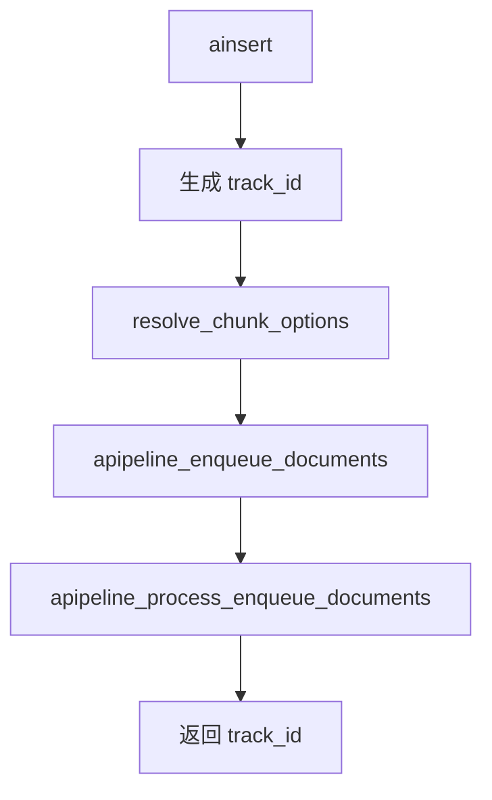
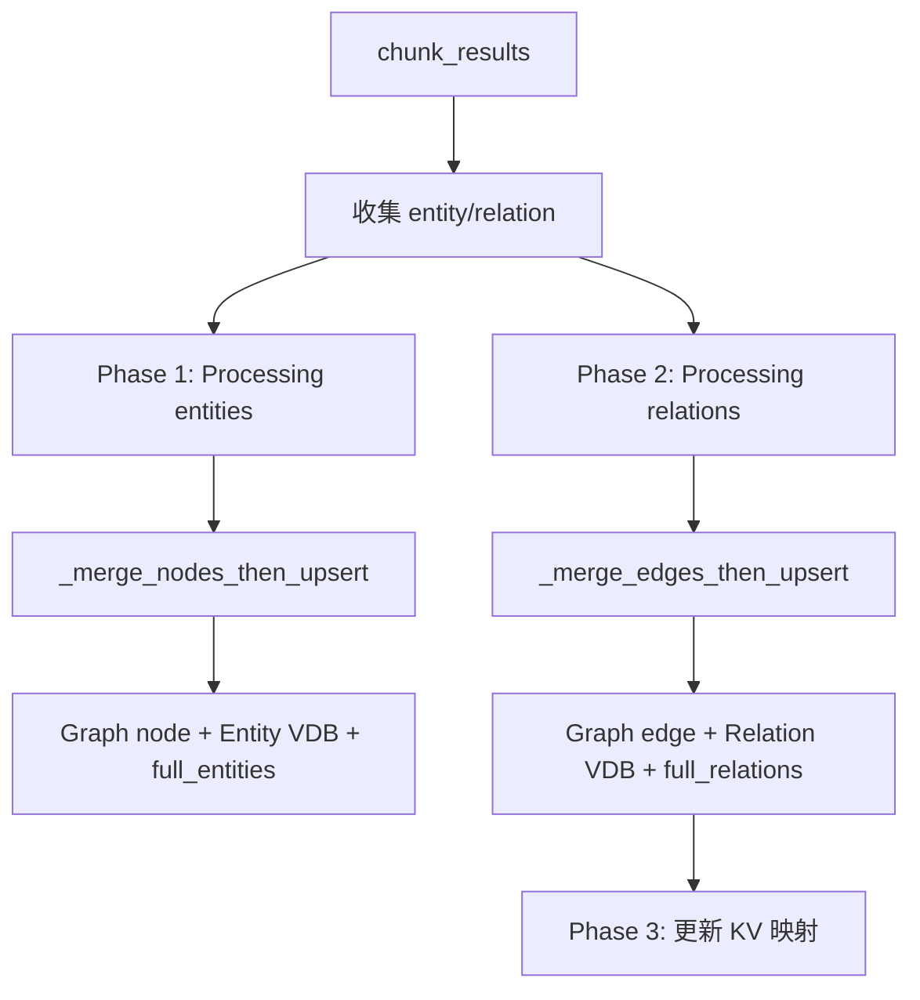
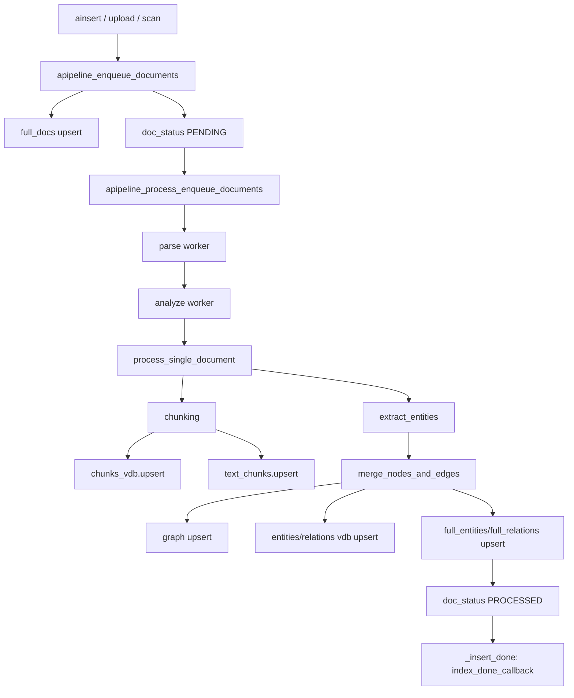
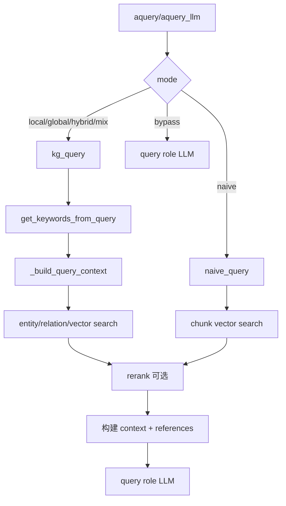

# 06 Core 核心流程详解

## Core 核心类和职责

核心类是 `lightrag/lightrag.py::LightRAG`：

```python
@final
@dataclass
class LightRAG(_RoleLLMMixin, _StorageMigrationMixin, _PipelineMixin):
    ...
```

继承顺序说明：

| Mixin/类 | 文件 | 职责 |
|---|---|---|
| `_RoleLLMMixin` | `lightrag/llm_roles.py` | 角色 LLM 的注册、包装、热更新、队列状态。 |
| `_StorageMigrationMixin` | `lightrag/storage_migrations.py` | 存储迁移检查。 |
| `_PipelineMixin` | `lightrag/pipeline.py` | 文档入队、解析、分析、索引处理。 |
| `LightRAG` | `lightrag/lightrag.py` | 存储实例化、初始化、插入/查询公共 API、图谱编辑和删除。 |

`@final` 表示这个类不是给外部继承扩展的稳定接口。二次开发优先通过配置、组合、Provider、Storage、API Router 扩展。

## 初始化流程

### `__post_init__`

`LightRAG.__post_init__` 在 dataclass 构造后运行，主要工作：

1. 初始化 shared data。
2. 创建 `working_dir`。
3. 校验 storage implementation。
4. 初始化 tokenizer，默认 `TiktokenTokenizer`。
5. 包装 embedding/rerank 函数，加入并发、超时、优先级控制。
6. 通过 `lightrag/kg/factory.py::get_storage_class()` 获取存储类。
7. 创建 KV、Vector、Graph、DocStatus 存储实例。
8. 建立角色 LLM 状态和 wrapper。

默认本地存储 namespace：

| 属性 | Namespace |
|---|---|
| `llm_response_cache` | `KV_STORE_LLM_RESPONSE_CACHE` |
| `text_chunks` | `KV_STORE_TEXT_CHUNKS` |
| `full_docs` | `KV_STORE_FULL_DOCS` |
| `full_entities` | `KV_STORE_FULL_ENTITIES` |
| `full_relations` | `KV_STORE_FULL_RELATIONS` |
| `entity_chunks` | `KV_STORE_ENTITY_CHUNKS` |
| `relation_chunks` | `KV_STORE_RELATION_CHUNKS` |
| `chunk_entity_relation_graph` | `GRAPH_STORE_CHUNK_ENTITY_RELATION` |
| `entities_vdb` | `VECTOR_STORE_ENTITIES` |
| `relationships_vdb` | `VECTOR_STORE_RELATIONSHIPS` |
| `chunks_vdb` | `VECTOR_STORE_CHUNKS` |
| `doc_status` | `DOC_STATUS` |

### `initialize_storages()`

必须显式调用：

```python
await rag.initialize_storages()
```

它会：

1. 设置默认 workspace。
2. 初始化 pipeline status。
3. 逐个调用所有 storage 的 `initialize()`。
4. 设置实例状态为 initialized。

如果漏掉，常见错误包括 storage 未初始化、上下文管理器错误、状态字典缺失等。

## insert / ainsert 文档插入流程

同步 `insert()` 是 async `ainsert()` 的 wrapper。核心入口：

```python
await rag.ainsert(
    input="文本或文本列表",
    ids=None,
    file_paths=None,
    split_by_character=None,
    split_by_character_only=False,
)
```

`ainsert()` 的主要流程：



伪代码：

```python
async def ainsert(input, ids=None, file_paths=None, ...):
    track_id = provided_or_generated
    chunk_options = resolve_chunk_options(self.addon_params, ...)
    await self.apipeline_enqueue_documents(
        input=input,
        ids=ids,
        file_paths=file_paths,
        track_id=track_id,
        chunk_options=chunk_options,
    )
    await self.apipeline_process_enqueue_documents()
    return track_id
```

## 文档处理 Pipeline 概览

文档处理逻辑主要在 `lightrag/pipeline.py::_PipelineMixin`：

| 方法 | 作用 |
|---|---|
| `apipeline_enqueue_documents` | 标准化 input/ids/file_paths，去重，写 `full_docs` 和 `doc_status`。 |
| `apipeline_process_enqueue_documents` | 抢占 pipeline busy 状态，拉取待处理文档，启动 batch worker。 |
| `_run_pipeline_batch` | 创建 parse/analyze/process 队列和 workers。 |
| `_parse_worker` | 按 engine 调用 `parse_native`、`parse_mineru`、`parse_docling`。 |
| `_analyze_worker` | 多模态分析。 |
| `_process_worker` | 调用 `process_single_document`。 |
| `process_single_document` | chunk、embedding、抽取 entity/relation、merge、写库、更新状态。 |

## chunk 切分流程

Chunker 注册在 `lightrag/chunker/__init__.py`：

| 策略 | 函数 | 说明 |
|---|---|---|
| legacy/fixed | `chunking_by_token_size`、`chunking_by_fixed_token` | token-size 切分。 |
| recursive | `chunking_by_recursive_character` | LangChain RecursiveCharacterTextSplitter，支持 CJK 分隔符。 |
| semantic vector | `chunking_by_semantic_vector` | 基于句子 embedding 相似度找断点。 |
| paragraph semantic | `chunking_by_paragraph_semantic` | 面向 DOCX sidecar 的标题/段落语义合并，缺失 sidecar 时 fallback。 |

`process_options` 中 `F/R/V/P` 选择策略；解析逻辑在 `lightrag/parser/routing.py::parse_process_options`。

## embedding 流程

Chunk embedding 发生在 `process_single_document()`：

```python
await self.chunks_vdb.upsert(chunks)
await self.text_chunks.upsert(chunks)
```

默认 `NanoVectorDBStorage.upsert()` 会：

1. 从 chunk 中取 `content`。
2. 分 batch 调用 `embedding_func(..., context="document")`。
3. 写入 `vdb_chunks.json`。

查询时 Vector Storage 的 `query()` 会对 query 调用 `embedding_func(..., context="query")`，支持非对称 embedding。

## 实体抽取流程

实体关系抽取入口：

```python
LightRAG._process_extract_entities(...)
```

它调用：

```python
operate.extract_entities(
    chunks,
    global_config=asdict(self),
    pipeline_status=...,
    llm_response_cache=self.llm_response_cache,
    text_chunks_storage=self.text_chunks,
)
```

`extract_entities()` 的关键行为：

| 步骤 | 说明 |
|---|---|
| 选择 LLM | 使用 `global_config["role_llm_funcs"]["extract"]`。 |
| 构造 Prompt | 来自 `lightrag/prompt.py`，可使用普通 delimiter 或 JSON 模式。 |
| LLM cache | 通过 `use_llm_func_with_cache(..., cache_type="extract")`。 |
| 解析结果 | `_process_json_extraction_result` 或 `_process_extraction_result`。 |
| gleaning | 可按 `entity_extract_max_gleaning` 追加抽取。 |
| 多模态补充 | 对 sidecar 中图片/表格/公式实体做增强。 |
| 更新 chunk cache | `update_chunk_cache_list`。 |

日志 `Chunk X of Y extracted ...` 来自 `operate.extract_entities()`。

## 关系抽取和合并流程

LLM 抽取结果同时包含 entity 和 relation。合并入口：

```python
operate.merge_nodes_and_edges(...)
```

核心阶段：



合并时会处理：

- 已存在节点/边的描述合并；
- source id、file path 限制；
- relation weight 累加；
- 必要时调用 LLM 做摘要；
- keyed lock 避免并发更新同一实体/关系。

## query / aquery 查询流程

同步 `query()` 是 async `aquery()` 的 wrapper。`aquery()` 返回最终文本或 async iterator；`aquery_llm()` 返回统一结构；`aquery_data()` 返回结构化检索数据。

查询模式分派在 `lightrag/lightrag.py::aquery_llm`：

| mode | 调用 |
|---|---|
| `local`、`global`、`hybrid`、`mix` | `lightrag/operate.py::kg_query` |
| `naive` | `lightrag/operate.py::naive_query` |
| `bypass` | 直接调用 `role_llm_funcs["query"]` |

## 查询模式差异

| 模式 | 检索对象 | 适合场景 |
|---|---|---|
| `local` | 低层关键词 -> entity VDB -> 图邻域关系 -> chunks | 问某个实体、人物、概念的具体信息。 |
| `global` | 高层关键词 -> relation VDB -> 相关实体 -> chunks | 问全局主题、关系、趋势、总结。 |
| `hybrid` | 同时做 local 和 global，再合并去重 | 默认稳妥选择，兼顾实体和关系。 |
| `mix` | KG 检索 + 直接 chunk 向量检索 | 推荐与 reranker 配合，适合综合问答。 |
| `naive` | 纯 chunk 向量检索 | 不需要图谱或快速验证向量检索。 |
| `bypass` | 不检索，直接问 LLM | 测试模型或普通聊天。 |

## 向量检索流程

`operate._perform_kg_search()` 根据 mode 执行：

- `_get_node_data(ll_keywords)`：entity VDB 查询。
- `_get_edge_data(hl_keywords)`：relation VDB 查询。
- `_get_vector_context(query, chunks_vdb)`：chunk VDB 查询，用于 `mix` 和 `naive`。

实体/关系检索会继续读 graph 节点/边数据和相关 chunks。

## 图检索流程

Graph Storage 抽象在 `lightrag/base.py::BaseGraphStorage`，提供：

- `has_node`
- `has_edge`
- `get_node`
- `get_edge`
- `get_node_edges`
- `upsert_node`
- `upsert_edge`
- `get_knowledge_graph`

默认 `NetworkXStorage` 使用 GraphML 文件 `graph_chunk_entity_relation.graphml`。

## LLM cache 机制

LLM cache 存储对象是：

```python
self.llm_response_cache
```

默认本地文件：

```text
kv_store_llm_response_cache.json
```

已确认 cache 使用场景：

| 场景 | cache_type |
|---|---|
| 实体抽取 | `extract` |
| 关键词抽取 | `keywords` |
| 查询回答 | query 相关 cache key，含 mode、query、top_k、token budget、keywords、rerank 等 |

配置项：

| 配置项 | 作用 |
|---|---|
| `ENABLE_LLM_CACHE` | 查询等 LLM cache 总开关。 |
| `ENABLE_LLM_CACHE_FOR_EXTRACT` | 实体抽取 cache 开关。 |
| `/documents/clear_cache` | 清理 cache endpoint，调用 `rag.aclear_cache()`。 |

## token 使用统计

当前源码已确认存在：

- `QueryParam.max_entity_tokens`、`max_relation_tokens`、`max_total_tokens` 控制上下文预算。
- `chunk_token_size`、`chunk_overlap_token_size` 控制索引切块。
- `summary_max_tokens`、`summary_context_size` 控制实体/关系摘要。
- `operate._apply_token_truncation()` 对 entities/relations 截断。
- `utils.process_chunks_unified()` 对 chunks rerank、过滤、token 截断。

未在当前源码中确认存在一个面向账单的、统一累加输入/输出 token 用量的持久化统计表。健康检查会返回队列状态和配置快照，但不是 token 计费统计。

## 索引流程图



## 查询流程图



