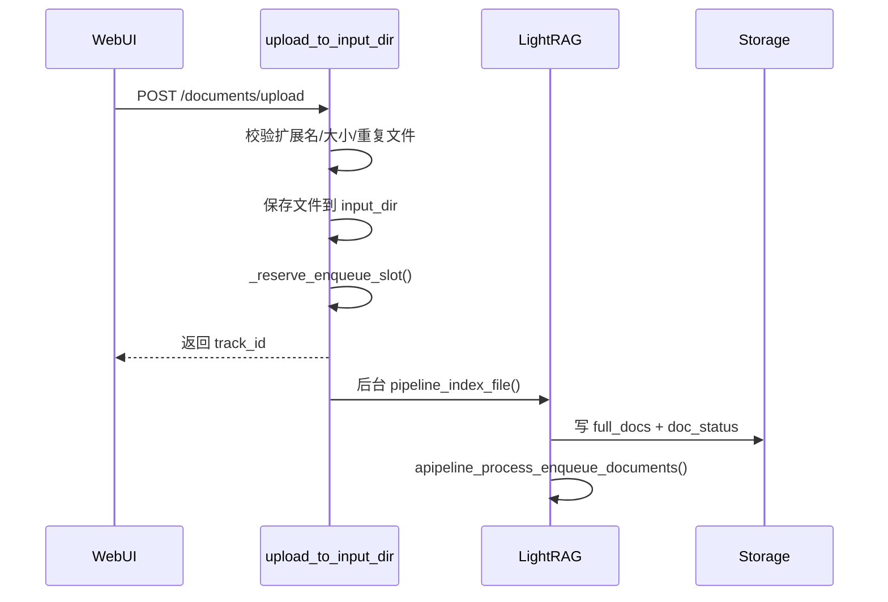
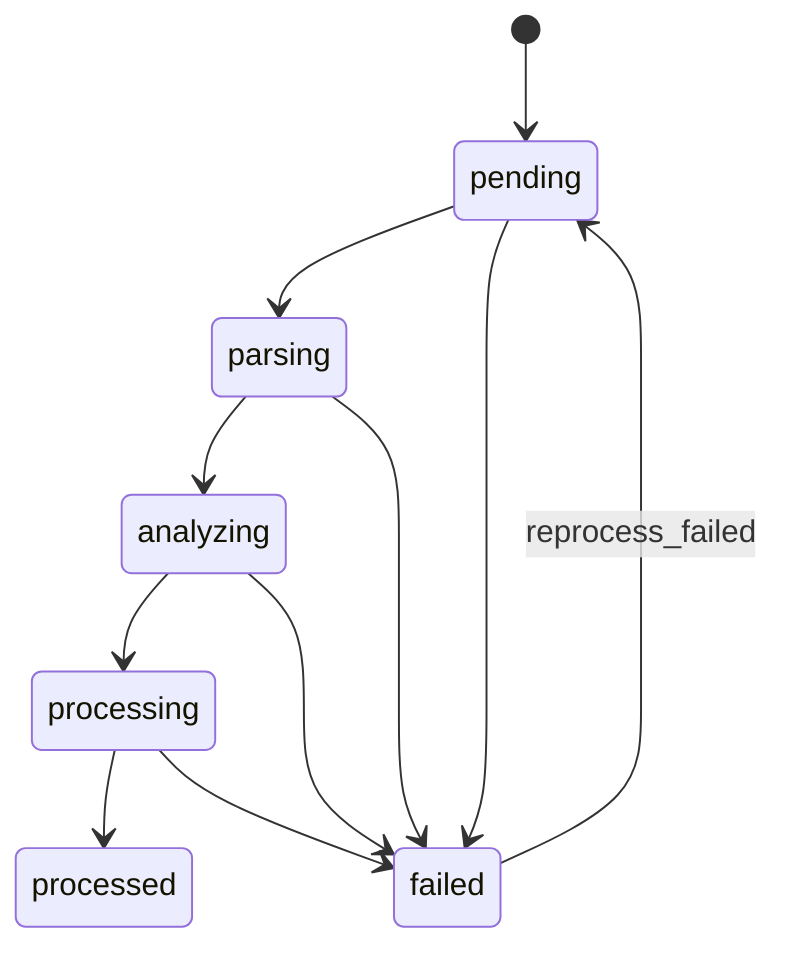
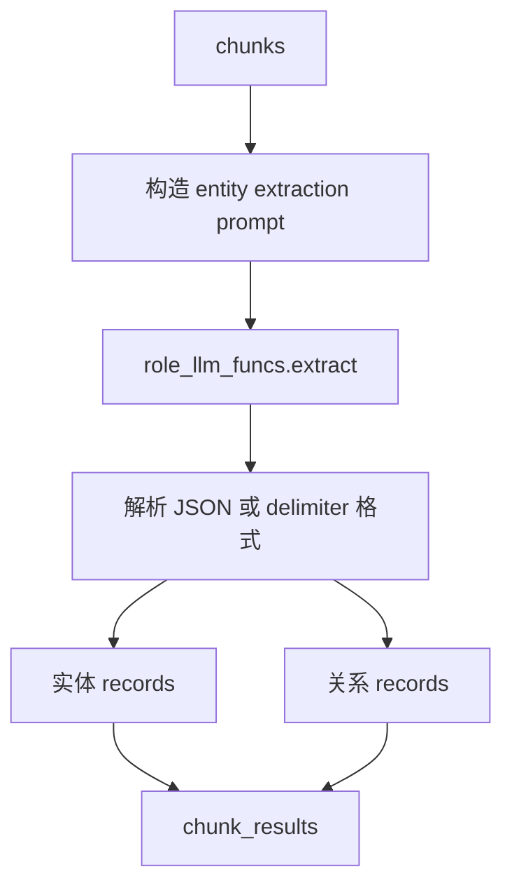
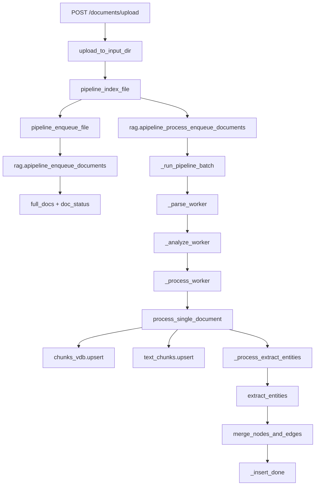

# 07 文档处理与索引流程

## 上传文件后如何进入处理队列

WebUI 上传文件调用 `lightrag_webui/src/api/lightrag.ts::uploadDocument()`，后端 endpoint 是：

```text
POST /documents/upload
```

后端函数：

```python
lightrag/api/routers/document_routes.py::upload_to_input_dir
```

流程：



关键函数：

| 函数 | 作用 |
|---|---|
| `DocumentManager.is_supported_file` | 校验扩展名是否支持。 |
| `_reserve_enqueue_slot` | enqueue 预留，拒绝 `scanning_exclusive` 或 `destructive_busy`。 |
| `pipeline_index_file` | 调用 `pipeline_enqueue_file` 后启动 pipeline。 |
| `pipeline_enqueue_file` | 决定 legacy/native/mineru/docling 解析路径，并调用 `rag.apipeline_enqueue_documents`。 |

## 文档状态如何变化

状态类型在 `document_routes.py::DocStatus` 和 `DocProcessingStatus` 相关结构中体现。



| 状态 | 来源 |
|---|---|
| `pending` | `apipeline_enqueue_documents` 写入待处理状态。 |
| `parsing` | `_parse_worker` 开始解析时更新。 |
| `analyzing` | `_analyze_worker` 开始分析时更新。 |
| `processing` | `process_single_document` 开始 chunk/index 时更新。 |
| `processed` | 索引完成后更新。 |
| `failed` | 任一阶段异常或重复/无内容等失败。 |

`preprocessed` 状态在 API 类型中存在；当前源码扫描未确认它在主流程中作为稳定最终态的全部触发条件，遇到时以 `doc_status` metadata 和日志为准。

## Pipeline 并发控制

共享状态位于 `lightrag.kg.shared_storage` 的 workspace 级 `pipeline_status`。

| 字段 | 作用 |
|---|---|
| `busy` | pipeline 或 destructive job 正在运行。普通 `busy=True` 不一定阻止 enqueue。 |
| `destructive_busy` | 清空或删除文档等破坏性任务进行中，必须拒绝 enqueue。 |
| `scanning` | `/documents/scan` 生命周期中。 |
| `scanning_exclusive` | scan 分类阶段，拒绝并发 enqueue。 |
| `pending_enqueues` | 上传/文本接口已预留但后台任务未完成的数量。 |
| `request_pending` | 处理 loop 的“有新文档”提示。 |

关键源码：

- `document_routes.py::_reserve_enqueue_slot`
- `document_routes.py::_acquire_destructive_busy`
- `pipeline.py::apipeline_enqueue_documents`
- `pipeline.py::apipeline_process_enqueue_documents`

## 文件如何被解析成文本

### Parser 路由

解析路由在 `lightrag/parser/routing.py`：

| 机制 | 说明 |
|---|---|
| `LIGHTRAG_PARSER` | 后缀规则，例如 `pdf:mineru`。 |
| 文件名 hint | 形如 `name.[mineru-it].pdf` 或 `name.[-R].docx`。 |
| `resolve_file_parser_directives` | 解析文件级 parser engine 和 process options。 |
| `validate_parser_routing_config` | Server 启动时校验规则。 |

### Parser engine

| Engine | 函数 | 说明 |
|---|---|---|
| `legacy` | `pipeline_enqueue_file` 内 legacy 提取 | PDF/DOCX/PPTX/XLSX/text 的基础提取。 |
| `native` | `pipeline.py::parse_native` | 当前确认支持 DOCX native parser 和 LightRAG sidecar 内容。 |
| `mineru` | `pipeline.py::parse_mineru` | 外部 MinerU 解析，生成 sidecar 和 LightRAG 内容。 |
| `docling` | `pipeline.py::parse_docling` | 外部 Docling 解析，生成 sidecar 和 LightRAG 内容。 |

`pipeline_enqueue_file()` 中，如果 engine 不是 `legacy`，会先写一个 pending parse 的 full_doc，后续由 `_parse_worker` 解析；legacy 则在 enqueue 阶段直接提取文本。

## 文本如何切 chunk

`process_single_document()` 会根据 `process_options` 决定 chunker：

| process option | 策略 | 函数 |
|---|---|---|
| 无显式 chunk selector | legacy `self.chunking_func` | 默认 `chunking_by_token_size` |
| `F` | fixed token | `chunking_by_fixed_token` |
| `R` | recursive character | `chunking_by_recursive_character` |
| `V` | semantic vector | `chunking_by_semantic_vector` |
| `P` | paragraph semantic | `chunking_by_paragraph_semantic` |

伪代码：

```python
opts = parse_process_options(full_doc["process_options"])
if opts.chunking_explicit:
    chunks = dispatch_file_chunker(opts.chunking, content, chunk_options)
else:
    chunks = self.chunking_func(tokenizer, content, ...)
```

## chunk 如何生成 embedding

`process_single_document()` 会创建 chunk dict，随后：

```python
await self.chunks_vdb.upsert(chunks)
await self.text_chunks.upsert(chunks)
```

默认向量存储 `NanoVectorDBStorage.upsert()`：

1. 读取每个 chunk 的 `content`。
2. 按 `embedding_batch_num` 分批。
3. 调用 `embedding_func(texts, context="document")`。
4. 写入 `vdb_chunks.json`。

`text_chunks` 是 KV Storage，用于保留 chunk 内容和 metadata。

## chunk 如何抽取 entity / relation

入口：

```python
LightRAG._process_extract_entities()
```

调用：

```python
operate.extract_entities()
```

抽取步骤：



如果 `process_options` 包含 `!`，则跳过 KG 抽取，只保留 chunks 和向量。

## entity / relation 如何合并

`operate.merge_nodes_and_edges()` 做三阶段合并：

| 阶段 | 日志 | 主要函数 |
|---|---|---|
| 收集 | `Merging stage` | 收集 chunk_results 中的 nodes/edges。 |
| 实体 | `Phase 1: Processing ... entities` | `_merge_nodes_then_upsert` |
| 关系 | `Phase 2: Processing ... relations` | `_merge_edges_then_upsert` |
| KV 映射 | 更新 full stores | `full_entities_storage`、`full_relations_storage` |

实体合并会处理：

- entity type；
- description 合并与摘要；
- source_id 合并与长度限制；
- file_path 合并；
- graph node upsert；
- entity vector upsert。

关系合并会处理：

- source/target；
- weight 累加；
- keywords 合并；
- description 合并与摘要；
- graph edge upsert；
- relation vector 删除旧 id 后重新 upsert。

## graph / vector / KV 如何写入

| 数据 | 默认存储属性 | 默认本地文件 |
|---|---|---|
| 原文 full docs | `rag.full_docs` | `kv_store_full_docs.json` |
| 文本 chunks | `rag.text_chunks` | `kv_store_text_chunks.json` |
| chunk 向量 | `rag.chunks_vdb` | `vdb_chunks.json` |
| entity 向量 | `rag.entities_vdb` | `vdb_entities.json` |
| relation 向量 | `rag.relationships_vdb` | `vdb_relationships.json` |
| 图结构 | `rag.chunk_entity_relation_graph` | `graph_chunk_entity_relation.graphml` |
| 文档状态 | `rag.doc_status` | `kv_store_doc_status.json` |
| LLM cache | `rag.llm_response_cache` | `kv_store_llm_response_cache.json` |
| entity 详情 | `rag.full_entities` | `kv_store_full_entities.json` |
| relation 详情 | `rag.full_relations` | `kv_store_full_relations.json` |

写盘时机：`LightRAG._insert_done()` 调用所有 storage 的 `index_done_callback()`，默认 JSON/Nano/NetworkX 会持久化到磁盘。

## 失败重试或错误处理机制

| 场景 | 处理 |
|---|---|
| Parser 失败 | `_parse_worker` 捕获异常，更新 `FAILED`。 |
| Analyze 失败 | `_analyze_worker` 捕获异常，更新 `FAILED`。 |
| Process 失败 | `process_single_document` 调用 `_finalize_doc_failure`。 |
| 重复内容 | `_mark_duplicate_after_parse` 可标记失败并删除重复 full_doc。 |
| 手动重试 | `POST /documents/reprocess_failed` 触发重新处理失败文档。 |
| 取消 | `POST /documents/cancel_pipeline` 设置 cancellation flag。 |

建议排查失败时查看：

```bash
curl http://localhost:9621/documents/paginated
curl http://localhost:9621/documents/pipeline_status
tail -n 200 lightrag.log
```

## 日志来源说明

| 日志片段 | 源码位置 | 含义 |
|---|---|---|
| `Chunk extracted` / `Chunk X of Y extracted` | `lightrag/operate.py::extract_entities` | 某个 chunk 的实体/关系抽取完成。 |
| `Merging stage` | `lightrag/operate.py::merge_nodes_and_edges` | 开始合并抽取结果。 |
| `Processing entities` | `merge_nodes_and_edges` | 正在合并实体。 |
| `Processing relations` | `merge_nodes_and_edges` | 正在合并关系。 |
| `Upserting relation VDB` | `lightrag/operate.py::_merge_edges_then_upsert` | 正在写入 relation 向量库。 |
| `Writing graph` | `lightrag/kg/networkx_impl.py::write_nx_graph` | NetworkX GraphML 写盘。 |
| `In memory DB persist to disk` | `lightrag/lightrag.py::_insert_done` | 所有存储的 `index_done_callback()` 已触发。 |

## 完整索引调用链



