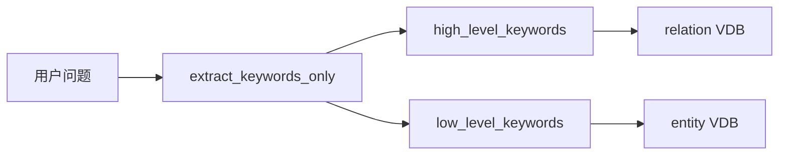
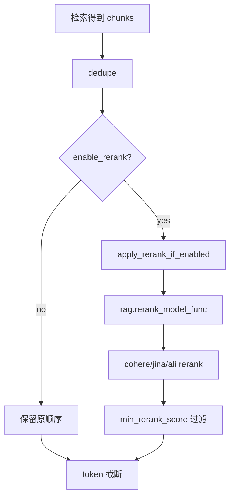
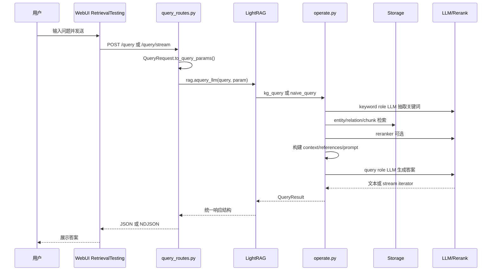

# 08 查询问答流程详解

## WebUI 输入问题后后端如何处理

前端查询页面是：

```text
lightrag_webui/src/features/RetrievalTesting.tsx
```

它根据 `settings.ts` 中的 `querySettings.stream` 选择：

| 前端函数 | 后端 endpoint |
|---|---|
| `queryText(request)` | `POST /query` |
| `queryTextStream(request, onChunk, onError)` | `POST /query/stream` |

后端入口在：

```text
lightrag/api/routers/query_routes.py
```

`QueryRequest.to_query_params()` 把 HTTP 请求转换为 `lightrag/base.py::QueryParam`。

## QueryParam 的主要字段

| 字段 | 说明 |
|---|---|
| `mode` | `local`、`global`、`hybrid`、`naive`、`mix`、`bypass`。 |
| `only_need_context` | 只返回检索上下文，不调用最终 LLM。 |
| `only_need_prompt` | 只返回最终 prompt。 |
| `response_type` | 期望输出格式，例如 multiple paragraphs。 |
| `stream` | 是否流式输出。 |
| `top_k` | KG 检索实体/关系数量。 |
| `chunk_top_k` | chunk 检索/重排后保留数量。 |
| `max_entity_tokens` | entity context token 预算。 |
| `max_relation_tokens` | relation context token 预算。 |
| `max_total_tokens` | 总上下文 token 预算。 |
| `hl_keywords` | 高层关键词；不提供时自动抽取。 |
| `ll_keywords` | 低层关键词；不提供时自动抽取。 |
| `conversation_history` | 对话历史。 |
| `user_prompt` | 用户附加指令。 |
| `enable_rerank` | 是否启用 reranker。 |
| `include_references` | 是否包含 references。 |

前端默认查询配置在 `lightrag_webui/src/stores/settings.ts`，默认 `mode='global'`、`top_k=40`、`chunk_top_k=20`、`stream=true`、`enable_rerank=true`。

## 查询模式说明

| 模式 | 后端函数 | 检索逻辑 |
|---|---|---|
| `local` | `operate.kg_query` | 低层关键词 -> entity VDB -> graph edges -> chunks。 |
| `global` | `operate.kg_query` | 高层关键词 -> relation VDB -> graph nodes -> chunks。 |
| `hybrid` | `operate.kg_query` | local + global 合并。 |
| `mix` | `operate.kg_query` | local/global KG + chunk vector context。 |
| `naive` | `operate.naive_query` | 纯 chunk vector search。 |
| `bypass` | `LightRAG.aquery_llm` 内直接调用 query role LLM | 不检索。 |

## keyword extraction 的作用

`kg_query()` 会调用：

```python
get_keywords_from_query(query, query_param, global_config, hashing_kv)
```

如果用户没有提供 `hl_keywords` / `ll_keywords`，会进入：

```python
extract_keywords_only(...)
```

它使用：

- Prompt：`lightrag/prompt.py::PROMPTS["keywords_extraction"]`
- LLM：`role_llm_funcs["keyword"]`
- Cache：`cache_type="keywords"`

高层关键词用于 global/relation 检索，低层关键词用于 local/entity 检索。



## entity / relation 检索逻辑

核心函数在 `lightrag/operate.py`：

| 函数 | 作用 |
|---|---|
| `_get_node_data` | 用低层关键词查询 `entities_vdb`，再读 graph node 和 degree。 |
| `_find_most_related_edges_from_entities` | 从实体扩展相关关系。 |
| `_find_related_text_unit_from_entities` | 根据 entity 关联 source chunks。 |
| `_get_edge_data` | 用高层关键词查询 `relationships_vdb`，再读 graph edge。 |
| `_find_most_related_entities_from_relationships` | 从关系扩展相关实体。 |
| `_find_related_text_unit_from_relations` | 根据 relation 关联 source chunks。 |
| `_apply_token_truncation` | 按 entity/relation token budget 截断。 |

实体和关系会做去重和 round-robin 合并，避免单一路径垄断上下文。

## vector 检索逻辑

Chunk 向量检索入口：

```python
_get_vector_context(query, chunks_vdb, query_param, ...)
```

使用场景：

| 场景 | 是否使用 chunk vector search |
|---|---|
| `naive` | 是，主路径。 |
| `mix` | 是，和 KG 检索结果合并。 |
| `local/global/hybrid` | 主要通过 entity/relation 的 source chunks 获取上下文，不是纯 query->chunk 检索主路径。 |

默认 `NanoVectorDBStorage.query()` 会对 query 调用 embedding，并按相似度返回 chunks。

## reranker 如何接入

Rerank 在 chunk 合并后、上下文截断前执行：



源码位置：

- `lightrag/utils.py::process_chunks_unified`
- `lightrag/utils.py::apply_rerank_if_enabled`
- `lightrag/rerank.py::cohere_rerank`
- `lightrag/rerank.py::jina_rerank`
- `lightrag/rerank.py::ali_rerank`

如果 `enable_rerank=True` 但未配置 `rerank_model_func`，源码会记录 warning 并使用原始 chunks。

## context 如何拼接

`kg_query()` 调用 `_build_query_context()`，内部流程：

1. `_perform_kg_search()` 检索 entity/relation/vector chunks。
2. `_apply_token_truncation()` 限制 entity/relation。
3. `_merge_all_chunks()` 合并 vector/entity/relation chunks。
4. `_build_context_str()` 计算可用 chunk token budget。
5. `process_chunks_unified()` 去重、rerank、过滤、截断。
6. `generate_reference_list_from_chunks()` 生成 references。
7. 使用 `PROMPTS["kg_query_context"]` 构造上下文文本。

`naive_query()` 使用 `PROMPTS["naive_query_context"]` 和 `PROMPTS["naive_rag_response"]`。

## LLM 如何生成最终答案

`kg_query()` 最终构造：

- system prompt：来自 `PROMPTS["rag_response"]`；
- context：KG + chunk 上下文；
- query：用户问题；
- history：`conversation_history`；
- user prompt：可选附加指令。

调用的是：

```python
global_config["role_llm_funcs"]["query"](...)
```

也就是角色模型中的 `query`。如果配置了 `QUERY_LLM_*`，它可以和抽取模型不同。

## stream 和 non-stream 区别

| 模式 | Endpoint | 返回 |
|---|---|---|
| non-stream | `POST /query` | JSON：`{"response": "...", "references": [...]}` |
| stream | `POST /query/stream` | NDJSON：可能先返回 references，再逐块返回 response。 |

后端 `query_text_stream()` 会判断：

- 如果 LLM 返回 async iterator，则逐块发送。
- 如果 cache 命中或非流式结果，则发送单条 NDJSON。

前端 `queryTextStream()` 在 `lightrag_webui/src/api/lightrag.ts` 中解析流并更新消息。

## 返回结果结构说明

后端 `rag.aquery_llm()` 返回内部结构大致为：

```python
{
    "status": "success" | "failure",
    "message": "...",
    "data": ...,
    "metadata": ...,
    "llm_response": {
        "content": "...",
        "response_iterator": ...,
        "is_streaming": True | False,
    },
}
```

HTTP `/query` 会简化为：

```json
{
  "response": "最终答案",
  "references": []
}
```

`/query/data` 返回 structured data，包括 entities、relationships、chunks、references、metadata 等。字段完整定义见 `lightrag/api/routers/query_routes.py::QueryDataResponse`。

## Mermaid 时序图



## 伪代码：`kg_query`

```python
async def kg_query(query, knowledge_graph_inst, entities_vdb, relationships_vdb, chunks_vdb, ...):
    keywords = await get_keywords_from_query(query, query_param, global_config, hashing_kv)
    context_result = await _build_query_context(
        query=query,
        hl_keywords=keywords.high_level,
        ll_keywords=keywords.low_level,
        mode=query_param.mode,
    )
    if query_param.only_need_context:
        return QueryResult(content=context_result.context)
    prompt = PROMPTS["rag_response"].format(context=context_result.context, ...)
    response = await role_llm_funcs["query"](prompt, stream=query_param.stream, ...)
    return QueryResult(content=response, raw_data=context_result.raw_data)
```

