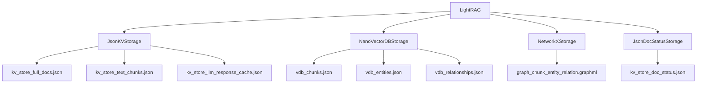
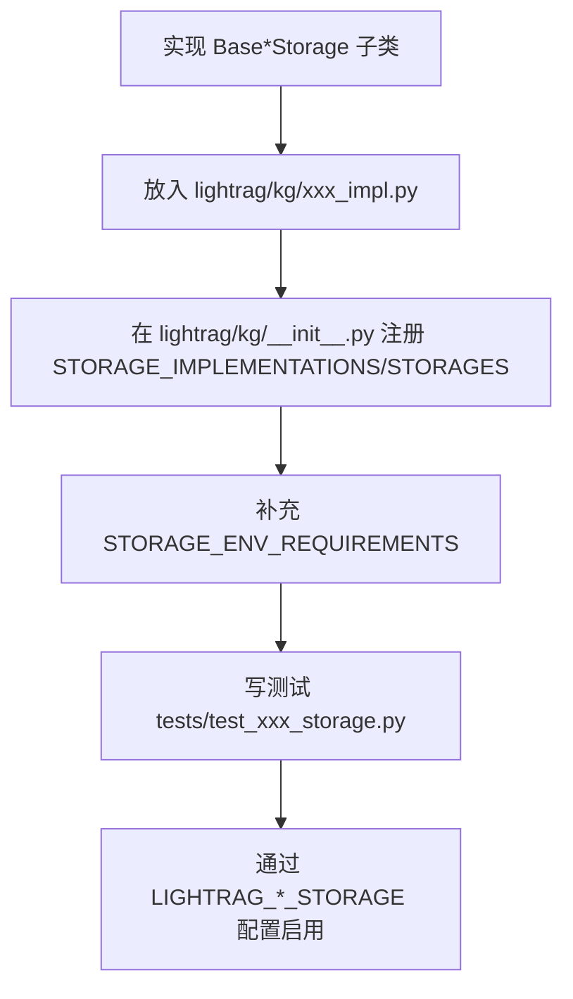

# 09 存储层详解

## 四类存储

LightRAG 使用四类存储抽象，定义在 `lightrag/base.py`：

| 类型 | 抽象类 | 职责 |
|---|---|---|
| KV Storage | `BaseKVStorage` | 保存 full docs、chunks、LLM cache、entity/relation 详情等键值数据。 |
| Vector Storage | `BaseVectorStorage` | 保存 chunks/entities/relationships 的 embedding 并支持相似度查询。 |
| Graph Storage | `BaseGraphStorage` | 保存实体节点和关系边，支持图邻域和知识图谱查询。 |
| Document Status Storage | `DocStatusStorage` | 保存文档处理状态、metadata、track_id、分页查询等。 |

`LightRAG.__post_init__` 会根据配置创建多个 namespace 的存储实例。

## 默认本地存储

默认配置来自 `lightrag/api/config.py::DefaultRAGStorageConfig`：

| 类型 | 默认实现 | 文件 |
|---|---|---|
| KV | `JsonKVStorage` | `kv_store_*.json` |
| Vector | `NanoVectorDBStorage` | `vdb_*.json` |
| Graph | `NetworkXStorage` | `graph_*.graphml` |
| DocStatus | `JsonDocStatusStorage` | `kv_store_doc_status.json` |

默认文件通常位于 `WORKING_DIR`，例如 `./rag_storage` 或 Docker 中 `/app/data/rag_storage`。



## KV Storage

抽象：`lightrag/base.py::BaseKVStorage`

常见 namespace：

| 属性 | 默认文件 |
|---|---|
| `llm_response_cache` | `kv_store_llm_response_cache.json` |
| `text_chunks` | `kv_store_text_chunks.json` |
| `full_docs` | `kv_store_full_docs.json` |
| `full_entities` | `kv_store_full_entities.json` |
| `full_relations` | `kv_store_full_relations.json` |
| `entity_chunks` | `kv_store_entity_chunks.json` |
| `relation_chunks` | `kv_store_relation_chunks.json` |

`JsonKVStorage` 位于 `lightrag/kg/json_kv_impl.py`：

- `upsert()` 更新内存字典并标记 update flag。
- `get_by_id()` / `get_by_ids()` 读取。
- `drop()` 清空。
- `index_done_callback()` 将内存数据写回 JSON 文件。

## Vector Storage

抽象：`lightrag/base.py::BaseVectorStorage`

实例：

| 属性 | 内容 |
|---|---|
| `chunks_vdb` | 文本 chunk embedding。 |
| `entities_vdb` | entity embedding。 |
| `relationships_vdb` | relation embedding。 |

默认 `NanoVectorDBStorage` 位于 `lightrag/kg/nano_vector_db_impl.py`：

- `upsert()` 会调用 `embedding_func(..., context="document")`。
- `query()` 会调用 `embedding_func(..., context="query")` 或使用已传入 query embedding。
- 本地文件名为 `vdb_{namespace}.json`。
- `cosine_better_than_threshold` 来自 `vector_db_storage_cls_kwargs`，Server 中由 `COSINE_THRESHOLD` 注入。

## Graph Storage

抽象：`lightrag/base.py::BaseGraphStorage`

默认 `NetworkXStorage` 位于 `lightrag/kg/networkx_impl.py`：

- 本地文件：`graph_chunk_entity_relation.graphml`。
- 通过 NetworkX 图保存节点和边。
- `write_nx_graph()` 使用临时文件做 atomic write，并记录 `Writing graph with ...` 日志。

关键接口：

| 方法 | 作用 |
|---|---|
| `has_node`、`has_edge` | 判断节点/边存在。 |
| `get_node`、`get_edge` | 读取节点/边属性。 |
| `get_node_edges` | 获取节点邻边。 |
| `upsert_node`、`upsert_edge` | 写节点/边。 |
| `get_knowledge_graph` | 给 API 图谱接口返回子图。 |

## Document Status Storage

抽象：`lightrag/base.py::DocStatusStorage`

默认 `JsonDocStatusStorage` 位于 `lightrag/kg/json_doc_status_impl.py`：

| 方法 | 作用 |
|---|---|
| `upsert` | 写入/更新文档状态。 |
| `get_docs_by_statuses` | 按状态拉取待处理/失败等文档。 |
| `get_docs_by_track_id` | 按 track_id 查询。 |
| `get_docs_paginated` | API 分页查询。 |
| `get_all_status_counts` | 统计各状态数量。 |
| `index_done_callback` | 写回 JSON 文件。 |

默认文件：`kv_store_doc_status.json`。

## 支持的存储后端

注册表在 `lightrag/kg/__init__.py::STORAGE_IMPLEMENTATIONS`。

| 类型 | 支持实现 |
|---|---|
| KV | `JsonKVStorage`、`RedisKVStorage`、`PGKVStorage`、`MongoKVStorage`、`OpenSearchKVStorage` |
| Graph | `NetworkXStorage`、`Neo4JStorage`、`PGGraphStorage`、`MongoGraphStorage`、`MemgraphStorage`、`OpenSearchGraphStorage` |
| Vector | `NanoVectorDBStorage`、`MilvusVectorDBStorage`、`PGVectorStorage`、`FaissVectorDBStorage`、`QdrantVectorDBStorage`、`MongoVectorDBStorage`、`OpenSearchVectorDBStorage` |
| DocStatus | `JsonDocStatusStorage`、`RedisDocStatusStorage`、`PGDocStatusStorage`、`MongoDocStatusStorage`、`OpenSearchDocStatusStorage` |

`lightrag/kg/factory.py::get_storage_class()` 会根据字符串名称加载类。

## PostgreSQL / MongoDB / Neo4j / OpenSearch 等说明

| 后端 | 文件 | 适合用途 |
|---|---|---|
| PostgreSQL | `lightrag/kg/postgres_impl.py` | 一体化持久化 KV/Vector/Graph/DocStatus，适合生产集中存储。源码中表名包括 `LIGHTRAG_DOC_FULL`、`LIGHTRAG_VDB_CHUNKS`、`LIGHTRAG_DOC_STATUS` 等。 |
| MongoDB | `lightrag/kg/mongo_impl.py` | 文档型 KV/Graph/Vector/DocStatus。 |
| Neo4j | `lightrag/kg/neo4j_impl.py` | 专用图数据库。 |
| Memgraph | `lightrag/kg/memgraph_impl.py` | 另一种图数据库后端。 |
| OpenSearch | `lightrag/kg/opensearch_impl.py` | KV、Vector、Graph、DocStatus 都可走 OpenSearch。 |
| Milvus | `lightrag/kg/milvus_impl.py` | 专用向量库。 |
| Qdrant | `lightrag/kg/qdrant_impl.py` | 专用向量库，workspace 使用 payload 隔离。 |
| Faiss | `lightrag/kg/faiss_impl.py` | 本地向量索引。 |
| Redis | `lightrag/kg/redis_impl.py` | KV/DocStatus。 |

## 本地默认存储的数据文件在哪里

以 `WORKING_DIR=./rag_storage` 为例：

```text
rag_storage/
  graph_chunk_entity_relation.graphml
  kv_store_doc_status.json
  kv_store_full_docs.json
  kv_store_text_chunks.json
  kv_store_llm_response_cache.json
  kv_store_full_entities.json
  kv_store_full_relations.json
  kv_store_entity_chunks.json
  kv_store_relation_chunks.json
  vdb_chunks.json
  vdb_entities.json
  vdb_relationships.json
```

如果设置 `WORKSPACE`，不同后端隔离方式不同：

| 后端类型 | workspace 隔离方式 |
|---|---|
| 文件型 | 通常在 `working_dir` 下分目录或文件命名隔离。 |
| collection 型 | collection 名称 prefix。 |
| 关系型 | workspace 列过滤。 |
| Qdrant | payload 分区。 |

具体以各 `lightrag/kg/*_impl.py` 实现为准。

## 什么时候会写盘

默认本地存储多为内存更新、阶段结束写盘：

| 触发点 | 说明 |
|---|---|
| `LightRAG._insert_done()` | 调用所有 storage 的 `index_done_callback()`，日志 `In memory DB persist to disk`。 |
| `JsonKVStorage.index_done_callback()` | 写 JSON。 |
| `JsonDocStatusStorage.index_done_callback()` | 写 doc status JSON。 |
| `NanoVectorDBStorage.index_done_callback()` | 持久化向量 DB。 |
| `NetworkXStorage.index_done_callback()` | 写 GraphML。 |
| Server 关闭 | `finalize_storages()` 关闭存储；是否额外写盘以实现为准。 |

## 如何清空数据重新索引

方式一：API 清空：

```bash
curl -X DELETE http://localhost:9621/documents
```

方式二：停止服务后删除本地工作目录中的索引文件：

```bash
rm rag_storage/vdb_chunks.json
rm rag_storage/vdb_entities.json
rm rag_storage/vdb_relationships.json
rm rag_storage/graph_chunk_entity_relation.graphml
rm rag_storage/kv_store_doc_status.json
rm rag_storage/kv_store_full_docs.json
rm rag_storage/kv_store_text_chunks.json
```

上面是说明用命令，实际操作前请确认目录，避免误删。Embedding 模型变更时建议整体重建索引。

## 更换存储后需要修改哪些配置

示例：切换 PostgreSQL：

```bash
LIGHTRAG_KV_STORAGE=PGKVStorage
LIGHTRAG_VECTOR_STORAGE=PGVectorStorage
LIGHTRAG_GRAPH_STORAGE=PGGraphStorage
LIGHTRAG_DOC_STATUS_STORAGE=PGDocStatusStorage

POSTGRES_HOST=<host>
POSTGRES_PORT=<port>
POSTGRES_USER=<user>
POSTGRES_PASSWORD=<password>
POSTGRES_DATABASE=<database>
POSTGRES_WORKSPACE=<workspace>
```

示例：Neo4j + Milvus + Redis：

```bash
LIGHTRAG_KV_STORAGE=RedisKVStorage
LIGHTRAG_DOC_STATUS_STORAGE=RedisDocStatusStorage
LIGHTRAG_GRAPH_STORAGE=Neo4JStorage
LIGHTRAG_VECTOR_STORAGE=MilvusVectorDBStorage
```

同时配置对应连接变量。具体必填变量由 `lightrag/kg/__init__.py::STORAGE_ENV_REQUIREMENTS` 定义。

## 新增存储后端的最小步骤



