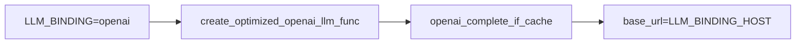
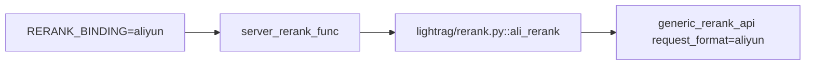
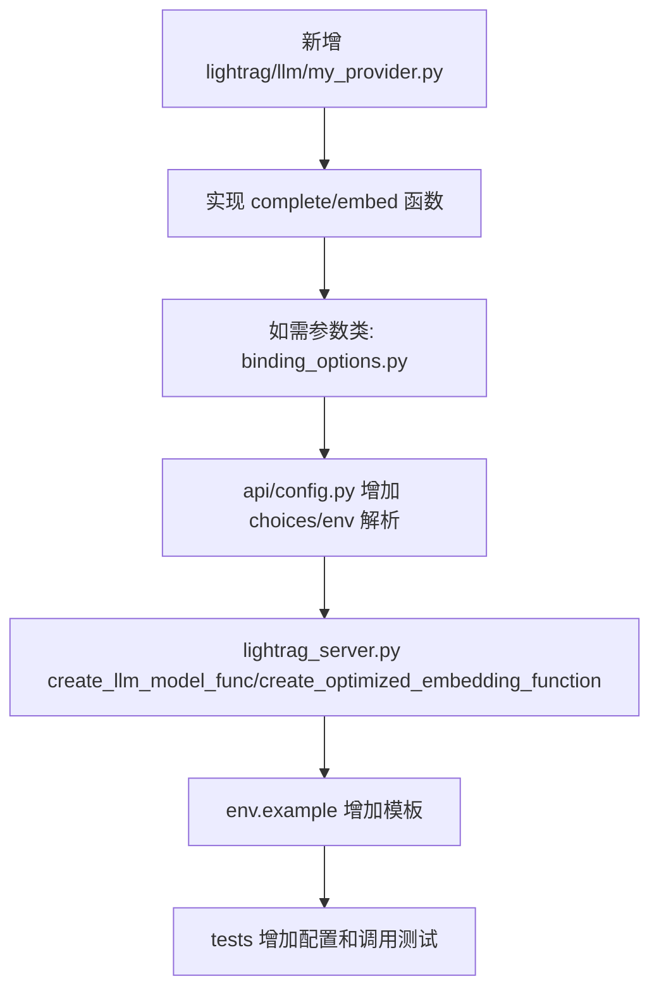

# 10 LLM Embedding Reranker 集成详解

## LLM provider 抽象在哪里

模型 Provider 的代码主要在 `lightrag/llm/`。

| 文件 | 主要函数 |
|---|---|
| `lightrag/llm/openai.py` | `openai_complete_if_cache`、`openai_complete`、`gpt_4o_complete`、`gpt_4o_mini_complete`、`openai_embed`、`azure_openai_complete_if_cache`、`azure_openai_embed` |
| `lightrag/llm/ollama.py` | `_ollama_model_if_cache`、`ollama_model_complete`、`ollama_embed` |
| `lightrag/llm/gemini.py` | `gemini_complete_if_cache`、`gemini_model_complete`、`gemini_embed` |
| `lightrag/llm/bedrock.py` | `bedrock_complete_if_cache`、`bedrock_complete`、`bedrock_embed` |
| `lightrag/llm/jina.py` | `jina_embed` |
| `lightrag/llm/voyageai.py` | `voyageai_embed` |
| `lightrag/llm/lollms.py` | `lollms_model_if_cache`、`lollms_model_complete`、`lollms_embed` |
| `lightrag/llm/hf.py` | `hf_model_complete`、`hf_embed` |
| `lightrag/llm/zhipu.py` | `zhipu_complete_if_cache`、`zhipu_embedding` |
| `lightrag/llm/nvidia_openai.py` | `nvidia_openai_embed` |
| `lightrag/llm/lmdeploy.py`、`llama_index_impl.py` | 本地/框架集成。 |

Server 直接暴露的 binding choices 以 `lightrag/api/config.py` 为准；`lightrag/llm/` 中存在的模块不等于 Server 都提供 `.env` 级一键 binding。

## OpenAI-compatible 调用在哪里

OpenAI-compatible 主入口：

```python
lightrag/llm/openai.py::openai_complete_if_cache
lightrag/llm/openai.py::openai_embed
```

Server 中构造函数：

```python
lightrag/api/lightrag_server.py::create_optimized_openai_llm_func
lightrag/api/lightrag_server.py::create_optimized_embedding_function
```

OpenAI-compatible 适合：

- OpenAI 官方；
- DashScope/百炼 OpenAI-compatible；
- DeepSeek OpenAI-compatible；
- vLLM OpenAI-compatible；
- LiteLLM proxy。

配置示例：

```bash
LLM_BINDING=openai
LLM_MODEL=<chat model>
LLM_BINDING_HOST=<openai-compatible base url>
LLM_BINDING_API_KEY=<api key>

EMBEDDING_BINDING=openai
EMBEDDING_MODEL=<embedding model>
EMBEDDING_BINDING_HOST=<openai-compatible base url>
EMBEDDING_BINDING_API_KEY=<api key>
EMBEDDING_DIM=<dimension>
```

## Ollama 调用在哪里

Ollama 文件：

```text
lightrag/llm/ollama.py
```

关键函数：

| 函数 | 用途 |
|---|---|
| `_ollama_model_if_cache` | 带缓存逻辑的底层 Ollama 调用。 |
| `ollama_model_complete` | LLM complete wrapper。 |
| `ollama_embed` | Embedding wrapper，带 `@wrap_embedding_func_with_attrs`。 |

Server 构造：

- `create_llm_model_func("ollama")` 返回 `ollama_model_complete`。
- `create_llm_model_kwargs("ollama")` 传入 `host`、`timeout`、`options`、`api_key`。
- `create_optimized_embedding_function("ollama", ...)` 调用 `ollama_embed.func`，避免二次 wrapper。

## Azure / Gemini / Bedrock 等说明

| Provider | Server binding | 关键源码 |
|---|---|---|
| Azure OpenAI | `azure_openai` | `lightrag/llm/azure_openai.py` 重导出 `openai.py` 中 Azure 函数；Server 使用 `azure_openai_complete_if_cache`、`azure_openai_embed`。 |
| Gemini | `gemini` | `lightrag/llm/gemini.py::gemini_complete_if_cache`、`gemini_embed`。 |
| Bedrock | `bedrock` | `lightrag/llm/bedrock.py::bedrock_complete_if_cache`、`bedrock_embed`；认证依赖 AWS region/key/session token 或运行环境。 |
| Lollms | `lollms` | `lightrag/llm/lollms.py`。 |
| Jina | embedding binding | `lightrag/llm/jina.py::jina_embed`。 |
| VoyageAI | embedding binding | `lightrag/llm/voyageai.py::voyageai_embed`。 |

Anthropic 模块在 `lightrag/llm/anthropic.py` 中存在，但当前 Server binding choices 扫描中未确认 `LLM_BINDING=anthropic` 是直接支持项。

## Embedding provider 抽象在哪里

Embedding 函数由 `lightrag.utils.EmbeddingFunc` 包装。Provider 函数通常用：

```python
@wrap_embedding_func_with_attrs(embedding_dim=..., max_token_size=...)
async def provider_embed(texts: list[str]) -> np.ndarray:
    ...
```

重要注意：

如果 provider 函数已经是 `EmbeddingFunc`，自定义再包装时要用 `.func` 取底层函数，避免二次包装。多个示例都写了这个注释，例如 `examples/lightrag_ollama_demo.py`。

## Reranker provider 抽象在哪里

Reranker 在：

```text
lightrag/rerank.py
```

| 函数 | Provider |
|---|---|
| `generic_rerank_api` | 通用 HTTP rerank 请求逻辑。 |
| `cohere_rerank` | Cohere 风格接口，支持 chunking。 |
| `jina_rerank` | Jina 风格接口。 |
| `ali_rerank` | Aliyun/DashScope 风格接口。 |
| `chunk_documents_for_rerank` | 长文档切块。 |
| `aggregate_chunk_scores` | chunk score 汇总回原始文档。 |

Server 中 `RERANK_BINDING != "null"` 时会创建：

```python
async def server_rerank_func(query, documents, top_n=None, extra_body=None):
    return await selected_rerank_func(...)
```

然后传入：

```python
LightRAG(rerank_model_func=server_rerank_func)
```

## DashScope / 阿里云百炼配置如何对应源码

### Chat/Embedding OpenAI-compatible

走 `openai` binding：

```bash
LLM_BINDING=openai
LLM_BINDING_HOST=https://dashscope.aliyuncs.com/compatible-mode/v1
LLM_MODEL=<qwen chat model>
LLM_BINDING_API_KEY=<DashScope API Key>
```

源码调用链：



Embedding 同理走 `openai_embed`，但必须设置正确 `EMBEDDING_DIM`。

### Rerank

走 `aliyun` binding：

```bash
RERANK_BINDING=aliyun
RERANK_MODEL=gte-rerank-v2
RERANK_BINDING_HOST=https://dashscope.aliyuncs.com/api/v1/services/rerank/text-rerank/text-rerank
RERANK_BINDING_API_KEY=<DashScope API Key>
```

源码调用链：



## LLM、Embedding、Reranker 分别在哪些流程被调用

| 类型 | 调用场景 | 源码 |
|---|---|---|
| LLM extract | chunk entity/relation 抽取 | `operate.extract_entities` -> `role_llm_funcs["extract"]` |
| LLM keyword | 查询关键词抽取 | `operate.extract_keywords_only` -> `role_llm_funcs["keyword"]` |
| LLM query | 最终答案生成 | `operate.kg_query` / `naive_query` -> `role_llm_funcs["query"]` |
| LLM summary | entity/relation 描述过长时摘要 | `operate._handle_entity_relation_summary` 相关逻辑 |
| VLM | 多模态分析 | `pipeline.analyze_multimodal`，使用 `role_llm_funcs["vlm"]` |
| Embedding document | chunks/entities/relations upsert | Vector Storage `upsert()` |
| Embedding query | vector query | Vector Storage `query()` |
| Reranker | chunks 排序和过滤 | `utils.process_chunks_unified` -> `apply_rerank_if_enabled` |

## Role-specific LLM 配置详解

角色注册在 `lightrag/llm_roles.py`：

```python
ROLES = (
    RoleSpec("extract", "EXTRACT", "extract LLM func"),
    RoleSpec("keyword", "KEYWORD", "keyword LLM func"),
    RoleSpec("query", "QUERY", "query LLM func"),
    RoleSpec("vlm", "VLM", "vlm LLM func"),
)
```

`RoleLLMConfig` 字段：

| 字段 | 说明 |
|---|---|
| `func` | 该角色原始 LLM 函数。 |
| `kwargs` | 该角色模型参数。 |
| `max_async` | 该角色并发。 |
| `timeout` | 该角色超时。 |
| `metadata` | binding/model/host/provider_options 等观测和热更新信息，敏感字段会 scrub。 |

`_RoleLLMMixin._wrap_llm_role_func()` 会使用 `priority_limit_async_func_call` 给每个角色单独队列。

## 如何新增一个自定义模型 provider

### 直接嵌入 Core 的最小方式

如果不需要 Server `.env` 一键配置，可以直接传函数：

```python
async def my_llm(prompt, system_prompt=None, history_messages=None, **kwargs):
    ...

async def my_embed(texts: list[str]):
    ...

rag = LightRAG(
    working_dir="./rag_storage",
    llm_model_func=my_llm,
    embedding_func=EmbeddingFunc(
        embedding_dim=1024,
        max_token_size=8192,
        func=my_embed,
    ),
)
```

### 接入 Server 配置体系



必须注意：

- complete 函数签名要兼容 `prompt`、`system_prompt`、`history_messages`、`**kwargs`。
- 如果支持 streaming，返回类型要和现有 `openai_complete_if_cache` 类似。
- Embedding 返回 `np.ndarray`，维度必须与 `EmbeddingFunc.embedding_dim` 一致。
- 不要在日志中输出真实 API Key。

## LLM cache 与 provider 的关系

角色 LLM wrapper 会注入：

```python
hashing_kv=self.llm_response_cache
```

Provider 函数如 `openai_complete_if_cache` 会利用这个 KV cache。不同角色、模型、prompt、参数需要区分 cache identity，相关测试包括 `tests/test_llm_cache_identity.py`、`tests/test_utils_llm_cache.py`。

