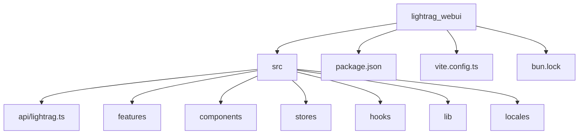
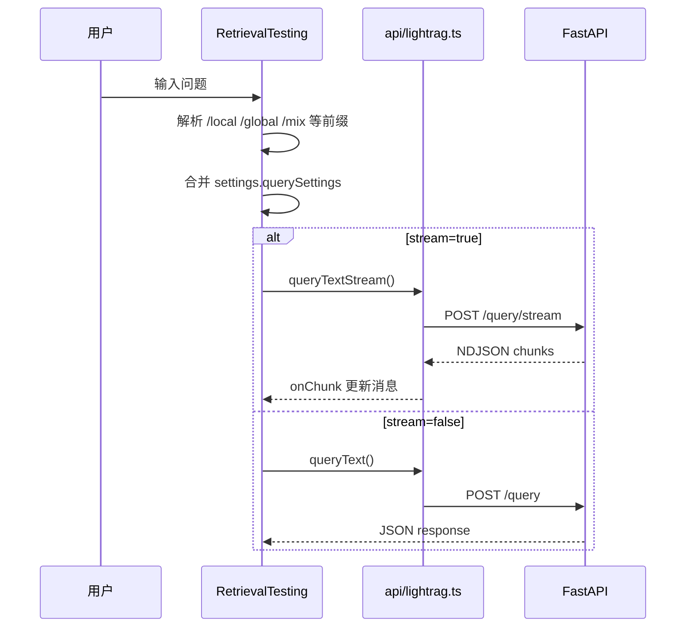
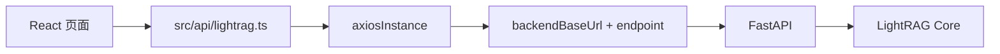

# 11 WebUI 前端结构详解

## 前端技术栈

`lightrag_webui/package.json` 确认的主要技术栈：

| 类别 | 技术 |
|---|---|
| 框架 | React 19、React DOM |
| 构建 | Vite、Bun |
| 语言 | TypeScript |
| 样式 | Tailwind CSS、tailwindcss-animate、tailwind-scrollbar |
| 状态 | Zustand |
| 路由 | `react-router-dom`，使用 `HashRouter` |
| 请求 | Axios |
| 图谱 | Sigma、Graphology、`@react-sigma/*` |
| Markdown/数学 | `react-markdown`、remark-gfm、remark-math、rehype-katex、mermaid |
| i18n | i18next、react-i18next |
| UI 基础 | Radix UI、lucide-react、sonner |
| 测试 | Bun 内置测试 runner |

## lightrag_webui 目录结构



| 路径 | 作用 |
|---|---|
| `src/main.tsx` | React 应用入口。 |
| `src/AppRouter.tsx` | `HashRouter`、登录保护、初始化认证状态。 |
| `src/App.tsx` | 主布局和 Tabs。 |
| `src/features/` | 页面级组件。 |
| `src/components/` | 通用组件和业务组件。 |
| `src/api/lightrag.ts` | 后端 API 类型和请求封装。 |
| `src/stores/settings.ts` | 用户设置和查询参数，persist key 为 `settings-storage`。 |
| `src/stores/state.ts` | 后端健康状态、认证状态。 |
| `src/stores/graph.ts` | 图谱状态。 |
| `src/lib/runtimeConfig.ts` | 读取后端注入的 API/WebUI prefix。 |
| `src/lib/pathPrefix.ts` | prefix 规范化。 |
| `src/locales/*.json` | 多语言文案。 |

## 页面路由

`src/AppRouter.tsx` 使用 `HashRouter`：

| 路由 | 组件 |
|---|---|
| `#/login` | `features/LoginPage.tsx` |
| `#/*` | 登录后进入 `App.tsx` |

`App.tsx` 中用 Tabs 控制主页面，不是传统 URL path 多页面：

| Tab value | 组件 | 功能 |
|---|---|---|
| `documents` | `DocumentManager` | 文档管理、上传、扫描、状态。 |
| `knowledge-graph` | `GraphViewer` | 图谱可视化。 |
| `retrieval` | `RetrievalTesting` | 检索问答。 |
| `api` | `ApiSite` | API 文档/入口。 |

## API 请求封装

核心文件：

```text
lightrag_webui/src/api/lightrag.ts
```

重要内容：

| 类型/函数 | 说明 |
|---|---|
| `QueryRequest`、`QueryResponse` | 查询请求/响应类型。 |
| `LightragStatus` | `/health` 返回结构。 |
| `DocStatusResponse`、`PaginatedDocsResponse` | 文档状态和分页类型。 |
| `axiosInstance` | Axios 实例，统一认证和错误处理。 |
| `checkHealth` | `GET /health`。 |
| `uploadDocument`、`batchUploadDocuments` | 上传文件。 |
| `insertText`、`insertTexts` | 插入文本。 |
| `scanNewDocuments` | `POST /documents/scan`。 |
| `getDocumentsPaginated` | `POST /documents/paginated`。 |
| `queryText` | `POST /query`。 |
| `queryTextStream` | `POST /query/stream`。 |
| `queryGraphs`、`getGraphLabels` | 图谱接口。 |
| `loginToServer`、`getAuthStatus` | 登录和认证状态。 |

`backendBaseUrl` 来自 `src/lib/constants.ts`，它读取 `runtimeConfig.ts` 中的 `apiPrefix`。

## 文档上传页面

页面组件：

```text
lightrag_webui/src/features/DocumentManager.tsx
```

相关组件：

| 组件 | 作用 |
|---|---|
| `components/documents/UploadDocumentsDialog` | 文件上传弹窗。 |
| `components/documents/ClearDocumentsDialog` | 清空文档确认。 |
| `components/documents/DeleteDocumentsDialog` | 删除文档确认。 |
| `components/documents/PipelineStatusDialog` | pipeline 状态展示。 |

主要后端接口：

- `scanNewDocuments()` -> `POST /documents/scan`
- `uploadDocument()` / `batchUploadDocuments()` -> `POST /documents/upload`
- `getDocumentsPaginated()` -> `POST /documents/paginated`
- `getDocumentStatusCounts()` -> `GET /documents/status_counts`
- `clearDocuments()` -> `DELETE /documents`
- `deleteDocuments()` -> `DELETE /documents/delete_document`

页面会根据 `/health` 的 `pipeline_active` 和文档状态计数调整轮询频率。

## 查询页面

页面组件：

```text
lightrag_webui/src/features/RetrievalTesting.tsx
```

相关组件：

| 组件 | 作用 |
|---|---|
| `components/retrieval/QuerySettings` | 查询参数设置。 |
| `components/retrieval/ChatMessage` | 展示消息、thinking、markdown、references。 |

流程：



## 图谱页面

页面组件：

```text
lightrag_webui/src/features/GraphViewer.tsx
```

图谱数据 hook：

```text
lightrag_webui/src/hooks/useLightragGraph.tsx
```

主要后端接口：

| 前端函数 | Endpoint |
|---|---|
| `queryGraphs(label, maxDepth, maxNodes)` | `GET /graphs` |
| `getGraphLabels()` | `GET /graph/label/list` |
| `getPopularLabels()` | `GET /graph/label/popular` |
| `searchLabels()` | `GET /graph/label/search` |

图谱渲染使用 Graphology 构造图对象，再交给 Sigma 相关组件渲染。

## 配置页面

当前源码中未确认存在独立“配置页面”路由。配置相关 UI 主要分散在：

| 文件 | 说明 |
|---|---|
| `components/AppSettings.tsx` | 应用设置。 |
| `components/retrieval/QuerySettings` | 查询参数设置。 |
| `components/graph/Settings` | 图谱显示和布局设置。 |
| `stores/settings.ts` | 这些设置的状态持久化。 |

后端运行配置主要通过 `.env` 和 `/health` 展示，不由 WebUI 直接持久写回 `.env`。

## 前端如何和后端交互



认证：

- token 存在 `localStorage` 的 `LIGHTRAG-API-TOKEN`。
- API Key 可存在 settings store 的 `apiKey`。
- `state.ts` 会解析 JWT payload 获取 username、role、exp。

## 前端构建产物如何被后端挂载

构建：

```bash
cd lightrag_webui
bun run build
```

输出：

```text
lightrag/api/webui/
```

后端：

- `WEBUI_PATH = "/webui"`
- `SmartStaticFiles` 对 HTML 禁用缓存，对 hash assets 加 long cache。
- 对 `index.html` 注入 runtime config。

## 如果要修改前端页面，从哪些文件开始

| 目标 | 入口文件 |
|---|---|
| 改文档列表/上传 | `src/features/DocumentManager.tsx`、`src/components/documents/*` |
| 改查询体验 | `src/features/RetrievalTesting.tsx`、`src/components/retrieval/*`、`src/stores/settings.ts` |
| 改图谱 | `src/features/GraphViewer.tsx`、`src/hooks/useLightragGraph.tsx`、`src/components/graph/*`、`src/stores/graph.ts` |
| 新增 API 调用 | `src/api/lightrag.ts` |
| 新增 Tab 页面 | `src/App.tsx`、`src/features/SiteHeader.tsx` |
| 改主题/样式 | `src/index.css`、`tailwind.config.js`、相关组件 className |
| 改多语言 | `src/locales/*.json`、`src/i18n.ts` |

修改前端后建议运行：

```bash
cd lightrag_webui
bun run lint
bun test
bun run build
```

