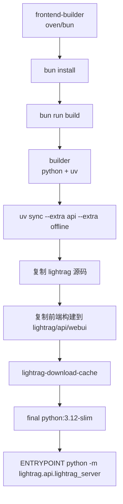
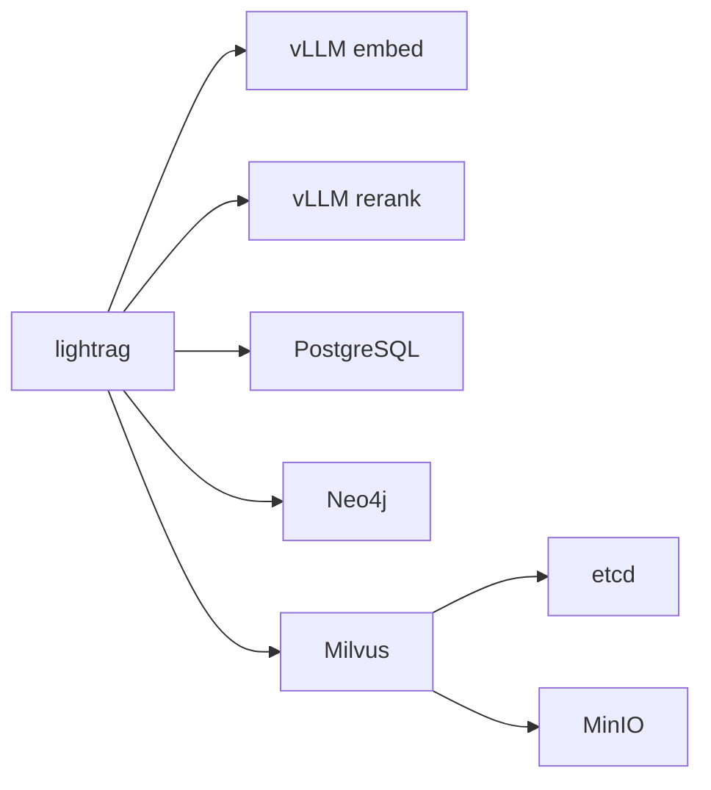

# 12 Docker 与部署详解

## Docker Compose 结构

基础文件：

```text
docker-compose.yml
```

服务：

| 服务 | 说明 |
|---|---|
| `lightrag` | LightRAG API Server + WebUI。 |

关键配置：

| 项 | 内容 |
|---|---|
| image | `ghcr.io/hkuds/lightrag:latest` |
| build | `Dockerfile` |
| ports | `${HOST:-0.0.0.0}:${PORT:-9621}:9621` |
| volumes | `./data/rag_storage:/app/data/rag_storage`、`./data/inputs:/app/data/inputs`、`./data/prompts:/app/data/prompts`、`./.env:/app/.env` |
| env | `WORKING_DIR=/app/data/rag_storage`、`INPUT_DIR=/app/data/inputs`、`PROMPT_DIR=/app/data/prompts` |
| command | `["python", "-m", "lightrag.api.lightrag_server"]` |
| extra_hosts | `host.docker.internal:host-gateway` |

## 镜像构建逻辑

`Dockerfile` 是多阶段构建：



`Dockerfile.lite` 类似，但安装较少 extras，适合不需要所有 offline provider/storage 依赖的镜像。

## 容器中的服务

基础 compose 只有 LightRAG 单服务。完整 compose：

```text
docker-compose-full.yml
```

包含：

| 服务 | 作用 |
|---|---|
| `lightrag` | API Server + WebUI。 |
| vLLM embedding 服务 | 提供 OpenAI-compatible embedding。 |
| vLLM rerank 服务 | 提供 rerank endpoint。 |
| `postgres` | PostgreSQL 存储。 |
| `neo4j` | 图数据库。 |
| `milvus` | 向量数据库。 |
| `etcd`、`minio` | Milvus 依赖。 |

完整 compose 更适合本地集成验证或完整自托管部署；生产环境建议根据实际选型拆分和加固。

## 环境变量如何传入

基础 compose 通过两种方式：

1. 挂载 `./.env:/app/.env`。
2. 在 compose `environment` 中显式设置路径相关变量。

`lightrag/api/lightrag_server.py` 会 `load_dotenv(".env", override=False)`，因此容器已有环境变量优先级高于 `.env` 文件。

不要把真实 `.env` COPY 到镜像里。compose 挂载或运行时 secret 注入更安全。

## 数据卷如何挂载

| 宿主路径 | 容器路径 | 作用 |
|---|---|---|
| `./data/rag_storage` | `/app/data/rag_storage` | 索引、KV、向量、图谱数据。 |
| `./data/inputs` | `/app/data/inputs` | 上传/扫描文件。 |
| `./data/prompts` | `/app/data/prompts` | 自定义 Prompt profile。 |
| `./.env` | `/app/.env` | 运行配置。 |

如果不挂载数据卷，容器重建后索引数据会丢失。

## WebUI 和 API 端口

| 服务 | 默认地址 |
|---|---|
| API | `http://localhost:9621` |
| WebUI | `http://localhost:9621/webui/` |
| Swagger | `http://localhost:9621/docs` |

修改端口：

```bash
PORT=18080
docker compose up -d
```

或写入 `.env`。

## 本地部署和服务器部署区别

| 方面 | 本地 | 服务器/生产 |
|---|---|---|
| 监听地址 | `localhost` 或 `0.0.0.0` | 通常容器内 `0.0.0.0`，外部由反向代理暴露。 |
| 认证 | 可 guest | 应配置 `AUTH_ACCOUNTS` 或 `LIGHTRAG_API_KEY`。 |
| HTTPS | 可不启用 | 建议由 Nginx/Caddy/Ingress 终止 TLS。 |
| 数据 | 本地 volume | 持久化卷或外部数据库。 |
| 模型 | 本地 Ollama/vLLM 或云 API | 通常走云 API、私有模型服务或集群内服务。 |
| 日志 | 本地文件/compose logs | 集中日志、轮转、审计。 |

## 生产环境部署注意事项

1. 配置强 `TOKEN_SECRET`。
2. 不开放无认证的 WebUI。
3. 不把 `.env` 和密钥打进镜像。
4. 为 `data/rag_storage`、数据库、向量库做备份。
5. 固定模型和 embedding 维度，避免误切换。
6. 配置 `CORS_ORIGINS`。
7. 使用反向代理处理 HTTPS、路径前缀、访问控制。
8. 控制上传大小 `MAX_UPLOAD_SIZE`。
9. 配置日志轮转 `LOG_MAX_BYTES`、`LOG_BACKUP_COUNT`。
10. 多 worker/Gunicorn 前先确认共享存储和并发语义。

## 如何避免把 API Key 打进镜像

错误方式：

```dockerfile
# 不要这样做
COPY .env /app/.env
ENV LLM_BINDING_API_KEY=真实密钥
```

推荐方式：

| 方式 | 说明 |
|---|---|
| compose volume | `./.env:/app/.env`，`.env` 不提交。 |
| compose env | 在部署平台 secret 管理中注入环境变量。 |
| Kubernetes Secret | 通过 Secret/ExternalSecret 注入。 |
| 云平台 Secret | 由平台在运行时注入。 |

## 如何更新代码和重新部署

源码部署：

```bash
git pull
uv sync --extra api
cd lightrag_webui
bun install --frozen-lockfile
bun run build
cd ..
lightrag-server
```

Docker 部署：

```bash
git pull
docker compose build lightrag
docker compose up -d
docker compose logs -f lightrag
```

如果使用远程镜像：

```bash
docker compose pull
docker compose up -d
```

升级前建议备份：

```bash
tar czf lightrag-data-backup.tgz data/
```

## docker-compose-full 的典型链路



容器内部服务名会作为 host 使用，例如 `postgres`、`neo4j`、`milvus`、`vllm-embed`、`vllm-rerank`。

