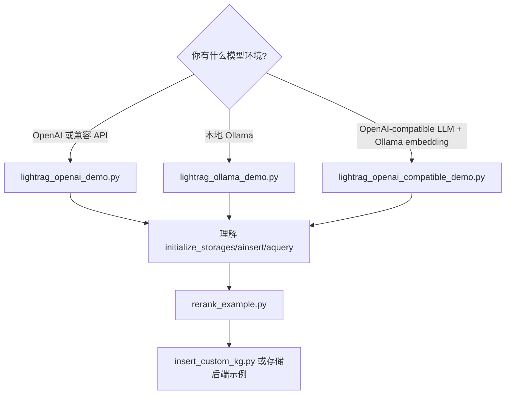

# 13 Examples 示例代码解读

## examples 目录概览

`examples/` 主要用于展示 Core 方式使用 LightRAG，不一定都适合作为生产模板。初学者建议先跑最小依赖的示例，再看外部存储和多模型示例。

| 示例 | 作用 |
|---|---|
| `lightrag_openai_demo.py` | OpenAI LLM + OpenAI Embedding 基础示例。 |
| `lightrag_openai_compatible_demo.py` | OpenAI-compatible LLM + Ollama Embedding。 |
| `lightrag_ollama_demo.py` | Ollama 本地 LLM + Embedding。 |
| `lightrag_gemini_demo.py` | Gemini LLM + Embedding。 |
| `lightrag_azure_openai_demo.py` | Azure OpenAI LLM/Embedding。 |
| `lightrag_vllm_demo.py` | vLLM embedding + Jina-compatible rerank。 |
| `rerank_example.py` | 自定义 rerank 函数接入。 |
| `insert_custom_kg.py` | 直接插入自定义知识图谱。 |
| `generate_query.py` | 查询生成相关示例，当前扫描未逐行确认全部细节。 |
| `graph_visual_with_html.py` | 从 GraphML/JSON 生成图谱可视化 HTML。 |
| `graph_visual_with_neo4j.py` | Neo4j 图谱可视化。 |
| `graph_visual_with_opensearch.py` | OpenSearch 图谱可视化。 |
| `milvus_kwargs_configuration_demo.py` | 通过 `vector_db_storage_cls_kwargs` 配置 Milvus index 参数。 |
| `opensearch_storage_demo.py` | OpenSearch 四类存储集成测试/演示。 |

## 推荐初学者先跑哪个示例



## OpenAI 示例

文件：

```text
examples/lightrag_openai_demo.py
```

关键点：

| 代码 | 说明 |
|---|---|
| `from lightrag.llm.openai import gpt_4o_mini_complete, openai_embed` | 使用内置 OpenAI Provider。 |
| `LightRAG(working_dir=WORKING_DIR, embedding_func=openai_embed, llm_model_func=gpt_4o_mini_complete)` | 最小 Core 初始化。 |
| `await rag.initialize_storages()` | 必须调用。 |
| `await rag.ainsert(f.read())` | 插入 `book.txt` 内容。 |
| `await rag.aquery(..., QueryParam(mode="naive/local/global/hybrid"))` | 演示不同查询模式。 |
| `await rag.finalize_storages()` | 清理存储。 |

示例会清理旧数据文件，包括 `graph_chunk_entity_relation.graphml`、`kv_store_doc_status.json`、`vdb_chunks.json` 等。

## OpenAI-compatible 示例

文件：

```text
examples/lightrag_openai_compatible_demo.py
```

关键点：

- LLM 使用 `openai_complete_if_cache`，模型名、host、key 来自环境变量。
- Embedding 使用 Ollama 的 `ollama_embed.func` 包装为 `EmbeddingFunc`。
- 演示 streaming 查询。

关键代码形态：

```python
async def llm_model_func(prompt, system_prompt=None, history_messages=[], **kwargs):
    return await openai_complete_if_cache(
        os.getenv("LLM_MODEL", "deepseek-chat"),
        prompt,
        base_url=os.getenv("LLM_BINDING_HOST", "..."),
        api_key=os.getenv("LLM_BINDING_API_KEY") or os.getenv("OPENAI_API_KEY"),
        **kwargs,
    )
```

适合接入 DashScope、DeepSeek、vLLM、LiteLLM 等 OpenAI-compatible 服务。

## Ollama 示例

文件：

```text
examples/lightrag_ollama_demo.py
```

关键参数：

| 参数 | 说明 |
|---|---|
| `llm_model_func=ollama_model_complete` | 使用 Ollama LLM。 |
| `llm_model_name=os.getenv("LLM_MODEL", "qwen2.5-coder:7b")` | LLM 模型名。 |
| `llm_model_kwargs["host"]` | Ollama host，默认 `http://localhost:11434`。 |
| `llm_model_kwargs["options"]["num_ctx"]` | 上下文窗口。 |
| `EmbeddingFunc(... func=partial(ollama_embed.func, ...))` | 包装 Ollama embedding。 |

适合完全本地模型验证。

## 本地模型和第三方示例

| 示例 | 场景 |
|---|---|
| `examples/unofficial-sample/lightrag_hf_demo.py` | HuggingFace 本地/远程模型。 |
| `examples/unofficial-sample/lightrag_lmdeploy_demo.py` | LMDeploy。 |
| `examples/unofficial-sample/lightrag_nvidia_demo.py` | NVIDIA OpenAI-compatible 或 embedding。 |
| `examples/unofficial-sample/lightrag_cloudflare_demo.py` | Cloudflare Workers AI。 |
| `examples/unofficial-sample/lightrag_llamaindex_direct_demo.py` | LlamaIndex direct。 |
| `examples/unofficial-sample/lightrag_llamaindex_litellm_demo.py` | LlamaIndex + LiteLLM。 |
| `examples/unofficial-sample/lightrag_bedrock_demo.py` | AWS Bedrock。 |

这些在 `unofficial-sample` 下，建议作为参考而不是生产默认模板。

## API 调用示例

仓库中直接 REST API 示例未逐个读取完整内容；已确认 API Server 文档在：

```text
docs/LightRAG-API-Server.md
docs/LightRAG-API-Server-zh.md
```

常见 REST 调用：

```bash
curl -X POST http://localhost:9621/documents/text \
  -H "Content-Type: application/json" \
  -d '{"text":"测试文本","file_source":"demo.txt"}'

curl -X POST http://localhost:9621/query \
  -H "Content-Type: application/json" \
  -d '{"query":"总结文档内容","mode":"hybrid"}'
```

如果启用了认证，需要加 `Authorization: Bearer <token>` 或 `X-API-Key: <key>`。

## Rerank 示例

文件：

```text
examples/rerank_example.py
```

关键点：

| 代码 | 说明 |
|---|---|
| `from lightrag.rerank import cohere_rerank` | 使用 Cohere 风格 rerank API。 |
| `rerank_model_func = partial(cohere_rerank, ...)` | 构造 rerank 函数。 |
| `LightRAG(..., rerank_model_func=rerank_model_func)` | 传给 Core。 |
| `QueryParam(enable_rerank=True/False)` | 按查询控制是否 rerank。 |

## 自定义知识图谱示例

文件：

```text
examples/insert_custom_kg.py
```

它演示：

- 构造 `custom_kg`；
- 调用 `rag.insert_custom_kg(custom_kg)`；
- 直接写入实体、关系、chunks。

适合已有结构化三元组/图谱数据的场景，不需要从原始文本中抽取。

## 外部存储示例

| 示例 | 说明 |
|---|---|
| `lightrag_gemini_postgres_demo.py` | Gemini + PostgreSQL 四类存储。 |
| `lightrag_openai_mongodb_graph_demo.py` | OpenAI + MongoDB graph。 |
| `lightrag_openai_opensearch_graph_demo.py` | OpenAI + OpenSearch 存储。 |
| `milvus_kwargs_configuration_demo.py` | Milvus index 参数。 |
| `opensearch_storage_demo.py` | 直接测试 OpenSearch KV/Vector/Graph/DocStatus。 |

## 示例代码中的关键参数

| 参数 | 解释 |
|---|---|
| `working_dir` | 本地数据目录。 |
| `llm_model_func` | LLM 完成函数。 |
| `llm_model_name` | 模型名，影响日志/cache identity/Provider 调用。 |
| `llm_model_kwargs` | Provider 参数，如 Ollama host/options。 |
| `embedding_func` | `EmbeddingFunc` 或带属性的 embedding 函数。 |
| `embedding_dim` | 向量维度，必须准确。 |
| `max_token_size` | embedding 最大 token。 |
| `rerank_model_func` | 可选 rerank 函数。 |
| `QueryParam(mode=...)` | 查询模式。 |

## 示例运行注意

1. 多数示例假设当前目录存在 `book.txt`，当前源码中未确认该文件一定存在。
2. 多数示例会删除 `WORKING_DIR` 下旧索引文件，运行前确认目录不是你的重要数据。
3. 示例中出现的默认模型名不代表你本地或账号一定可用。
4. 不要把真实 API Key 写入示例文件；使用环境变量。

