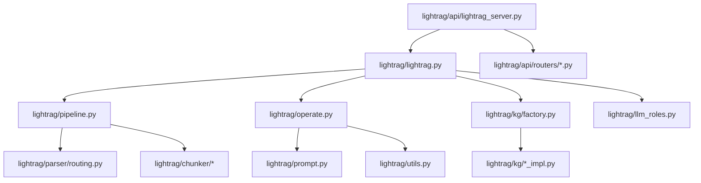

# 14 关键源码逐文件解读

## 总体依赖关系

## Core 相关文件

| 文件 | 职责 | 关键类/函数 |
|---|---|---|
| `lightrag/lightrag.py` | `LightRAG` 主类，存储实例化、初始化、插入、查询、删除、图谱编辑。 | `LightRAG`、`__post_init__`、`initialize_storages`、`ainsert`、`aquery_llm`、`aquery_data`、`_insert_done`、`_process_extract_entities`、`ainsert_custom_kg` |
| `lightrag/base.py` | 核心数据结构和抽象接口。 | `QueryParam`、`QueryResult`、`BaseKVStorage`、`BaseVectorStorage`、`BaseGraphStorage`、`DocStatusStorage` |
| `lightrag/operate.py` | 抽取、合并、查询的主要算法实现。 | `extract_entities`、`merge_nodes_and_edges`、`kg_query`、`naive_query`、`extract_keywords_only`、`_perform_kg_search` |
| `lightrag/pipeline.py` | 文档处理 pipeline。 | `_PipelineMixin`、`apipeline_enqueue_documents`、`apipeline_process_enqueue_documents`、`process_single_document`、`parse_native`、`parse_mineru`、`parse_docling` |
| `lightrag/utils_pipeline.py` | pipeline 纯工具函数。 | 文档 ID、content hash、source key、artifact path、payload normalization |
| `lightrag/addon_params.py` | 可观察 addon 参数和默认参数。 | `ObservableAddonParams`、`default_addon_params`、`normalize_addon_params` |
| `lightrag/storage_migrations.py` | 存储迁移。 | `_StorageMigrationMixin`、`check_and_migrate_data` |

## API Server 相关文件

| 文件 | 职责 | 关键类/函数 |
|---|---|---|
| `lightrag/api/lightrag_server.py` | Server 主入口和 app 装配。 | `main`、`create_app`、`create_optimized_openai_llm_func`、`create_optimized_embedding_function`、`SmartStaticFiles` |
| `lightrag/api/config.py` | CLI/env 配置解析。 | `parse_args`、`DefaultRAGStorageConfig`、`get_default_host`、`validate_auth_configuration` |
| `lightrag/api/utils_api.py` | API 认证和环境检查。 | `check_env_file`、`get_combined_auth_dependency` |
| `lightrag/api/auth.py` | JWT/账号认证。 | `AuthHandler` 等 |
| `lightrag/api/run_with_gunicorn.py` | Gunicorn 启动。 | `main` |
| `lightrag/api/gunicorn_config.py` | Gunicorn 配置和 lifecycle hook。 | `on_starting`、`on_exit`、`post_fork` |

## Router 文件

| 文件 | 职责 | 关键入口 |
|---|---|---|
| `lightrag/api/routers/document_routes.py` | 文档上传、文本插入、扫描、状态、删除、pipeline 控制。 | `create_document_routes`、`DocumentManager`、`pipeline_enqueue_file`、`pipeline_index_texts`、`run_scanning_process` |
| `lightrag/api/routers/query_routes.py` | 查询接口。 | `QueryRequest`、`query_text`、`query_text_stream`、`query_data` |
| `lightrag/api/routers/graph_routes.py` | 图谱接口。 | `get_knowledge_graph`、`update_entity`、`update_relation`、`create_entity`、`merge_entities` |
| `lightrag/api/routers/ollama_api.py` | Ollama-compatible API。 | `OllamaAPI`、`parse_query_mode`、`generate`、`chat` |

## 存储相关文件

| 文件 | 职责 |
|---|---|
| `lightrag/kg/__init__.py` | 注册所有 storage implementations 和环境变量依赖。 |
| `lightrag/kg/factory.py` | 根据名字解析 storage class。 |
| `lightrag/kg/json_kv_impl.py` | 默认 KV JSON 存储。 |
| `lightrag/kg/json_doc_status_impl.py` | 默认 DocStatus JSON 存储。 |
| `lightrag/kg/nano_vector_db_impl.py` | 默认本地向量存储。 |
| `lightrag/kg/networkx_impl.py` | 默认本地图存储。 |
| `lightrag/kg/postgres_impl.py` | PostgreSQL KV/Vector/Graph/DocStatus。 |
| `lightrag/kg/mongo_impl.py` | MongoDB KV/Vector/Graph/DocStatus。 |
| `lightrag/kg/opensearch_impl.py` | OpenSearch KV/Vector/Graph/DocStatus。 |
| `lightrag/kg/neo4j_impl.py` | Neo4j Graph。 |
| `lightrag/kg/milvus_impl.py` | Milvus Vector。 |
| `lightrag/kg/qdrant_impl.py` | Qdrant Vector。 |
| `lightrag/kg/faiss_impl.py` | Faiss Vector。 |
| `lightrag/kg/shared_storage.py` | workspace 共享状态和 pipeline status。 |

## 模型相关文件

| 文件 | 职责 |
|---|---|
| `lightrag/llm_roles.py` | 角色 LLM registry、`RoleLLMConfig`、队列包装、热更新。 |
| `lightrag/llm/openai.py` | OpenAI-compatible LLM/Embedding、Azure wrapper。 |
| `lightrag/llm/ollama.py` | Ollama。 |
| `lightrag/llm/gemini.py` | Gemini。 |
| `lightrag/llm/bedrock.py` | Bedrock。 |
| `lightrag/llm/binding_options.py` | Provider 参数类和 env/CLI 自动注册。 |
| `lightrag/rerank.py` | Cohere/Jina/Aliyun rerank。 |

## Parser / Chunker / Prompt

| 文件 | 职责 |
|---|---|
| `lightrag/parser/routing.py` | Parser engine 和 process options 路由。 |
| `lightrag/parser/cli.py` | Parser debug CLI。 |
| `lightrag/parser/debug.py` | 离线 LightRAG stub。 |
| `lightrag/parser/docx/*` | native DOCX parser。 |
| `lightrag/parser/external/*` | MinerU/Docling 外部解析辅助。 |
| `lightrag/chunker/token_size.py` | token-size/fixed chunker。 |
| `lightrag/chunker/recursive_character.py` | recursive character chunker。 |
| `lightrag/chunker/semantic_vector.py` | semantic vector chunker。 |
| `lightrag/chunker/paragraph_semantic.py` | paragraph semantic chunker。 |
| `lightrag/prompt.py` | 文本抽取、关键词、RAG 回答 Prompt。 |
| `lightrag/prompt_multimodal.py` | 多模态 Prompt。 |

## WebUI 关键文件

| 文件 | 职责 |
|---|---|
| `lightrag_webui/src/AppRouter.tsx` | Router 和登录保护。 |
| `lightrag_webui/src/App.tsx` | 主 tabs 布局。 |
| `lightrag_webui/src/api/lightrag.ts` | API 请求封装。 |
| `lightrag_webui/src/features/DocumentManager.tsx` | 文档管理。 |
| `lightrag_webui/src/features/RetrievalTesting.tsx` | 查询页面。 |
| `lightrag_webui/src/features/GraphViewer.tsx` | 图谱页面。 |
| `lightrag_webui/src/stores/settings.ts` | 用户设置持久化。 |
| `lightrag_webui/src/stores/state.ts` | 后端健康和认证状态。 |
| `lightrag_webui/vite.config.ts` | 构建输出、dev proxy、runtime config 注入。 |

## 适合二次开发优先阅读的文件

| 优先级 | 文件 | 原因 |
|---|---|---|
| 1 | `lightrag/lightrag.py` | 公共 API 和存储装配中心。 |
| 2 | `lightrag/base.py` | 参数和抽象定义。 |
| 3 | `lightrag/pipeline.py` | 文档入库和索引主流程。 |
| 4 | `lightrag/operate.py` | 抽取、检索、上下文、LLM 生成核心。 |
| 5 | `lightrag/api/routers/*.py` | 外部 API 行为。 |
| 6 | `lightrag/api/lightrag_server.py` | Server 配置到 Core 的装配。 |
| 7 | `lightrag_webui/src/api/lightrag.ts` | 前后端契约。 |

## 一般不需要先改的底层文件

| 文件/目录 | 原因 |
|---|---|
| `lightrag/kg/*_impl.py` | 除非新增/修复存储后端，否则先通过配置使用。 |
| `lightrag/llm/*` | 除非接新 Provider，否则先用已有 binding。 |
| `lightrag/parser/docx/*` | native DOCX parser 细节复杂，修改前先读测试。 |
| `lightrag/api/auth.py` | 认证安全敏感，改动要配测试。 |
| `lightrag/kg/shared_storage.py` | pipeline 并发共享状态敏感。 |

## 关键参数索引

| 参数/类 | 文件 | 说明 |
|---|---|---|
| `QueryParam` | `lightrag/base.py` | 查询参数。 |
| `RoleLLMConfig` | `lightrag/llm_roles.py` | 角色模型配置。 |
| `ProcessOptions` | `lightrag/parser/routing.py` | 文件处理选项。 |
| `EmbeddingFunc` | `lightrag/utils.py` | Embedding 函数包装。 |
| `DefaultRAGStorageConfig` | `lightrag/api/config.py` | 默认存储。 |
| `STORAGE_IMPLEMENTATIONS` | `lightrag/kg/__init__.py` | 存储实现注册。 |

