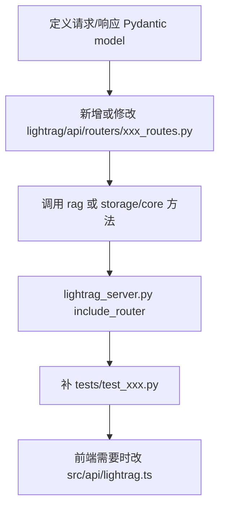

# 15 二次开发指南

## 新增一个 API 应该改哪里

推荐新增 router，而不是把所有逻辑塞进 `lightrag_server.py`。

步骤：



适合参考：

- 文档接口：`lightrag/api/routers/document_routes.py`
- 查询接口：`lightrag/api/routers/query_routes.py`
- 图谱接口：`lightrag/api/routers/graph_routes.py`

如果 API 会修改索引或删除数据，要遵守 pipeline 并发契约，参考 `_reserve_enqueue_slot()` 和 `_acquire_destructive_busy()`。

## 新增一个文档解析方式应该改哪里

相关文件：

| 文件 | 作用 |
|---|---|
| `lightrag/parser/routing.py` | 注册 engine、后缀能力、endpoint requirement、filename hint。 |
| `lightrag/pipeline.py` | 增加 `parse_xxx()` 和 `_parse_worker` 分派。 |
| `lightrag/parser/external/` 或新子目录 | 放 parser adapter。 |
| `lightrag/constants.py` | 如果需要新增 engine 常量或 process option。 |
| `docs/FileProcessingPipeline-zh.md` | 更新用户文档。 |
| `tests/parser/` | 增加 parser 测试。 |

设计建议：

- Parser 输出尽量归一到 full doc content + sidecar。
- 外部服务 endpoint/token 用 env 配置，不要写死。
- 解析失败要写入 `FAILED` 状态和清晰 error。

## 新增一个存储后端应该改哪里

步骤：

1. 在 `lightrag/kg/xxx_impl.py` 实现对应抽象类。
2. 在 `lightrag/kg/__init__.py` 的 `STORAGE_IMPLEMENTATIONS` 和 `STORAGES` 注册。
3. 在 `STORAGE_ENV_REQUIREMENTS` 写必需环境变量。
4. 必要时修改 `env.example`。
5. 增加测试，例如 `tests/test_xxx_storage.py`。

要实现的接口以 `lightrag/base.py` 为准：

| 类型 | 抽象 |
|---|---|
| KV | `BaseKVStorage` |
| Vector | `BaseVectorStorage` |
| Graph | `BaseGraphStorage` |
| DocStatus | `DocStatusStorage` |

## 新增一个 LLM provider 应该改哪里

直接 Core 使用：只需传入自定义 `llm_model_func` 和 `EmbeddingFunc`。

Server 级支持：

| 文件 | 修改 |
|---|---|
| `lightrag/llm/my_provider.py` | 实现 complete/embed。 |
| `lightrag/llm/binding_options.py` | 增加 Provider 参数类。 |
| `lightrag/api/config.py` | 增加 choices、env、默认 host。 |
| `lightrag/api/lightrag_server.py` | 在 `create_llm_model_func` 和/或 `create_optimized_embedding_function` 分支接入。 |
| `env.example` | 增加配置模板。 |
| `tests/` | 增加配置解析和最小调用测试。 |

函数签名建议兼容：

```python
async def my_complete(prompt, system_prompt=None, history_messages=None, **kwargs):
    ...
```

Embedding 返回：

```python
np.ndarray  # shape = (len(texts), embedding_dim)
```

## 修改文档切分策略应该改哪里

| 目标 | 文件 |
|---|---|
| 改默认 fixed token | `lightrag/chunker/token_size.py` |
| 改 recursive character | `lightrag/chunker/recursive_character.py` |
| 改 semantic vector | `lightrag/chunker/semantic_vector.py` |
| 改 paragraph semantic | `lightrag/chunker/paragraph_semantic.py` |
| 改策略选择/参数快照 | `lightrag/parser/routing.py` |
| 改 pipeline 调用 | `lightrag/pipeline.py::process_single_document` |
| 改配置模板 | `env.example` |

测试参考：

- `tests/test_chunking.py`
- `tests/test_chunker_recursive_character.py`
- `tests/test_chunker_semantic_vector.py`
- `tests/test_paragraph_semantic_*.py`

## 修改 Prompt 应该改哪里

默认 Prompt：

```text
lightrag/prompt.py
lightrag/prompt_multimodal.py
```

实体抽取 Prompt profile 支持外部文件：

| 配置 | 作用 |
|---|---|
| `PROMPT_DIR` | prompt 文件目录。 |
| `ENTITY_TYPE_PROMPT_FILE` | 实体类型/抽取 prompt profile 文件。 |
| `ENTITY_EXTRACTION_USE_JSON` | JSON 抽取模式。 |

如果只是调优实体类型或示例，优先使用外部 prompt profile，而不是直接改源码默认 Prompt。

## 修改 WebUI 页面应该改哪里

| 目标 | 文件 |
|---|---|
| 新增 Tab | `lightrag_webui/src/App.tsx`、`features/SiteHeader.tsx` |
| 新增 API 类型和请求 | `lightrag_webui/src/api/lightrag.ts` |
| 文档页面 | `features/DocumentManager.tsx`、`components/documents/*` |
| 查询页面 | `features/RetrievalTesting.tsx`、`components/retrieval/*` |
| 图谱页面 | `features/GraphViewer.tsx`、`hooks/useLightragGraph.tsx`、`components/graph/*` |
| 全局状态 | `stores/settings.ts`、`stores/state.ts`、`stores/graph.ts` |
| 多语言 | `locales/*.json` |

构建后端可挂载产物：

```bash
cd lightrag_webui
bun run build
```

## 集成到自己的系统：API 还是嵌入 Core

| 方式 | 优点 | 缺点 | 适合 |
|---|---|---|---|
| REST API | 语言无关、部署独立、有 WebUI/Swagger、可复用认证 | 多一层服务和网络调用 | 业务系统集成、团队部署 |
| 直接嵌入 Core | 调用更灵活、少一层 HTTP、易做 Python 内部定制 | 需要自己管理生命周期、并发和配置 | Python 服务内部集成、研究实验 |

嵌入 Core 时必须：

```python
await rag.initialize_storages()
...
await rag.finalize_storages()
```

## 二次开发推荐分支策略

1. 从上游同步分支创建 feature 分支。
2. 每次只改一个方向：API、Core、Storage、Provider、WebUI 分开。
3. 不把 `.env`、运行数据、`uv.lock` 的无关改动混入功能提交。
4. 先写最小测试，再做大重构。
5. 如果仓库是 `HKUDS/LightRAG` 的 fork，创建 PR 时目标应指向上游 `HKUDS/LightRAG`。

## 不建议随便改的核心模块

| 模块 | 原因 |
|---|---|
| `pipeline_status` 并发语义 | 影响上传、扫描、删除并发安全。 |
| `LightRAG.__post_init__` 存储装配 | 改错会导致所有存储或角色 LLM 失效。 |
| `operate.merge_nodes_and_edges` | 影响实体/关系合并、图谱一致性、向量一致性。 |
| `base.py` 抽象类 | 影响所有存储实现。 |
| `llm_roles.py` 队列包装 | 影响所有 LLM 调用并发、超时、热更新。 |
| `api/auth.py` | 安全敏感。 |

## 建议的开发验证命令

```bash
ruff check .
./scripts/test.sh tests
cd lightrag_webui && bun run lint && bun test && bun run build
```

如果只改某一部分，先跑对应测试文件，例如：

```bash
./scripts/test.sh tests/test_query_data_endpoint.py
./scripts/test.sh tests/test_json_doc_status_storage.py
./scripts/test.sh tests/parser
```

