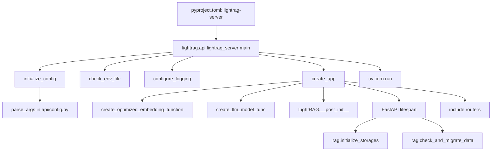
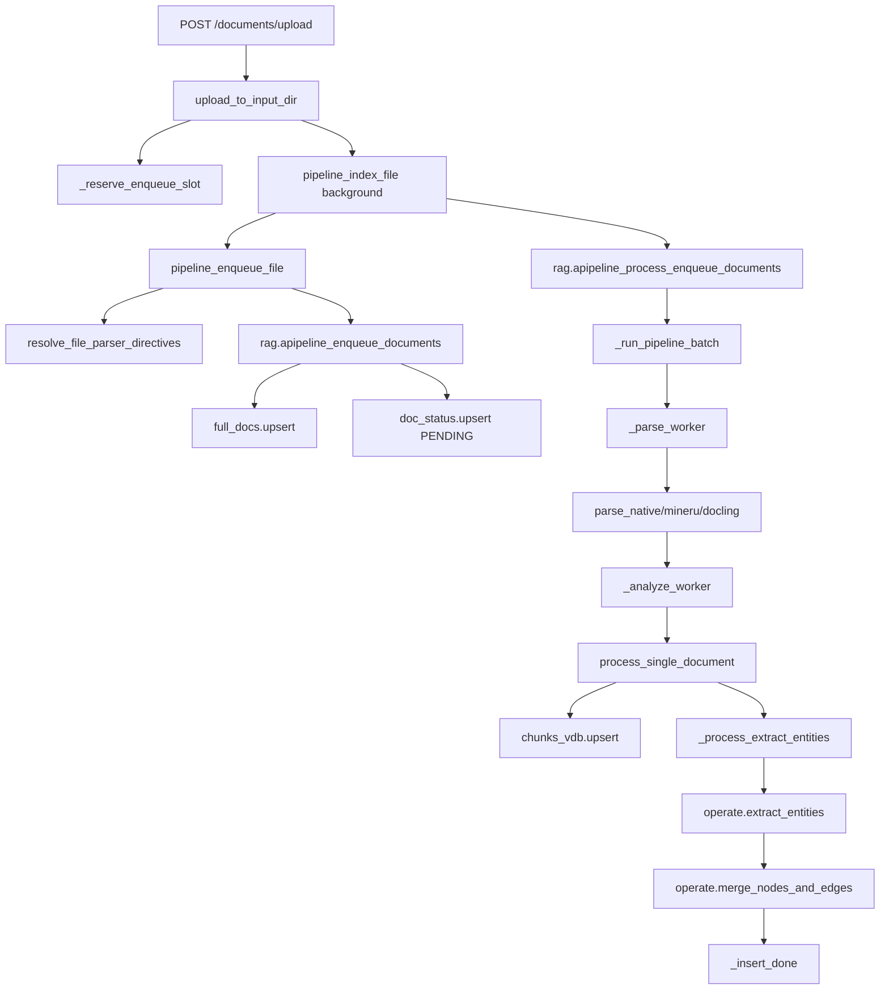
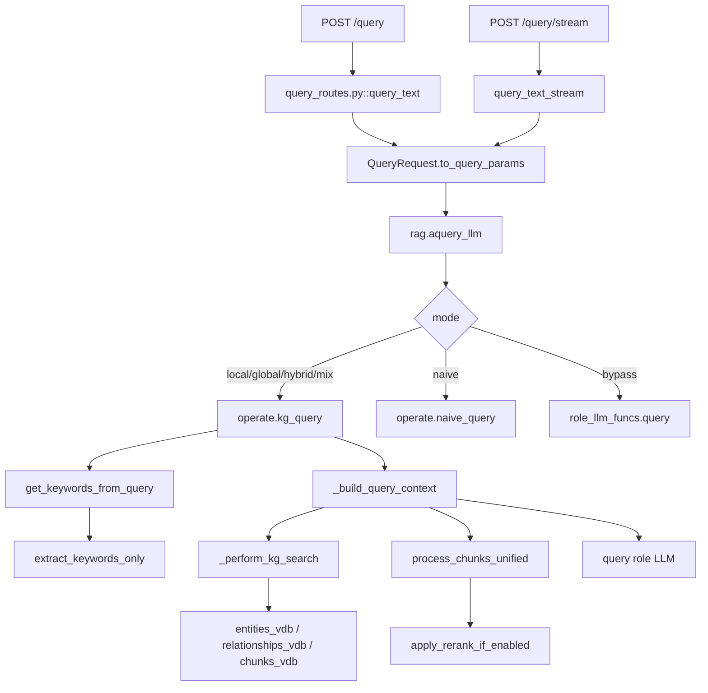
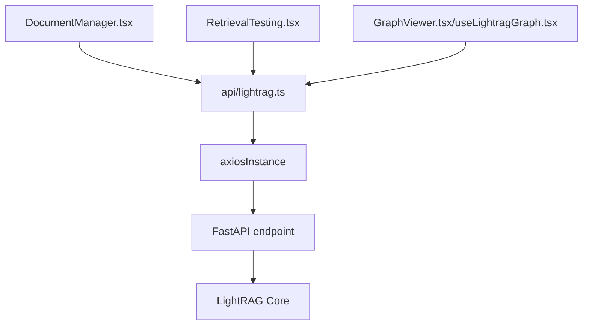
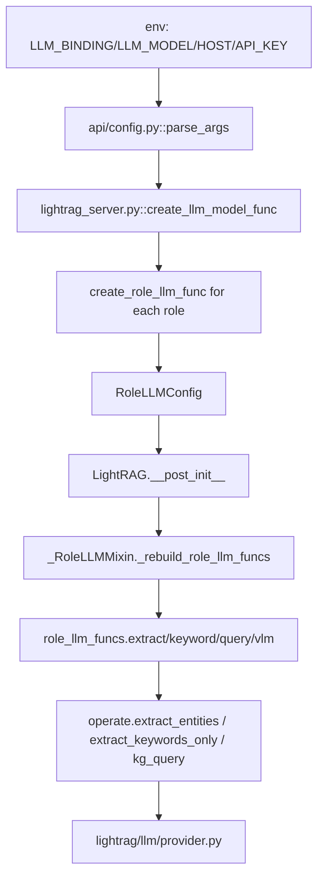
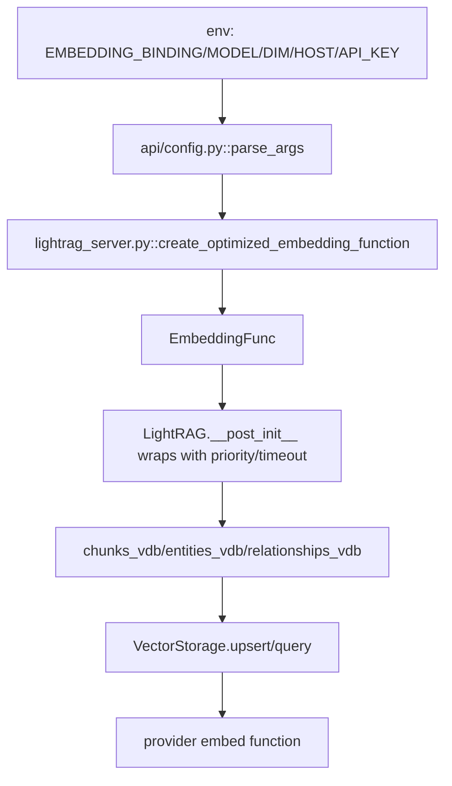
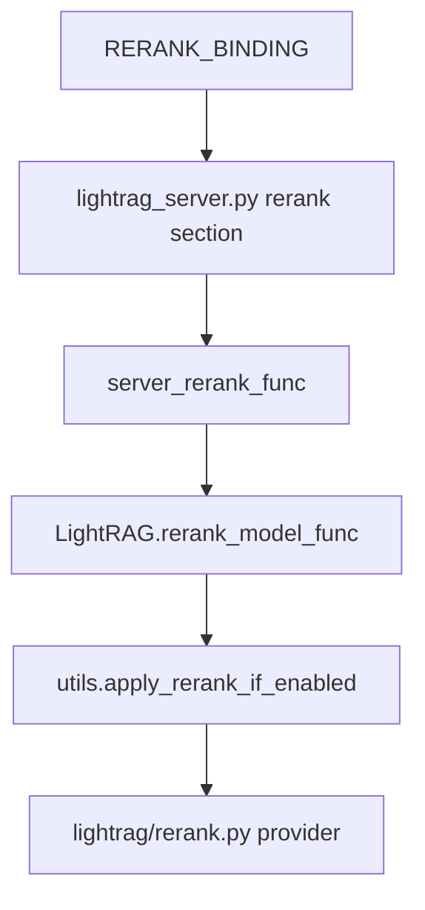
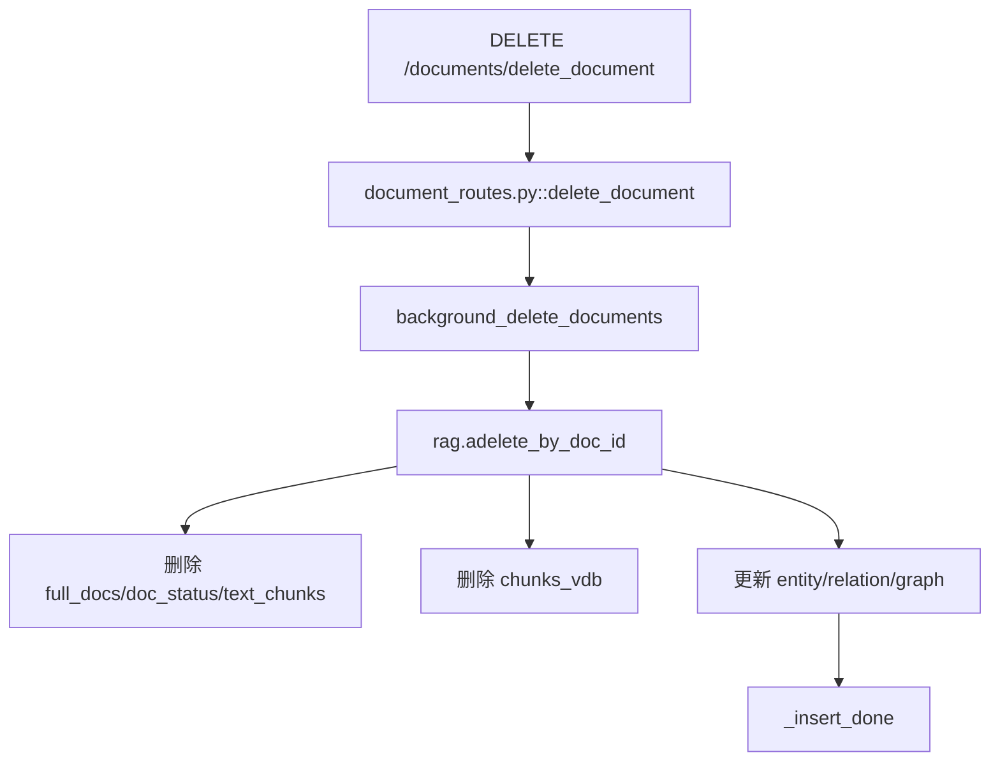

# 17 源码调用链路索引

## 从 `lightrag-server` 命令开始的启动链路



文件/函数索引：

| 顺序 | 文件 | 函数 |
|---|---|---|
| 1 | `pyproject.toml` | `[project.scripts]` |
| 2 | `lightrag/api/lightrag_server.py` | `main` |
| 3 | `lightrag/api/config.py` | `parse_args` |
| 4 | `lightrag/api/lightrag_server.py` | `create_app` |
| 5 | `lightrag/lightrag.py` | `LightRAG.__post_init__` |
| 6 | `lightrag/lightrag.py` | `initialize_storages` |

## 从上传文档接口开始的索引链路



涉及文件：

| 阶段 | 文件 | 函数/类 |
|---|---|---|
| API | `lightrag/api/routers/document_routes.py` | `upload_to_input_dir`、`pipeline_index_file`、`pipeline_enqueue_file` |
| 路由解析 | `lightrag/parser/routing.py` | `resolve_file_parser_directives`、`parse_process_options` |
| enqueue | `lightrag/pipeline.py` | `apipeline_enqueue_documents` |
| process | `lightrag/pipeline.py` | `apipeline_process_enqueue_documents`、`_run_pipeline_batch`、`process_single_document` |
| 抽取 | `lightrag/lightrag.py` / `lightrag/operate.py` | `_process_extract_entities`、`extract_entities` |
| 合并 | `lightrag/operate.py` | `merge_nodes_and_edges` |
| 持久化 | `lightrag/lightrag.py` | `_insert_done` |

## 从 query 接口开始的查询链路



涉及文件：

| 阶段 | 文件 | 函数 |
|---|---|---|
| API | `lightrag/api/routers/query_routes.py` | `query_text`、`query_text_stream`、`query_data` |
| 参数 | `lightrag/base.py` | `QueryParam` |
| Core | `lightrag/lightrag.py` | `aquery_llm`、`aquery_data` |
| 查询算法 | `lightrag/operate.py` | `kg_query`、`naive_query` |
| rerank | `lightrag/utils.py` / `lightrag/rerank.py` | `process_chunks_unified`、`apply_rerank_if_enabled`、`cohere_rerank`、`jina_rerank`、`ali_rerank` |

## 从 WebUI 页面请求到后端 API 的链路



| 页面 | 前端文件 | API 函数 | 后端 |
|---|---|---|---|
| 文档管理 | `features/DocumentManager.tsx` | `scanNewDocuments`、`uploadDocument`、`getDocumentsPaginated` | `document_routes.py` |
| 查询 | `features/RetrievalTesting.tsx` | `queryText`、`queryTextStream` | `query_routes.py` |
| 图谱 | `features/GraphViewer.tsx`、`hooks/useLightragGraph.tsx` | `queryGraphs`、`getGraphLabels` | `graph_routes.py` |
| 登录 | `features/LoginPage.tsx` | `loginToServer`、`getAuthStatus` | `lightrag_server.py` |

## 从 LLM 配置到实际调用模型的链路



| 配置 | 解析/使用 |
|---|---|
| `LLM_BINDING` | `create_llm_model_func` 和 role fallback。 |
| `EXTRACT_LLM_BINDING` | `resolve_role_llm_settings("extract")`。 |
| `KEYWORD_LLM_MODEL` | keyword 角色模型。 |
| `QUERY_LLM_TIMEOUT` | query 角色超时。 |
| `VLM_PROCESS_ENABLE` | 多模态处理开关。 |

## 从 Embedding 配置到实际生成向量的链路



调用点：

| 场景 | 文件 | 函数 |
|---|---|---|
| chunk 写入 | `lightrag/pipeline.py` | `process_single_document` -> `chunks_vdb.upsert` |
| entity 写入 | `lightrag/operate.py` | `_merge_nodes_then_upsert` |
| relation 写入 | `lightrag/operate.py` | `_merge_edges_then_upsert` |
| query 检索 | `lightrag/kg/*_impl.py` | `query` |

## 从 Rerank 配置到实际调用的链路



## 从删除文档接口到存储更新的链路



具体删除细节以 `lightrag/lightrag.py::adelete_by_doc_id` 和相关 helper 为准。

## 从图谱编辑接口到 Core 的链路

| Endpoint | Core |
|---|---|
| `POST /graph/entity/edit` | `rag.aedit_entity` |
| `POST /graph/relation/edit` | `rag.aedit_relation` |
| `POST /graph/entity/create` | `rag.acreate_entity` |
| `POST /graph/relation/create` | `rag.acreate_relation` |
| `POST /graph/entities/merge` | `rag.amerge_entities` |

这些接口会同时维护 Graph、Vector、KV 中的相关数据。修改前建议读 `lightrag/api/routers/graph_routes.py` 和 `lightrag/lightrag.py` 对应方法。

## 快速查找命令

```bash
rg -n "def aquery_llm|def kg_query|def naive_query" lightrag
rg -n "apipeline_enqueue_documents|process_single_document" lightrag
rg -n "create_document_routes|create_query_routes|create_graph_routes" lightrag/api
rg -n "RoleSpec|ROLES|RoleLLMConfig" lightrag
rg -n "STORAGE_IMPLEMENTATIONS|get_storage_class" lightrag/kg
```

