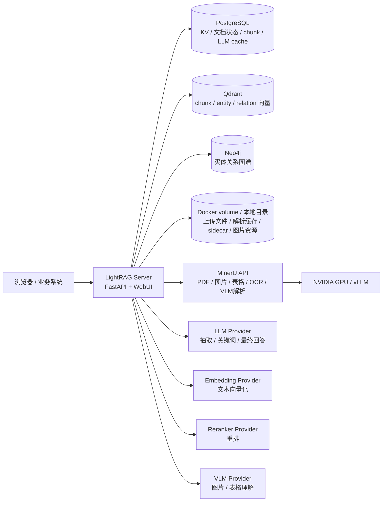
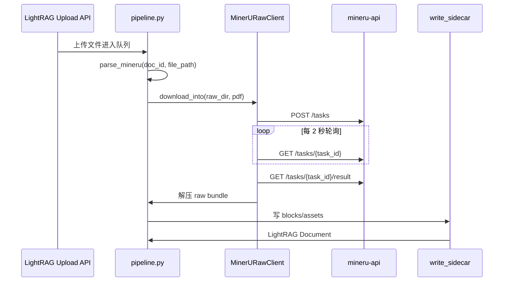
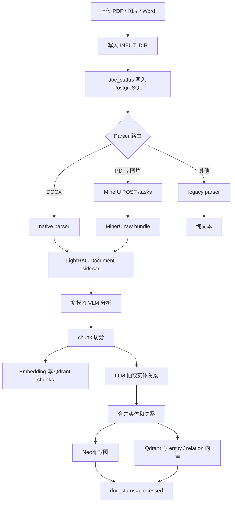
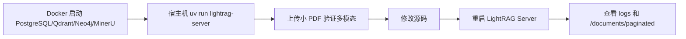
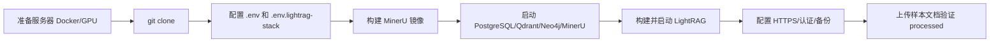

# Docker 本地开发与服务器部署手册

本文面向已经把 LightRAG 基本流程跑通之后的下一阶段：把本地文件存储升级到 PostgreSQL / Qdrant / Neo4j，把 PDF 和图片等多模态文档交给 MinerU 解析，并形成一套可以迁移到服务器的完整部署方法。

本文基于当前项目目录：

```text
/home/cjy/LightRAG
```

当前部署目标不是“临时跑一下项目”，而是形成以下能力：

- LightRAG Server 使用当前源码运行，便于后续二次开发。
- 文档状态、全文、chunk、LLM cache 使用 PostgreSQL。
- chunk / entity / relation 的向量使用 Qdrant。
- 实体关系图谱使用 Neo4j。
- PDF / 图片 / 表格 / 图示由 MinerU + VLM 流水线处理。
- 本地开发和服务器部署使用同一套 Compose 栈思路。

---

## 1. 当前推荐架构

### 1.1 组件关系



### 1.2 当前存储分工

| 数据类型 | 当前组件 | LightRAG 配置项 | 说明 |
|---|---|---|---|
| 文档全文 | PostgreSQL | `LIGHTRAG_KV_STORAGE=PGKVStorage` | 原始文本、解析后的 LightRAG Document、chunk 原文等 |
| 文档状态 | PostgreSQL | `LIGHTRAG_DOC_STATUS_STORAGE=PGDocStatusStorage` | `pending`、`parsing`、`analyzing`、`processing`、`processed`、`failed` |
| LLM cache | PostgreSQL | `LIGHTRAG_KV_STORAGE=PGKVStorage` | `extract`、`analysis`、`summary`、`query` 等缓存 |
| chunk 向量 | Qdrant | `LIGHTRAG_VECTOR_STORAGE=QdrantVectorDBStorage` | 用户问题可直接检索原文片段 |
| entity 向量 | Qdrant | 同上 | 检索实体节点 |
| relation 向量 | Qdrant | 同上 | 检索关系文本 |
| 图谱结构 | Neo4j | `LIGHTRAG_GRAPH_STORAGE=Neo4JStorage` | 实体节点、关系边、图遍历 |
| 上传文件 | Docker volume 或宿主机目录 | `INPUT_DIR` | PDF、图片、Word 等原文件 |
| 解析产物 | Docker volume 或宿主机目录 | `INPUT_DIR/__parsed__` | MinerU raw bundle、LightRAG sidecar、图片资源 |

### 1.3 本地已验证过的多模态流程

本地实际上传 `SCX-21卫星罗经.pdf` 后，完整流程已经跑通：

| 阶段 | 结果 |
|---|---|
| MinerU 解析 | 成功，`GET /tasks/{task_id}/result 200 OK` |
| sidecar 写入 | 17 个 blocks |
| 表格 | 3 个 |
| 图片 / 图示 | 6 个 |
| 公式 | 0 个 |
| VLM 分析 | 图片和表格均成功分析 |
| chunk | 12 个 |
| 实体 | 74 个 |
| 关系 | 145 条 |
| 最终状态 | `processed` |

成功日志的关键标志：

```text
[sidecar] wrote 17 blocks ... engine=mineru
[analyze_multimodal] completed
Chunk 12 of 12 extracted ...
Completed merging: 74 entities, 0 extra entities, 145 relations
Completed processing file 1/1
```

---

## 2. 关键文件

| 文件 | 是否提交 | 作用 |
|---|---:|---|
| `docker-compose.lightrag-stack.yml` | 是 | PostgreSQL / Qdrant / Neo4j / MinerU / LightRAG 的 Compose 栈 |
| `.env.lightrag-stack.example` | 是 | Compose 栈配置模板，不放真实密钥 |
| `.env.lightrag-stack` | 否 | 本地实际 Compose 配置，包含端口和数据库密码 |
| `.docker/mineru/Dockerfile` | 是 | 构建本地 `mineru:latest` GPU 镜像 |
| `.env` | 否 | LightRAG 原始运行配置，包含模型、API Key、存储覆盖项 |
| `env.example` | 是 | LightRAG 官方配置模板 |
| `lightrag/parser/external/mineru/client.py` | 是 | LightRAG 调用 MinerU local API 的客户端 |

不要提交以下内容：

```text
.env
.env.lightrag-stack
data/
logs/
lightrag.log
Docker volume 导出的数据
真实 API Key / Token / 密码
```

---

## 3. 镜像清单

### 3.1 当前 Compose 使用的镜像

| 服务 | 镜像 | 来源 | 当前本机大小 | 说明 |
|---|---|---|---:|---|
| LightRAG | `lightrag-stack:local` | 当前源码构建 | 本机未固定，构建后生成 | 服务器部署建议用当前源码构建 |
| PostgreSQL | `gzdaniel/postgres-for-rag:16.6` | Docker Hub | 约 1.06GB | LightRAG 支持的 PostgreSQL RAG 镜像 |
| Qdrant | `qdrant/qdrant:latest` | Docker Hub | 约 274MB | 向量数据库 |
| Neo4j | `neo4j:5-community` | Docker Hub | 约 958MB | 图数据库 |
| MinerU | `mineru:latest` | 本地 Dockerfile 构建 | 约 52.9GB | 基于 vLLM 的完整 MinerU local API 镜像 |
| vLLM base | `vllm/vllm-openai:v0.11.2` | Docker Hub | 约 43.1GB | MinerU 镜像基础镜像 |
| vLLM mirror tag | `docker.m.daocloud.io/vllm/vllm-openai:v0.11.2` | 本地 tag / 镜像源 tag | 约 43.1GB | `.docker/mineru/Dockerfile` 使用这个 tag |

查看本机镜像：

```bash
docker images --format '{{.Repository}}:{{.Tag}} {{.ID}} {{.Size}}' \
  | grep -E '^(lightrag-stack:|mineru:|vllm/vllm-openai:|docker\.m\.daocloud\.io/vllm/vllm-openai:|gzdaniel/postgres-for-rag:|qdrant/qdrant:|neo4j:)'
```

### 3.2 为什么 MinerU 镜像这么大

`mineru:latest` 当前不是轻量 API 镜像，而是完整 GPU / VLM 镜像：

```dockerfile
FROM docker.m.daocloud.io/vllm/vllm-openai:v0.11.2
RUN python3 -m pip install -U "mineru[core]>=3.0.0"
RUN MINERU_MODEL_SOURCE=modelscope mineru-models-download -s modelscope -m all
```

体积大的主要原因：

| 来源 | 说明 |
|---|---|
| `vllm/vllm-openai:v0.11.2` | 已包含 CUDA、PyTorch、vLLM、推理运行时 |
| `mineru[core]` | 安装 MinerU API、解析器、OCR、Office 解析依赖 |
| ModelScope 模型 | 下载 MinerU VLM / OCR / Layout / 表格 / 公式模型 |
| 字体和系统库 | 中文字体、`libgl1`、`fontconfig` 等 |

---

## 4. MinerU 详细说明

### 4.1 当前 MinerU 版本

在容器内确认到：

| 包 | 版本 |
|---|---|
| `mineru` | `3.2.1` |
| `vllm` | `0.11.2+cu129` |
| `torch` | `2.9.0+cu129` |
| `transformers` | `4.57.6` |
| `modelscope` | `1.32.0` |

查看命令：

```bash
docker compose --env-file .env.lightrag-stack \
  -f docker-compose.lightrag-stack.yml \
  --profile mineru \
  exec mineru-api python3 -m pip show mineru vllm torch transformers modelscope
```

### 4.2 当前 MinerU 模型

模型位置：

```text
/root/.cache/modelscope/hub/models/OpenDataLab
```

当前已下载模型目录：

| 模型目录 | 大小 | 作用 |
|---|---:|---|
| `MinerU2___5-Pro-2605-1___2B` | 约 2.2GB | MinerU VLM 模型，日志中显示为 `MinerU2.5-Pro-2605-1.2B`，由 vLLM 加载 |
| `PDF-Extract-Kit-1___0/models/Layout/PP-DocLayoutV2` | `Layout` 总约 205MB | 版面检测 / 页面布局分析 |
| `PDF-Extract-Kit-1___0/models/OCR/paddleocr_torch` | `OCR` 总约 780MB | OCR 文本检测和识别 |
| `PDF-Extract-Kit-1___0/models/MFR/pp_formulanet_plus_m` | `MFR` 总约 1.4GB | 公式识别相关 |
| `PDF-Extract-Kit-1___0/models/MFR/unimernet_hf_small_2503` | 同上 | 公式识别相关 |
| `PDF-Extract-Kit-1___0/models/TabCls/paddle_table_cls` | `TabCls` 总约 6.5MB | 表格分类 |
| `PDF-Extract-Kit-1___0/models/TabRec/SlanetPlus` | `TabRec` 总约 16MB | 表格结构识别 |
| `PDF-Extract-Kit-1___0/models/TabRec/UnetStructure` | 同上 | 表格结构识别 |

模型总体积：

| 目录 | 大小 |
|---|---:|
| `OpenDataLab/MinerU2___5-Pro-2605-1___2B` | 约 2.2GB |
| `OpenDataLab/PDF-Extract-Kit-1___0` | 约 2.4GB |
| `OpenDataLab` 合计 | 约 4.5GB |

查看命令：

```bash
docker compose --env-file .env.lightrag-stack \
  -f docker-compose.lightrag-stack.yml \
  --profile mineru \
  exec mineru-api sh -lc \
  'du -h -d 3 /root/.cache/modelscope/hub/models/OpenDataLab | sort -h'
```

### 4.3 MinerU API 协议

LightRAG 当前使用 MinerU local API，不是调用 MinerU 官方云 API。

| 接口 | 作用 |
|---|---|
| `GET /health` | 健康检查 |
| `POST /tasks` | 提交解析任务 |
| `GET /tasks/{task_id}` | 轮询任务状态 |
| `GET /tasks/{task_id}/result` | 下载解析结果 zip |

LightRAG 侧对应代码：

| 文件 | 类 / 函数 | 作用 |
|---|---|---|
| `lightrag/pipeline.py` | `parse_mineru()` | Pipeline 中调用 MinerU 的入口 |
| `lightrag/parser/external/mineru/client.py` | `MinerURawClient` | 上传文件、轮询任务、下载 zip |
| `lightrag/parser/external/mineru/ir_builder.py` | `MinerUIRBuilder` | 把 MinerU raw bundle 转成 LightRAG IR |
| `lightrag/sidecar.py` | `write_sidecar()` | 写入 LightRAG Document sidecar |

调用链：



### 4.4 MinerU 运行模式

当前配置：

```env
MINERU_API_MODE=local
MINERU_LOCAL_BACKEND=hybrid-auto-engine
MINERU_LOCAL_PARSE_METHOD=auto
MINERU_LOCAL_IMAGE_ANALYSIS=true
MINERU_POLL_INTERVAL_SECONDS=2
MINERU_MAX_POLLS=900
MINERU_HTTP_TIMEOUT_SECONDS=1800
```

含义：

| 配置项 | 当前值 | 说明 |
|---|---|---|
| `MINERU_API_MODE` | `local` | 使用本地 self-hosted `mineru-api` |
| `MINERU_LOCAL_BACKEND` | `hybrid-auto-engine` | 使用 MinerU hybrid 后端，自动结合 VLM / OCR / layout |
| `MINERU_LOCAL_PARSE_METHOD` | `auto` | 自动判断 OCR / text 解析策略 |
| `MINERU_LOCAL_IMAGE_ANALYSIS` | `true` | 允许 MinerU 做本地图片分析 |
| `MINERU_POLL_INTERVAL_SECONDS` | `2` | LightRAG 每 2 秒查询一次 MinerU 任务状态 |
| `MINERU_MAX_POLLS` | `900` | 最多轮询 900 次，约 30 分钟 |
| `MINERU_HTTP_TIMEOUT_SECONDS` | `1800` | 单次 HTTP 读超时放大到 30 分钟 |

为什么需要 `MINERU_HTTP_TIMEOUT_SECONDS=1800`：

早期测试时，大 PDF 提交到 MinerU 后，MinerU 已经接受任务，但首次加载 vLLM 模型和解析 PDF 超过了 LightRAG 原先硬编码的 120 秒 HTTP timeout，导致 LightRAG 报：

```text
ERROR: Parse worker failed (mineru):
```

现在已把 MinerU HTTP timeout 做成环境变量，避免大 PDF 或首次加载模型时被 2 分钟提前中断。

### 4.5 GPU 和显存要求

当前本机验证环境：

| 项 | 值 |
|---|---|
| GPU | NVIDIA GeForce RTX 4060 Laptop |
| 显存 | 约 8GB |
| WSL | 可访问 Docker GPU |
| MinerU 后端 | `hybrid-auto-engine` |

从实际日志看，8GB 显存可以处理小型 5 页 PDF，并成功加载 MinerU VLM：

```text
Using vllm-async-engine as the inference engine for VLM
Model loading took 2.1601 GiB memory
Available KV cache memory: 2.00 GiB
hybrid batch ratio (auto, vram=8GB): 2
```

但 8GB 显存不代表可以稳定处理所有生产 PDF。对于大文件、扫描件、图片很多的 PDF，建议：

| 场景 | 建议 |
|---|---|
| 本地验证 | 先用 5 到 20 页样本文档 |
| 生产 GPU | 优先 16GB 显存以上 |
| 大 PDF | 拆分文件，或调低并发 |
| 显存不足 | 改用 `pipeline` 后端并关闭图片分析 |

轻量 fallback：

```env
MINERU_LOCAL_BACKEND=pipeline
MINERU_LOCAL_IMAGE_ANALYSIS=false
STACK_MINERU_LOCAL_BACKEND=pipeline
STACK_MINERU_LOCAL_IMAGE_ANALYSIS=false
```

---

## 5. 配置文件

### 5.1 `.env`

`.env` 是 LightRAG Server 自身配置，放模型服务、存储配置和功能开关。不要提交。

建议保留这些类型的配置：

| 类型 | 示例变量 |
|---|---|
| 基础 LLM | `LLM_BINDING`、`LLM_BINDING_HOST`、`LLM_MODEL`、`LLM_BINDING_API_KEY` |
| Embedding | `EMBEDDING_BINDING`、`EMBEDDING_BINDING_HOST`、`EMBEDDING_MODEL`、`EMBEDDING_DIM` |
| Reranker | `RERANK_BINDING`、`RERANK_MODEL`、`RERANK_BINDING_HOST` |
| 角色模型 | `EXTRACT_LLM_MODEL`、`KEYWORD_LLM_MODEL`、`QUERY_LLM_MODEL`、`VLM_LLM_MODEL` |
| MinerU | `MINERU_API_MODE`、`MINERU_LOCAL_ENDPOINT`、`MINERU_LOCAL_BACKEND` |
| Parser | `LIGHTRAG_PARSER`、`VLM_PROCESS_ENABLE` |
| 存储 | `LIGHTRAG_KV_STORAGE`、`QDRANT_URL`、`NEO4J_URI`、`POSTGRES_*` |

示例，不要写真实 key：

```env
LLM_BINDING=openai
LLM_BINDING_HOST=https://dashscope.aliyuncs.com/compatible-mode/v1
LLM_MODEL=qwen3.6-plus
LLM_BINDING_API_KEY=<your-qwen-api-key>

EXTRACT_LLM_BINDING=openai
EXTRACT_LLM_BINDING_HOST=https://api.deepseek.com
EXTRACT_LLM_MODEL=deepseek-v4-flash
EXTRACT_LLM_BINDING_API_KEY=<your-deepseek-api-key>

VLM_LLM_BINDING=openai
VLM_LLM_BINDING_HOST=https://dashscope.aliyuncs.com/compatible-mode/v1
VLM_LLM_MODEL=qwen3-vl-plus
VLM_LLM_BINDING_API_KEY=<your-qwen-api-key>

EMBEDDING_BINDING=openai
EMBEDDING_BINDING_HOST=https://dashscope.aliyuncs.com/compatible-mode/v1
EMBEDDING_MODEL=text-embedding-v4
EMBEDDING_DIM=1024
EMBEDDING_BINDING_API_KEY=<your-qwen-api-key>
```

### 5.2 `.env.lightrag-stack`

`.env.lightrag-stack` 是 Compose 栈配置，控制端口、镜像名、数据库密码和 Docker 内部服务地址。不要提交。

当前核心配置：

```env
STACK_LIGHTRAG_BIND_HOST=0.0.0.0
STACK_LIGHTRAG_PORT=9621
STACK_DOTENV_FILE=./.env

STACK_POSTGRES_USER=postgres
STACK_POSTGRES_PASSWORD=123456
STACK_POSTGRES_DATABASE=rag

STACK_NEO4J_USERNAME=neo4j
STACK_NEO4J_PASSWORD=123456
STACK_NEO4J_DATABASE=neo4j

STACK_MINERU_IMAGE=mineru:latest
STACK_MINERU_LOCAL_ENDPOINT=http://mineru-api:8000
STACK_MINERU_LOCAL_BACKEND=hybrid-auto-engine
STACK_MINERU_LOCAL_IMAGE_ANALYSIS=true
STACK_VLM_PROCESS_ENABLE=true
```

服务器部署时必须改强密码：

```env
STACK_POSTGRES_PASSWORD=<strong-postgres-password>
STACK_NEO4J_PASSWORD=<strong-neo4j-password>
```

### 5.3 容器内和宿主机地址差异

| 运行方式 | PostgreSQL | Qdrant | Neo4j | MinerU |
|---|---|---|---|---|
| LightRAG 容器内 | `postgres:5432` | `http://qdrant:6333` | `neo4j://neo4j:7687` | `http://mineru-api:8000` |
| 宿主机源码运行 | `localhost:15432` | `http://localhost:6333` | `neo4j://localhost:7687` | `http://127.0.0.1:8000` |

这点非常重要。容器里不要写 `localhost:15432` 访问 PostgreSQL，因为容器内的 `localhost` 指的是 LightRAG 容器自己。

---

## 6. 本地开发运行方式

本地开发推荐：数据库、Qdrant、Neo4j、MinerU 用 Docker，LightRAG Server 用宿主机源码运行。

优点：

- 改 Python 源码后重启 `uv run lightrag-server` 即可。
- 不需要每次 `docker build lightrag`。
- 存储服务和生产架构一致。
- MinerU 依然用 Docker GPU，避免污染宿主机 Python 环境。

### 6.1 启动基础存储

```bash
docker compose --env-file .env.lightrag-stack -f docker-compose.lightrag-stack.yml up -d postgres qdrant neo4j
```

### 6.2 启动 MinerU

如果还没有 `mineru:latest`，先构建：

```bash
docker build -t mineru:latest -f .docker/mineru/Dockerfile .docker/mineru
```

如果拉取 vLLM 基础镜像很慢或者频繁失败，可先手动拉取并打 tag，之后再运行构建命令：

```bash
docker pull vllm/vllm-openai:v0.11.2
docker tag vllm/vllm-openai:v0.11.2 docker.m.daocloud.io/vllm/vllm-openai:v0.11.2
```

启动 MinerU：

```bash
docker compose --env-file .env.lightrag-stack -f docker-compose.lightrag-stack.yml --profile mineru up -d mineru-api
```

停止运行：

```
docker compose --env-file .env.lightrag-stack -f docker-compose.lightrag-stack.yml --profile mineru stop mineru-api
```

确认 MinerU：

```bash
curl http://127.0.0.1:8000/health
```

确认 GPU：

```bash
docker compose --env-file .env.lightrag-stack -f docker-compose.lightrag-stack.yml --profile mineru exec mineru-api nvidia-smi
```

### 6.3 宿主机启动 LightRAG Server

当前 `.env` 已经配置宿主机访问地址时，直接运行：

```bash
uv run lightrag-server
```

访问：

| 页面 | 地址 |
|---|---|
| WebUI | `http://localhost:9621` |
| Swagger | `http://localhost:9621/docs` |
| Health | `http://localhost:9621/health` |
| MinerU API | `http://127.0.0.1:8000/docs` |
| Qdrant | `http://127.0.0.1:6333` |
| Neo4j Browser | `http://127.0.0.1:7474` |

### 6.4 修改源码后怎么运行

后端源码：

```bash
# Ctrl+C 停止当前服务
uv run lightrag-server
```

前端源码：

```bash
cd lightrag_webui
bun install --frozen-lockfile
bun run build
cd ..
uv run lightrag-server
```

使用热重载开发 API：

```bash
uv run uvicorn lightrag.api.lightrag_server:app --reload --host 0.0.0.0 --port 9621
```

---

## 7. 容器化运行 LightRAG

如果要验证更接近服务器的部署方式，可以把 LightRAG Server 也放进 Docker。

### 7.1 构建 LightRAG 镜像

```bash
docker compose \
  --env-file .env.lightrag-stack \
  -f docker-compose.lightrag-stack.yml \
  build lightrag
```

镜像名来自：

```env
STACK_LIGHTRAG_IMAGE=lightrag-stack:local
```

说明：

- 这个镜像来自当前源码，不是官方 `ghcr.io/hkuds/lightrag:latest`。
- 修改源码后必须重新 build。
- `.env` 会以只读方式挂载进容器：`${STACK_DOTENV_FILE:-./.env}:/app/.env:ro`。

### 7.2 启动完整栈

包含 MinerU：

```bash
docker compose \
  --env-file .env.lightrag-stack \
  -f docker-compose.lightrag-stack.yml \
  --profile mineru \
  up -d
```

不包含 MinerU：

```bash
docker compose \
  --env-file .env.lightrag-stack \
  -f docker-compose.lightrag-stack.yml \
  up -d postgres qdrant neo4j lightrag
```

查看状态：

```bash
docker compose \
  --env-file .env.lightrag-stack \
  -f docker-compose.lightrag-stack.yml \
  --profile mineru \
  ps
```

---

## 8. 多模态文档处理配置

### 8.1 Parser 策略

当前推荐配置：

```env
LIGHTRAG_PARSER=docx:native-teP,pdf:mineru-iteP,png:mineru-iP,jpg:mineru-iP,jpeg:mineru-iP,*:legacy-R
STACK_LIGHTRAG_PARSER=docx:native-teP,pdf:mineru-iteP,png:mineru-iP,jpg:mineru-iP,jpeg:mineru-iP,*:legacy-R
```

含义：

| 规则 | 说明 |
|---|---|
| `docx:native-teP` | Word 使用 LightRAG native parser，处理表格、公式，并使用段落语义分块 |
| `pdf:mineru-iteP` | PDF 使用 MinerU，启用图片、表格、公式处理，并使用段落语义分块 |
| `png/jpg/jpeg:mineru-iP` | 图片文件使用 MinerU，启用图片处理和段落语义分块 |
| `*:legacy-R` | 其他文件使用 legacy parser 和 recursive chunking |

LightRAG parser 后缀里的字母来自项目源码的路由规则，常见理解：

| 后缀 | 作用 |
|---|---|
| `i` | image / drawing 相关处理 |
| `t` | table 相关处理 |
| `e` | equation 相关处理 |
| `P` | paragraph semantic chunking |
| `R` | recursive chunking |

### 8.2 VLM 开关

多模态能力有两层：

| 层 | 配置 | 说明 |
|---|---|---|
| MinerU 本地解析 | `MINERU_LOCAL_IMAGE_ANALYSIS=true` | MinerU 自己在解析阶段使用本地 VLM / OCR / layout |
| LightRAG 多模态分析 | `VLM_PROCESS_ENABLE=true` | LightRAG 把 sidecar 中的图片、表格等再交给 VLM 生成语义描述 |

当前已验证 `VLM_PROCESS_ENABLE=true` 会对图片和表格产生类似日志：

```text
Analyzing drawing/...: ok
Analyzing table/...: ok
[analyze_multimodal] completed
```

如果要控制成本，可以临时关闭 LightRAG VLM：

```env
VLM_PROCESS_ENABLE=false
STACK_VLM_PROCESS_ENABLE=false
```

关闭后，MinerU 仍然可以解析 PDF，但 LightRAG 不会额外调用云端 VLM 去分析每张图和每个表。

### 8.3 大文档建议

| 文档类型 | 建议 |
|---|---|
| 小 PDF，图表多 | `hybrid-auto-engine` + `VLM_PROCESS_ENABLE=true` |
| 大 PDF，主要是文字 | 可考虑 `pipeline` + `VLM_PROCESS_ENABLE=false` |
| 扫描件 | 需要 OCR，优先 MinerU，注意耗时 |
| 图片说明书 | 开启图片解析和 VLM，但先用小样本评估费用 |
| 200 页以上文档 | 建议拆分、降低并发、先关闭实体关系抽取或 VLM 做试算 |

---

## 9. 上传文档后的完整流程



关键日志解释：

| 日志 | 意义 |
|---|---|
| `[File Extraction]Deferred ... to mineru parser` | 文件被路由到 MinerU，不是 legacy |
| `[MinerU] Parsing ...` | LightRAG 正在调用 MinerU |
| `[sidecar] wrote ... blocks` | MinerU 结果已经转成 LightRAG Document |
| `Analyzing drawing/table ... ok` | LightRAG VLM 分析图片或表格成功 |
| `Chunking P` | 使用 paragraph semantic chunking |
| `Chunk X of Y extracted A Ent + B Rel` | 对第 X 个 chunk 抽取出 A 个实体和 B 条关系 |
| `Merging stage` | 开始合并重复实体和关系 |
| `Upserting relation VDB` | 关系文本写入 Qdrant 关系向量集合 |
| `Completed merging` | 图谱合并完成 |
| `Completed processing file` | 整个文件处理完成 |

---

## 10. 日志和健康检查

### 10.1 查看服务状态

```bash
docker compose \
  --env-file .env.lightrag-stack \
  -f docker-compose.lightrag-stack.yml \
  --profile mineru \
  ps
```

### 10.2 LightRAG 日志

宿主机源码运行：

```bash
tail -f lightrag.log
```

容器运行：

```bash
docker compose \
  --env-file .env.lightrag-stack \
  -f docker-compose.lightrag-stack.yml \
  logs -f lightrag
```

### 10.3 MinerU 日志

```bash
docker compose \
  --env-file .env.lightrag-stack \
  -f docker-compose.lightrag-stack.yml \
  --profile mineru \
  logs -f mineru-api
```

停止运行：

```
docker compose --env-file .env.lightrag-stack -f docker-compose.lightrag-stack.yml --profile mineru stop mineru-api
```


### 10.4 健康检查

```bash
curl http://127.0.0.1:9621/health
curl http://127.0.0.1:8000/health
curl http://127.0.0.1:6333/collections
```

Neo4j Browser：

```text
http://127.0.0.1:7474
```

### 10.5 查询文档状态

```bash
curl -sS -X POST http://127.0.0.1:9621/documents/paginated \
  -H 'Content-Type: application/json' \
  -d '{"page":1,"page_size":20,"sort_field":"updated_at","sort_direction":"desc"}' \
  | python3 -m json.tool
```

常见状态：

| 状态 | 说明 |
|---|---|
| `pending` | 已入队，等待处理 |
| `parsing` | 正在解析文件 |
| `analyzing` | 正在分析多模态内容 |
| `processing` | 正在切 chunk、向量化、抽实体关系、写库 |
| `processed` | 完成 |
| `failed` | 失败，需要看 `error_msg` 和日志 |

---

## 11. 数据卷和备份

### 11.1 当前 Docker volumes

| volume | 作用 | 必须备份 |
|---|---|---:|
| `lightrag-stack_postgres_data` | PostgreSQL 数据 | 是 |
| `lightrag-stack_qdrant_data` | Qdrant 向量数据 | 是 |
| `lightrag-stack_neo4j_data` | Neo4j 图数据 | 是 |
| `lightrag-stack_neo4j_logs` | Neo4j 日志 | 可选 |
| `lightrag-stack_lightrag_inputs` | 上传文件和解析产物 | 是 |
| `lightrag-stack_lightrag_rag_storage` | LightRAG 工作目录 | 是 |
| `lightrag-stack_lightrag_prompts` | Prompt 覆盖目录 | 是，如果有自定义 |
| `lightrag-stack_lightrag_tiktoken` | tiktoken 缓存 | 可选 |
| `lightrag-stack_mineru_cache` | MinerU 运行缓存 | 可选，模型已在镜像内 |
| `lightrag-stack_mineru_outputs` | MinerU 临时输出 | 可选 |

查看：

```bash
docker volume ls | grep lightrag-stack
```

### 11.2 PostgreSQL 备份

当前本地用户和库为 `postgres` / `rag`：

```bash
docker compose \
  --env-file .env.lightrag-stack \
  -f docker-compose.lightrag-stack.yml \
  exec -T postgres pg_dump -U postgres -d rag > backup_postgres.sql
```

恢复：

```bash
cat backup_postgres.sql | docker compose \
  --env-file .env.lightrag-stack \
  -f docker-compose.lightrag-stack.yml \
  exec -T postgres psql -U postgres -d rag
```

### 11.3 Volume 备份示例

```bash
mkdir -p backups
docker run --rm \
  -v lightrag-stack_qdrant_data:/data:ro \
  -v "$PWD/backups:/backup" \
  busybox \
  tar czf /backup/qdrant_data.tgz -C /data .
```

其他 volume 同理。

### 11.4 清空全部 Docker 栈数据

谨慎执行：

```bash
docker compose \
  --env-file .env.lightrag-stack \
  -f docker-compose.lightrag-stack.yml \
  --profile mineru \
  down -v
```

这会删除 PostgreSQL、Qdrant、Neo4j、LightRAG 上传文件、MinerU volume。不会删除项目目录里的旧 `data/`，但会清空这套 Docker 栈的数据。

---

## 12. 服务器部署

### 12.1 服务器要求

| 项 | 建议 |
|---|---|
| OS | Linux 服务器，Ubuntu / Debian 常见 |
| Docker | Docker Engine + `docker compose` 插件 |
| CPU | 4 核以上，生产建议 8 核以上 |
| 内存 | 最低 16GB，生产建议 32GB 以上 |
| 磁盘 | 取决于文档量，建议 SSD，至少预留 100GB 起 |
| GPU | 多模态 MinerU 建议 NVIDIA GPU，生产建议 16GB 显存以上 |
| 网络 | 能访问模型 API、镜像仓库、必要时访问 ModelScope |

检查：

```bash
docker info
docker compose version
nvidia-smi
docker run --rm --gpus all nvidia/cuda:12.4.1-base-ubuntu22.04 nvidia-smi
```

### 12.2 拉取代码

```bash
git clone <your-repo-url> LightRAG
cd LightRAG
```

不要把本地 `.env`、`.env.lightrag-stack`、`data/`、日志打包提交到服务器 Git。

### 12.3 准备配置

```bash
cp env.example .env
cp .env.lightrag-stack.example .env.lightrag-stack
```

必须修改：

```env
STACK_POSTGRES_PASSWORD=<strong-password>
STACK_NEO4J_PASSWORD=<strong-password>
TOKEN_SECRET=<strong-random-secret>
LIGHTRAG_API_KEY=<strong-api-key-if-needed>
```

数据库端口不建议对公网开放：

```env
STACK_POSTGRES_BIND_HOST=127.0.0.1
STACK_QDRANT_BIND_HOST=127.0.0.1
STACK_NEO4J_HTTP_BIND_HOST=127.0.0.1
STACK_NEO4J_BOLT_BIND_HOST=127.0.0.1
STACK_MINERU_BIND_HOST=127.0.0.1
```

如果需要外部访问 WebUI/API：

```env
STACK_LIGHTRAG_BIND_HOST=0.0.0.0
STACK_LIGHTRAG_PORT=9621
```

生产建议在前面加 Nginx / Caddy / Traefik，并使用 HTTPS。

### 12.4 构建 MinerU 镜像

注意cuda版本，3090cuda是12.8，MinerU：latest最新的镜像必须是cuda12.9

服务器如果能直接访问 Docker Hub：

```bash
docker pull vllm/vllm-openai:v0.10.2

```

然后构建：

```bash
docker build --no-cache -t mineru:cuda128 -f .docker/mineru/Dockerfile .docker/mineru
```

如果服务器不能访问外网，建议：

1. 在能联网的机器构建 `mineru:latest`。
2. `docker save mineru:latest -o mineru_latest.tar`。
3. 上传到服务器。
4. `docker load -i mineru_latest.tar`。

### 12.5 启动完整服务

```bash
docker compose --env-file .env.lightrag-stack -f docker-compose.lightrag-stack.yml --profile mineru up -d postgres qdrant neo4j mineru-api
```

源码启动LightRAG：

```
uv run lightrag-server
```

或者镜像启动：

构建 LightRAG：

```bash
docker compose --env-file .env.lightrag-stack -f docker-compose.lightrag-stack.yml build lightrag
```

启动 LightRAG：

```bash
docker compose --env-file .env.lightrag-stack -f docker-compose.lightrag-stack.yml --profile mineru up -d lightrag
```

检查：

```bash
docker compose \
  --env-file .env.lightrag-stack \
  -f docker-compose.lightrag-stack.yml \
  --profile mineru \
  ps
```

### 12.6 反向代理建议

示例目标：

```text
https://rag.example.com -> http://127.0.0.1:9621
```

代理层建议：

| 项 | 建议 |
|---|---|
| HTTPS | 必须 |
| 上传大小 | 调大请求体限制，例如 200MB / 1GB |
| 超时 | 上传和查询接口适当放大 |
| 认证 | 使用 LightRAG auth 或代理层鉴权 |
| 日志 | 开启 access/error log，并做轮转 |
| 只暴露 | 只暴露 80/443，不直接暴露数据库和 MinerU |

---

## 13. 更新和发布

### 13.1 本地开发更新

```bash
git pull
uv run lightrag-server
```

如果改了前端：

```bash
cd lightrag_webui
bun install --frozen-lockfile
bun run build
cd ..
uv run lightrag-server
```

### 13.2 服务器容器更新

```bash
cd /path/to/LightRAG
git pull
docker compose --env-file .env.lightrag-stack -f docker-compose.lightrag-stack.yml build lightrag
docker compose --env-file .env.lightrag-stack -f docker-compose.lightrag-stack.yml --profile mineru up -d lightrag
```

如果修改了 `.docker/mineru/Dockerfile` 或 MinerU 版本：

```bash
docker build -t mineru:latest -f .docker/mineru/Dockerfile .docker/mineru
docker compose --env-file .env.lightrag-stack -f docker-compose.lightrag-stack.yml --profile mineru up -d mineru-api
```

```
#修改postgres镜像密码为123456
docker exec -it -u postgres lightrag-stack-postgres-1 psql -d rag -c "ALTER USER postgres WITH PASSWORD '123456';"
#重启镜像
docker compose --env-file .env.lightrag-stack -f docker-compose.lightrag-stack.yml restart postgres lightrag
#查看日志
docker compose --env-file .env.lightrag-stack -f docker-compose.lightrag-stack.yml logs -f lightrag
```


### 13.3 回滚

如果服务器部署失败：

```bash
git log --oneline -5
git checkout <last-good-commit>
docker compose --env-file .env.lightrag-stack -f docker-compose.lightrag-stack.yml build lightrag
docker compose --env-file .env.lightrag-stack -f docker-compose.lightrag-stack.yml --profile mineru up -d lightrag
```

回滚代码不会自动回滚数据库数据。如果索引结构或模型配置变更很大，先备份再操作。


---

## 16. 推荐路线

### 16.1 本地二次开发



### 16.2 服务器部署



## 项目端口占用

镜像本身不占端口，容器运行后才占端口。你这套 docker-compose.lightrag-stack.yml 默认会用这些宿主机端口：

  ┌─────────────────┬────────────┬──────────┬───────────┬──────────────────────────┐
  │ 服务            │ 宿主机端口 │ 容器端口 │ 默认绑定  │ 用途                     │
  ├─────────────────┼────────────┼──────────┼───────────┼──────────────────────────┤
  │ LightRAG Server │       9621 │     9621 │ 0.0.0.0   │ WebUI / API / Swagger    │
  │ PostgreSQL      │      15432 │     5432 │ 127.0.0.1 │ 文档、chunk、状态、cache │
  │ Qdrant          │       6333 │     6333 │ 127.0.0.1 │ 向量数据库 HTTP API      │
  │ Neo4j Browser   │       7474 │     7474 │ 127.0.0.1 │ Neo4j Web 管理页         │
  │ Neo4j Bolt      │       7687 │     7687 │ 127.0.0.1 │ LightRAG 连接 Neo4j      │
  │ MinerU API      │       8000 │     8000 │ 127.0.0.1 │ PDF / 图片解析           │
  └─────────────────┴────────────┴──────────┴───────────┴──────────────────────────┘

  部署前检查端口：

```
sudo ss -lntp | grep -E ':(9621|15432|6333|7474|7687|8000)\b'
```

  如果没有输出，说明这些端口当前没被占用。

  如果端口被占用，主要改这个文件：

  .env.lightrag-stack

  对应修改项：

```
STACK_LIGHTRAG_PORT=9621
STACK_POSTGRES_PORT=15432
STACK_QDRANT_PORT=6333
STACK_NEO4J_HTTP_PORT=7474
STACK_NEO4J_BOLT_PORT=7687
STACK_MINERU_PORT=8000
```

  例如端口冲突可以改成：

```
STACK_LIGHTRAG_PORT=19621
STACK_POSTGRES_PORT=25432
STACK_QDRANT_PORT=16333
STACK_NEO4J_HTTP_PORT=17474
STACK_NEO4J_BOLT_PORT=17687
STACK_MINERU_PORT=18000
```

  如果你是 LightRAG 也跑在 Docker 里，只改 .env.lightrag-stack 就行，容器内部仍然用服务名互相访问。

  如果你是 宿主机源码运行 uv run lightrag-server，改了端口后还要同步改 .env：

```
PORT=19621
POSTGRES_PORT=25432
QDRANT_URL=http://localhost:16333
NEO4J_URI=neo4j://localhost:17687
MINERU_LOCAL_ENDPOINT=http://127.0.0.1:18000
```

  改完后重启：

```
docker compose --env-file .env.lightrag-stack -f docker-compose.lightrag-stack.yml --profile mineru up -d
```

  如果源码方式运行，再重启：

```
uv run lightrag-server
```

### 换版本

• 不能升级驱动的话，就不要再用现在这个 mineru:latest。现在这个镜像基于 CUDA 12.9，服务器只能到 CUDA 12.8，所以只能 重建
  一个 CUDA 12.8 版 MinerU 镜像。

  vLLM 官方镜像是 vllm/vllm-openai；我查到 v0.10.2 对应 CUDA 12.8，比较适合你这台服务器。参考：vLLM Docker 镜像说明和
  v0.10.2 镜像环境信息。
  来源：https://docs.vllm.ai/en/v0.10.2/getting_started/installation/gpu.html
  (https://docs.vllm.ai/en/v0.10.2/getting_started/installation/gpu.html)、https://docker.aityp.com/image/docker.io/vllm/vllm-openai%3Av0.10.2
  (https://docker.aityp.com/image/docker.io/vllm/vllm-openai%3Av0.10.2)

  在服务器上这样操作。

  先停掉失败的 MinerU 容器：

  docker compose --env-file .env.lightrag-stack \
    -f docker-compose.lightrag-stack.yml \
    --profile mineru stop mineru-api

  docker compose --env-file .env.lightrag-stack \
    -f docker-compose.lightrag-stack.yml \
    --profile mineru rm -f mineru-api

  拉 CUDA 12.8 的 vLLM 基础镜像：

  docker pull vllm/vllm-openai:v0.10.2

  如果 Docker Hub 还是限流，就走镜像源：

  docker pull docker.m.daocloud.io/vllm/vllm-openai:v0.10.2
  docker tag docker.m.daocloud.io/vllm/vllm-openai:v0.10.2 vllm/vllm-openai:v0.10.2

  确认它确实是 CUDA 12.8：

  docker image inspect vllm/vllm-openai:v0.10.2 \
    --format '{{range .Config.Env}}{{println .}}{{end}}' | grep -Ei 'CUDA_VERSION|NVIDIA_REQUIRE_CUDA'

  你应该看到类似：

  CUDA_VERSION=12.8.1
  NVIDIA_REQUIRE_CUDA=cuda>=12.8

  然后改服务器上的 .docker/mineru/Dockerfile，把第一行基础镜像从 CUDA 12.9 改成 CUDA 12.8：

  FROM vllm/vllm-openai:v0.10.2

  如果你想继续用 DaoCloud 镜像源，也可以写成：

  FROM docker.m.daocloud.io/vllm/vllm-openai:v0.10.2

  重新构建 MinerU 镜像：

  docker build -t mineru:cuda128 -f .docker/mineru/Dockerfile .
  docker tag mineru:cuda128 mineru:latest

  确认新的 mineru:latest 已经不是 CUDA 12.9：

  docker image inspect mineru:latest \
    --format '{{range .Config.Env}}{{println .}}{{end}}' | grep -Ei 'CUDA_VERSION|NVIDIA_REQUIRE_CUDA|MINERU'

  测试 GPU 能否进容器：

  docker run --rm --gpus all --entrypoint nvidia-smi mineru:latest

  如果这里能看到 GPU，再启动 MinerU：

  docker compose --env-file .env.lightrag-stack \
    -f docker-compose.lightrag-stack.yml \
    --profile mineru up -d mineru-api

  看日志：

  docker compose --env-file .env.lightrag-stack \
    -f docker-compose.lightrag-stack.yml \
    --profile mineru logs -f mineru-api

  健康检查：

  curl http://127.0.0.1:8000/health

  不要用 NVIDIA_DISABLE_REQUIRE=1 去强行跳过 CUDA 12.9 检查。那只是绕过启动校验，不代表 CUDA 12.9 容器真的能在 CUDA 12.8
  驱动上稳定跑，后面更可能在 vLLM、torch、flash-attn 阶段炸。

  所以你的服务器路线就是：

  不能升级驱动
  => MinerU 基础镜像降到 vllm/vllm-openai:v0.10.2
  => 重建 mineru:latest
  => 再启动 mineru-api

  15432 端口占用先不用管，等 MinerU 镜像问题解决后再处理。


### 下载到本地然后转发

在网络稳定的机器上：

  docker pull vllm/vllm-openai:v0.10.2
  docker save vllm/vllm-openai:v0.10.2 -o vllm-openai-v0.10.2.tar

  传服务器，使用支持断点续传的 rsync：

  rsync -avP vllm-openai-v0.10.2.tar casia@服务器IP:/mnt/local4t/cjy/

  服务器加载：

  docker load -i /mnt/local4t/cjy/vllm-openai-v0.10.2.tar

  这个方案最稳，因为 rsync 断了可以继续，不会像 Docker pull 那样大层重下。
