# 知识库调研分享会

## 1. 分享定位

这份材料面向技术同事，但默认听众没有系统接触过 RAG、知识图谱或 LightRAG。目标不是讲某个源码怎么写，而是把“为什么要做知识库、知识库系统通常怎么做、LightRAG 解决了什么问题、工程落地会遇到什么挑战”讲清楚。

建议分享时长约 30 分钟，重点放在 LightRAG 和实际落地经验上。整体比例可以按下面安排：

| 部分 | 时间 | 目标 |
|---|---:|---|
| 知识库是什么 | 4 分钟 | 建立共同语言，避免一开始就陷入模型和向量库。 |
| 常见方案对比 | 7 分钟 | 讲清基础 RAG、图 RAG、Agentic RAG、多模态 RAG 的差异。 |
| LightRAG 重点介绍 | 14 分钟 | 解释它为什么不只是“向量检索 + 大模型”。 |
| 挑战和改进方向 | 5 分钟 | 回到工程现实：效果、成本、数据、部署和评估。 |

一句话主线：

> 知识库不是把文件丢给大模型，而是把企业文档变成“可检索、可追溯、可更新、可治理”的知识资产，再让大模型基于这些资产回答问题。

## 2. 为什么需要知识库

### 2.1 从“找文档”到“问知识”

很多团队的资料并不少，真正的问题通常是：

- 文档分散在网盘、Wiki、代码仓库、OA、邮件、PDF、Word、图片里。
- 搜索只能命中文件名或关键词，找到了也要自己读。
- 新同事不知道该搜什么关键词。
- 老文档没人维护，新文档没人知道。
- 同一个问题反复问人，知识没有沉淀成服务。

传统文档检索解决的是“我知道关键词，帮我找到相关文件”。知识库问答希望解决的是“我用自然语言描述问题，系统帮我找到依据并组织答案”。

### 2.2 知识库系统的基本目标

一个面向问答的知识库，通常至少要做到四件事：

| 目标 | 说明 | 例子 |
|---|---|---|
| 找得到 | 能从大量文档里召回相关内容 | 问“设备初始化失败怎么办”，能找到说明书中的故障排查章节。 |
| 说得清 | 能把零散片段组织成自然语言答案 | 不只是贴 5 段原文，而是总结步骤和注意事项。 |
| 有依据 | 能告诉用户答案来自哪里 | 返回文件名、页码、章节或原文片段。 |
| 可维护 | 文档更新后知识库能更新 | 新版本手册上传后，旧答案不会一直污染结果。 |

### 2.3 大模型为什么不能直接当知识库

大模型本身有很多能力，但直接问大模型有几个问题：

| 问题 | 说明 |
|---|---|
| 不知道企业内部资料 | 模型训练时没有见过公司内部文档、项目说明、设备手册。 |
| 容易编造 | 没有检索依据时，模型可能生成看起来合理但不真实的答案。 |
| 更新慢 | 文档今天更新，模型不会自动知道。 |
| 权限难控 | 不同用户能看到哪些文档，需要业务系统控制。 |
| 成本不可控 | 把大文档全文塞给模型，成本和延迟都很高。 |

所以知识库的核心不是“大模型替代文档”，而是“大模型基于可控的检索上下文回答问题”。

## 3. RAG：当前最常见的知识库实现方式

RAG 是 Retrieval-Augmented Generation，中文通常叫“检索增强生成”。简单说，就是先检索，再生成。

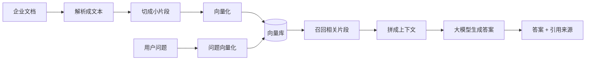

### 3.1 一个生活化类比

可以把 RAG 理解成“带资料的开卷问答”：

- 向量库像一个很快的资料检索员。
- 大模型像一个会总结表达的人。
- 检索结果像考试时翻到的参考页。
- 最终答案不是凭空记忆，而是基于翻到的资料组织出来。

### 3.2 基础 RAG 的典型流程

索引阶段：

1. 上传文档。
2. 抽取文本。
3. 切分成 chunk，也就是较小的文本片段。
4. 用 Embedding 模型把 chunk 变成向量。
5. 写入向量数据库。

查询阶段：

1. 用户输入问题。
2. 把问题也变成向量。
3. 在向量库里找最相似的 chunk。
4. 把这些 chunk 和问题一起发给大模型。
5. 大模型生成答案。

### 3.3 基础 RAG 的优点和局限

| 维度 | 优点 | 局限 |
|---|---|---|
| 实现复杂度 | 相对简单，容易跑通 Demo | 对文档结构、实体关系理解有限 |
| 检索速度 | 向量检索成熟，速度较快 | 相似不等于相关，容易召回噪声 |
| 成本 | 比全文塞给大模型便宜 | 文档很大时，切块和重排仍有成本 |
| 可解释性 | 可以返回 chunk 原文 | 很难回答跨章节、跨文档、关系型问题 |
| 适用场景 | FAQ、说明文档、政策问答 | 复杂业务知识、流程关系、系统依赖关系 |

基础 RAG 最常见的问题是：它擅长找“相似片段”，但不擅长理解“知识之间的关系”。

### 3.4 RAG 的发展历史

RAG 不是突然出现的，它是搜索、信息检索、问答系统、向量表示、大模型应用逐步融合出来的结果。可以用下面这条线理解：

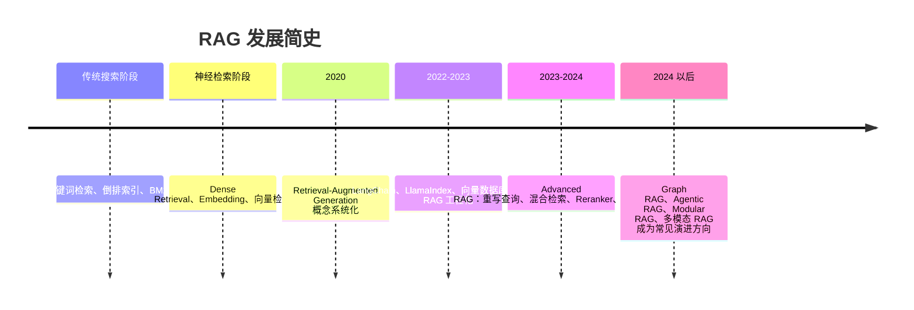

#### 传统搜索阶段：关键词和倒排索引

最早的企业搜索通常依赖关键词匹配。用户输入关键词，系统用倒排索引找到包含这些词的文档。典型算法包括 TF-IDF、BM25。

这种方式的优点是快、稳定、可解释；缺点是强依赖字面匹配。比如用户问“设备启动不了”，文档里写的是“上电初始化失败”，关键词搜索不一定能命中。

#### 神经检索阶段：语义向量

Embedding 模型出现后，文本可以被表示成向量。系统不再只看字面词是否相同，而是看语义是否接近。

比如：

```text
问题：设备启动不了怎么办？
文档：上电后初始化失败的处理步骤如下……
```

虽然字面词不完全一样，但语义很接近，向量检索更容易把它们匹配到一起。

#### 2020：RAG 概念系统化

2020 年，Lewis 等人的论文《Retrieval-Augmented Generation for Knowledge-Intensive NLP Tasks》系统化提出 RAG：把可检索的外部知识和生成模型结合，用检索结果增强生成回答。

这个思想解决了大模型的一个核心问题：模型参数里的知识不容易更新，而外部知识库可以随时更新。

#### 2022-2023：基础 RAG 工程化

大模型能力快速提升后，RAG 开始从论文范式变成工程方案。LangChain、LlamaIndex、Haystack、向量数据库、Embedding API 等工具逐渐成熟，开发者可以比较快地搭建：

```text
文档解析 -> chunk -> embedding -> 向量库 -> 检索 -> LLM回答
```

这一阶段的重点是“让大模型能用私有文档回答问题”。

#### 2023-2024：Advanced RAG

基础 RAG 跑通后，大家发现效果不稳定，于是出现了大量增强手段：

| 技术 | 解决的问题 |
|---|---|
| Query Rewrite | 用户问题太口语化，先改写成更适合检索的查询。 |
| Multi Query | 一个问题生成多个检索查询，提高召回率。 |
| Hybrid Search | 结合关键词检索和向量检索，避免只靠语义相似。 |
| Reranker | 先召回较多候选，再用更强模型重排。 |
| Context Compression | 把召回内容压缩成更短、更相关的上下文。 |
| Metadata Filter | 按部门、时间、文档类型、权限过滤结果。 |

这一阶段的核心是：不再满足于“能问答”，而是追求“召回更准、上下文更干净、回答更稳定”。

#### 2024 以后：RAG 开始分化

随着场景变复杂，RAG 逐渐分化出几条方向：

| 方向 | 核心变化 |
|---|---|
| Graph RAG | 从文档中抽取实体关系，用知识图谱增强检索。 |
| Agentic RAG | 让智能体决定查什么、查几次、是否调用工具。 |
| Modular RAG | 把 RAG 拆成可组合模块，便于替换和实验。 |
| Multimodal RAG | 处理图片、表格、公式、扫描件、图纸等非纯文本资料。 |

LightRAG 主要属于 Graph RAG 方向，同时当前版本也在向多模态和工程化 Server 方向扩展。

### 3.5 向量化和向量检索：一个具体例子

很多人第一次听到“向量化”会觉得抽象。可以把它理解成：Embedding 模型把一句话压缩成一串数字，这串数字表示它的语义位置。

假设有三段文档：

| 编号 | 文档片段 |
|---|---|
| A | 上电后设备初始化失败时，请检查电源线、保险丝和主控板指示灯。 |
| B | 修改网络参数后，需要保存配置并重启服务。 |
| C | 本设备支持 NMEA0183 和 NMEA2000 两种数据输出协议。 |

用户问题：

```text
设备开机没反应应该先检查什么？
```

关键词上看，问题里没有“初始化失败”“上电后”这些原文词。但向量化后，问题向量会更接近 A，因为它们语义上都在讲“启动异常和排查”。

简化理解：

```text
embedding("设备开机没反应应该先检查什么？") -> [0.12, -0.38, 0.77, ...]
embedding("上电后设备初始化失败时...")        -> [0.10, -0.35, 0.80, ...]
embedding("修改网络参数后...")              -> [-0.41, 0.22, 0.19, ...]
```

向量检索就是在大量文档向量中找“离问题向量最近”的几个。

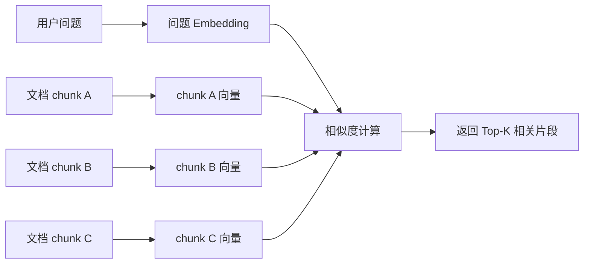

#### 常见相似度计算方式

| 方法 | 直观理解 | 常见用途 |
|---|---|---|
| Cosine Similarity 余弦相似度 | 看两个向量方向是否接近 | 文本语义检索中非常常见。 |
| Dot Product 点积 | 方向和长度一起影响得分 | 一些向量模型和检索库常用。 |
| L2 / Euclidean 欧氏距离 | 看两个点在空间里的直线距离 | 图像、向量聚类、部分向量索引中常见。 |

RAG 中最常见的是余弦相似度或点积。实际选择要和 Embedding 模型训练方式、向量库配置保持一致。

#### Top-K 和阈值

向量检索通常会返回 Top-K：

```text
Top-K = 5
```

意思是返回最相似的 5 个片段。Top-K 太小，可能漏掉正确资料；Top-K 太大，可能把无关内容也塞给大模型。

还可以设置相似度阈值：

```text
只保留相似度 > 0.2 的结果
```

阈值太高会漏召回，阈值太低会引入噪声。知识库调优时，经常要同时调 Top-K、阈值、chunk 大小和 reranker。

### 3.6 常用向量检索算法

如果文档只有几百个 chunk，可以逐个算相似度，这叫精确 KNN。问题是当数据达到百万、千万级向量时，逐个比较会很慢，所以实际工程里经常使用 ANN，也就是 Approximate Nearest Neighbor，近似最近邻搜索。

它的思想是：不保证每次都找到绝对最接近的向量，但用很小的准确率损失换取更快速度。

| 算法 / 索引 | 思路 | 优点 | 代价 |
|---|---|---|---|
| Flat / Brute Force | 对所有向量逐个计算距离 | 最准确、实现简单 | 数据大时慢、成本高 |
| HNSW | 构建多层小世界图，从高层快速导航到近邻 | 召回和速度平衡好，向量库常用 | 内存占用较高，构建索引有成本 |
| IVF | 先把向量聚成多个桶，查询时只查相关桶 | 适合大规模数据，速度快 | 聚类质量影响召回 |
| PQ / IVF-PQ | 对向量进行压缩编码 | 节省内存，适合超大规模 | 精度会下降 |
| Hybrid Search | 结合关键词检索和向量检索 | 同时利用字面匹配和语义匹配 | 需要融合排序，调参更复杂 |

常见工具的定位：

| 工具 | 说明 |
|---|---|
| Faiss | 向量相似度搜索库，常用于本地或研究场景。 |
| Qdrant | 向量数据库，常用 HNSW，支持 payload 过滤，适合服务化部署。 |
| Milvus | 面向大规模向量检索的向量数据库，索引类型丰富。 |
| pgvector | PostgreSQL 扩展，适合已有 PostgreSQL 体系的小到中等规模场景。 |
| Elasticsearch / OpenSearch | 可做关键词检索，也支持向量检索，适合混合检索场景。 |

在知识库里，向量库不是“越高级越好”。很多检索问题真正的原因不是向量库，而是：

- chunk 切得不合适；
- embedding 模型不适合中文或业务领域；
- 问题没有改写好；
- Top-K 太小或太大；
- 没有 reranker；
- 文档解析质量差；
- 权限或 metadata filter 把正确内容过滤掉。

### 3.7 检索准确率怎么评估

知识库要先评估“有没有找对资料”，再评估“有没有答对”。如果检索阶段没找对，大模型后面再强也很难稳定回答。

评估检索需要一组测试集：

| 字段 | 例子 |
|---|---|
| question | 设备开机没反应应该检查什么？ |
| gold_chunks | 说明书第 3.2 节“上电初始化失败排查”对应的 chunk id |
| gold_answer | 应检查电源线、保险丝、主控板指示灯等。 |

常见检索指标：

| 指标 | 含义 | 适合回答的问题 |
|---|---|---|
| Recall@K | 正确片段是否出现在前 K 个结果里 | 有没有找全？ |
| Precision@K | 前 K 个结果里有多少是真相关 | 召回结果干不干净？ |
| Hit Rate@K | 前 K 个结果里是否至少有一个正确片段 | 是否命中关键资料？ |
| MRR | 第一个正确结果排在多靠前 | 正确结果是不是排前面？ |
| nDCG@K | 考虑相关性等级和排序位置 | 排序质量好不好？ |

#### 一个简化例子

假设问题 Q 的标准相关 chunk 是：

```text
gold = {A, D}
```

系统返回 Top-5：

```text
[B, A, C, E, D]
```

那么：

| 指标 | 结果 | 解释 |
|---|---:|---|
| Recall@5 | 2 / 2 = 1.0 | 两个正确片段 A、D 都被找到了。 |
| Precision@5 | 2 / 5 = 0.4 | 5 个结果里只有 2 个真正相关。 |
| Hit Rate@5 | 1 | 至少命中了一个正确片段。 |
| MRR | 1 / 2 = 0.5 | 第一个正确结果 A 排第 2。 |

如果系统返回：

```text
[A, B, C, E, F]
```

则：

| 指标 | 结果 | 解释 |
|---|---:|---|
| Recall@5 | 1 / 2 = 0.5 | 只找到了 A，漏掉 D。 |
| Precision@5 | 1 / 5 = 0.2 | 噪声更多。 |
| Hit Rate@5 | 1 | 虽然命中了，但不完整。 |
| MRR | 1 / 1 = 1.0 | 第一个结果就是正确的，但只说明排序靠前，不说明召回完整。 |

这说明没有一个指标能代表全部。实际评估通常要组合看：

- Recall@K 看有没有漏；
- Precision@K 看噪声多不多；
- MRR/nDCG 看排序好不好；
- 人工抽样看返回片段是否真的支持答案。

#### 检索评估怎么用于调优

| 问题现象 | 可能原因 | 调优方向 |
|---|---|---|
| Recall@K 低 | 正确片段没召回 | 增大 Top-K、换 embedding、改 chunk、加 query rewrite。 |
| Precision@K 低 | 噪声片段多 | 加 reranker、调阈值、加 metadata filter、减小 Top-K。 |
| MRR 低 | 正确片段排得靠后 | 使用 reranker、混合检索、改 query rewrite。 |
| 多个版本混杂 | 旧文档也被召回 | 加版本 metadata、权限和时间过滤。 |

评估时要注意：检索准确率不是问模型“答得对不对”，而是看系统有没有把正确证据找出来。

## 4. 常见知识库方案对比

### 4.1 基础 RAG

基础 RAG 是最常见的方案，核心是“文本切块 + 向量检索 + 大模型回答”。

适合：

- FAQ。
- 产品说明书。
- 制度文档。
- 内容比较规整、问题比较直接的场景。

不适合：

- 强依赖实体关系的问题。
- 跨文档综合分析。
- 图纸、表格、扫描件较多的场景。

### 4.2 图 RAG

图 RAG 会把文档中的实体和关系抽取出来，形成知识图谱。比如：

```text
设备A --包含--> 模块B
模块B --依赖--> 配置项C
故障D --可能原因--> 模块B异常
```

这样系统不仅能检索相似文本，还能沿着关系扩展上下文。

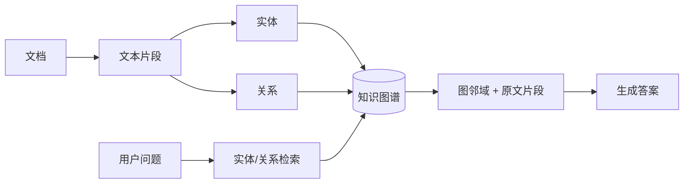

优点：

- 更适合复杂知识、跨文档关联和实体关系问题。
- 图谱可以可视化，便于发现知识结构。
- 可结合实体、关系、原文片段一起生成答案。

局限：

- 实体关系抽取依赖大模型，成本更高。
- 抽取质量不稳定，错误关系会污染图谱。
- 构建和维护比基础 RAG 复杂。

### 4.3 Agentic RAG

Agentic RAG 可以理解为“让智能体决定怎么查资料”。它不是固定检索一次，而是可能多轮规划：

1. 先理解用户问题。
2. 判断需要查哪些知识库或工具。
3. 分步骤检索。
4. 必要时调用数据库、API、搜索工具。
5. 汇总结果。

适合：

- 问题需要多步骤推理。
- 需要调用外部工具。
- 需要和业务系统联动。

风险：

- 延迟更高。
- 调用链更难追踪。
- 容易出现“工具调用正确但推理路径不稳定”的问题。
- 对权限和审计要求更高。

### 4.4 多模态 RAG

多模态 RAG 面对的不再只是纯文本，还包括：

- 扫描 PDF。
- 图片。
- 表格。
- 公式。
- 图纸。
- PPT。
- Word 中的嵌入图片。

典型流程是先用文档解析引擎把这些内容转成结构化中间结果，再进入 RAG 流水线。

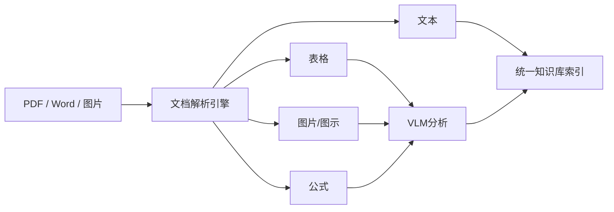

优点：

- 能处理真实企业文档，而不是只处理干净文本。
- 对说明书、报告、图纸、合同扫描件更有价值。

难点：

- 解析质量决定后续问答质量。
- OCR、表格识别、版面理解容易出错。
- GPU、模型、解析服务会带来额外部署复杂度。

### 4.5 Modular RAG：模块化 RAG

Modular RAG 可以翻译成“模块化 RAG”。它不是简单多加一个功能，而是把 RAG 拆成一组可替换、可编排、可评估的模块。

一个模块化 RAG 系统可能包含：


模块化的好处是：

- 可以单独替换 Embedding 模型，不影响文档解析模块；
- 可以对比不同 chunk 策略，不必重写整个系统；
- 可以从纯向量检索切换到混合检索；
- 可以把 Reranker、Query Rewrite、权限过滤作为独立模块；
- 适合做实验、评测和生产系统演进。

它的代价是系统设计更复杂。模块边界、数据格式、缓存、错误处理、观测和版本管理都要设计清楚。

可以把 Modular RAG 理解为 Advanced RAG 的工程化形态：不是某一个固定算法，而是一种“把 RAG 系统拆成积木”的架构思想。

### 4.6 方案对比表

| 方案 | 核心能力 | 优点 | 主要问题 | 适合场景 |
|---|---|---|---|---|
| 基础 RAG | 向量检索文本片段 | 简单、成熟、成本低 | 关系理解弱 | FAQ、手册问答 |
| 图 RAG | 实体关系图谱 + 检索 | 结构化、适合复杂关系 | 抽取成本高、质量需治理 | 复杂业务知识、设备系统、法律政策 |
| Agentic RAG | 智能体规划检索和工具调用 | 灵活、可处理多步骤任务 | 延迟高、可控性差 | 运维助手、业务助手、数据分析助手 |
| Modular RAG | 模块化组合 Loader / Retriever / Reranker / Generator | 便于替换、实验、评估和生产演进 | 架构和工程治理复杂 | 平台型知识库、需要持续调优的系统 |
| 多模态 RAG | 解析图片、表格、PDF、公式 | 覆盖真实文档形态 | 解析和部署复杂 | 产品说明书、扫描件、图文报告 |
| LightRAG | 图 RAG + 多查询模式 + Server | 兼顾工程化和图谱能力 | 索引阶段更重 | 需要结构化检索和可视化图谱的知识库 |

### 4.7 代表性开源项目

下面列的是适合作为调研入口的开源项目，不代表唯一选择，也不代表每个项目都适合直接生产使用。选型时要看团队技术栈、部署要求、文档类型、权限要求和二次开发成本。

| 类型 | 项目 | 简要说明 |
|---|---|---|
| 基础 RAG / 应用框架 | LangChain | LLM 应用开发框架，生态丰富，适合快速组合模型、工具、检索器和 Agent。 |
| 基础 RAG / 数据框架 | LlamaIndex | 重点面向私有数据接入、索引和查询，适合围绕数据构建 RAG。 |
| 基础 RAG / Pipeline | Haystack | 面向生产级 AI Pipeline，可组合 Retriever、Reader、Generator 等组件。 |
| 基础 RAG / 知识库产品 | RAGFlow | 偏完整应用形态，包含文档解析、检索、问答等知识库能力。 |
| 图 RAG | Microsoft GraphRAG | 微软开源的图增强 RAG 系统，强调从文本中构建图结构并做全局/局部检索。 |
| 图 RAG | LightRAG | 当前重点调研项目，强调轻量图增强、Server/WebUI、多存储后端和多查询模式。 |
| 图 RAG | Neo4j GraphRAG | 依托 Neo4j 图数据库生态，适合已有图数据库或强关系数据场景。 |
| Agentic RAG | LangGraph | 用图来编排 Agent 状态和流程，适合多步骤、可控的 Agentic RAG。 |
| Agentic RAG | Dify | 可视化 LLM 应用平台，包含工作流、Agent、RAG Pipeline、模型管理和观测能力。 |
| Agentic RAG | CrewAI / AutoGen | 多 Agent 协作框架，更适合任务编排和工具调用，不是专门的知识库产品。 |
| Modular RAG | Cognita | TrueFoundry 开源的模块化 RAG 应用框架，强调生产应用和模块组合。 |
| Modular RAG | OpenRAG | 模块化、可扩展的 RAG 实验和应用框架，适合探索不同 RAG 技术组合。 |
| Modular RAG | RAGLAB | 面向研究的模块化 RAG 框架，适合复现实验和比较不同算法。 |
| 多模态 RAG | RAG-Anything | 面向文本、图片、表格、公式等多模态内容的一体化 RAG 框架。 |
| 多模态 RAG | QAnything | 本地知识库问答系统，支持多种文件格式和离线部署。 |

选项目时可以用下面的问题快速筛选：

| 问题 | 更偏向的项目类型 |
|---|---|
| 我只想快速做一个文档问答 Demo | LangChain、LlamaIndex、Haystack |
| 我想要比较完整的知识库产品形态 | RAGFlow、Dify、QAnything、LightRAG Server |
| 我的文档关系复杂，想看图谱 | LightRAG、Microsoft GraphRAG、Neo4j GraphRAG |
| 我需要多步骤工具调用 | LangGraph、Dify、CrewAI、AutoGen |
| 我想研究和对比不同 RAG 算法 | RAGLAB、OpenRAG、Cognita |
| 我的文档有大量 PDF、图片、表格、公式 | RAG-Anything、LightRAG + MinerU / Docling、QAnything |

## 5. 重点：LightRAG 是什么（多模态+图RAG）

LightRAG 是一个以图结构增强检索的 RAG 框架。它不是只把文档切块后放进向量库，而是在索引时额外抽取实体和关系，构建知识图谱；查询时再结合图谱、向量检索、关键词抽取、重排和大模型生成答案。

当前项目中，LightRAG 的能力可以概括成五层：

| 层次 | 作用 |
|---|---|
| Server / WebUI | 提供文档上传、查询、图谱查看、API 文档等入口。 |
| 文档处理流水线 | 解析文档、切块、多模态分析、实体关系抽取。 |
| 检索与生成核心 | 根据查询模式组合图检索、向量检索和最终回答。 |
| 存储层 | 支持 KV、向量、图、文档状态四类存储。 |
| 模型接入层 | 支持 LLM、Embedding、Reranker、VLM 分角色配置。 |

### 5.1 LightRAG 和普通 RAG 的关键区别

普通 RAG 的知识主要存在于 chunk 里：

```text
文档 -> chunk -> 向量 -> 相似片段 -> 答案
```

LightRAG 额外构建结构：

```text
文档 -> chunk -> 实体 / 关系 -> 知识图谱
             -> chunk 向量
             -> entity 向量
             -> relation 向量
```

这样一来，查询时不只是问“哪些文本片段和问题相似”，还可以问：

- 问题中涉及哪些实体？
- 这些实体和哪些关系有关？
- 这些关系来自哪些原文片段？
- 是否需要同时做纯文本向量检索补充上下文？

### 5.2 LightRAG 整体架构

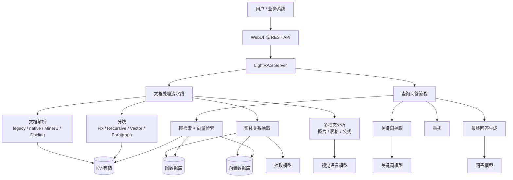

### 5.3 LightRAG 中的四类数据

在实际落地时，很容易误以为“知识库数据都在向量库里”。LightRAG 不是这样，它至少有四类核心数据：

| 数据 | 含义 | 典型存储 |
|---|---|---|
| 原文和 chunk | 文档解析后的全文、分块文本、来源信息 | KV Storage，例如 PostgreSQL 或 JSON 文件 |
| 向量 | chunk、entity、relation 的 embedding | Vector Storage，例如 Qdrant、NanoVectorDB、Milvus |
| 图谱 | 实体节点、关系边、图邻域 | Graph Storage，例如 Neo4j、NetworkX、PostgreSQL |
| 文档状态 | pending、parsing、processing、processed、failed 等 | DocStatus Storage，例如 PostgreSQL 或 JSON 文件 |

在生产环境中，我们调研后的组合是：

| 类型 | 选型 | 原因 |
|---|---|---|
| KV / 文档状态 | PostgreSQL | 通用、稳定、便于备份和查询状态。 |
| 向量数据库 | Qdrant | 专用向量检索，部署和使用相对直接。 |
| 图数据库 | Neo4j | 图谱可视化和关系查询能力强。 |
| 多模态解析 | MinerU | 适合 PDF、图片、表格、OCR、版面识别。 |
| 服务入口 | LightRAG Server | 自带 API、WebUI、Swagger 和图谱查看。 |

### 5.4 文档上传后发生了什么

可以用一份设备说明书举例。用户上传一个 PDF 后，LightRAG 大致经历这些阶段：

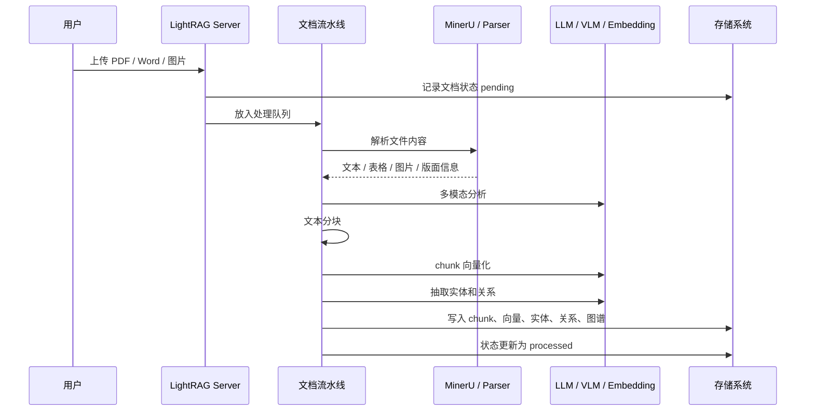

这里有几个关键点：

- 上传接口本身不是全部处理逻辑，它主要负责接收文件、保存文件、登记任务。
- 真正耗时的是后台流水线：解析、OCR、多模态分析、向量化、实体关系抽取。
- 对图 RAG 来说，索引阶段比基础 RAG 更重，因为它要调用模型抽取实体和关系。
- 对多模态文档来说，解析质量很关键；如果 PDF 是扫描件或图片很多，耗时会明显增加。

### 5.5 LightRAG 的文件处理能力

当前版本的文件处理流水线支持多种内容抽取引擎：

| 引擎 | 可以怎么理解 | 适合场景 |
|---|---|---|
| legacy | 旧版解析方式，偏通用和兼容 | 快速兼容已有流程。 |
| native | LightRAG 内置结构化解析，目前重点支持 docx | Word 文档、结构化段落、表格元数据。 |
| mineru | 外部 MinerU 解析服务 | PDF、扫描件、图片、表格、版面复杂文档。 |
| docling | 外部 Docling 解析服务 | PDF、Office、HTML、图片等文档解析。 |

也支持不同分块方式：

| 分块方式 | 思路 | 适合场景 |
|---|---|---|
| Fix | 固定大小切块 | 简单、稳定、成本低。 |
| Recursive | 按段落/符号递归切分 | 普通文本和 Markdown。 |
| Vector | 语义向量辅助分块 | 希望块语义更完整的场景。 |
| Paragraph | 段落语义分块 | 带章节和段落结构的文档。 |

这说明 LightRAG 已经不是只能处理纯文本的 Demo，而是向真实企业文档处理靠近。

#### 为什么 chunk 很重要

chunk 是 RAG 系统里的基本检索单元。它决定了系统“拿什么内容去匹配用户问题”。

chunk 切得不好，会直接影响后续所有阶段：

| 问题 | 后果 |
|---|---|
| chunk 太大 | 检索结果包含太多无关内容，浪费上下文窗口，Reranker 和 LLM 更难判断重点。 |
| chunk 太小 | 片段缺少上下文，单独召回后看不懂，容易丢失标题、表格说明和前后条件。 |
| overlap 太小 | 跨边界的信息被切断，问题答案可能分散在两个 chunk 中。 |
| overlap 太大 | 重复内容变多，向量数量和成本上升，召回结果容易冗余。 |
| 不按结构切 | 标题、段落、表格、图注被拆散，答案依据难追溯。 |

一个典型例子：

```text
标题：3.2 上电初始化失败排查
正文：如果设备上电后无响应，请依次检查电源线、保险丝、主控板指示灯。
表格：指示灯状态 / 可能原因 / 处理方法
```

如果 chunk 只包含表格中间几行，没有标题和前置说明，用户问“开机没反应怎么办”时，即使命中这个 chunk，模型也可能不知道这个表格是在讲“上电初始化失败”。

所以 chunk 不是简单“切短一点”，而是在“检索粒度、语义完整、上下文成本、可追溯性”之间找平衡。

#### 常见 chunk 方法

| 方法 | 规则 | 优点 | 缺点 | 适合场景 |
|---|---|---|---|---|
| 固定长度切分 | 每 N 个 token 或字符切一块，可设置 overlap | 简单稳定，容易实现 | 可能切断句子、表格和章节 | 快速 Demo、纯文本、日志 |
| 递归切分 | 先按标题/段落/换行/句号/空格逐级切，超长再细切 | 比固定切分更自然 | 依赖分隔符，复杂版面仍可能切坏 | Markdown、普通文档、网页文本 |
| 滑动窗口 | 固定窗口向前滑动，每块有重叠 | 不容易漏掉边界信息 | 冗余多，成本高 | 长正文、问答跨边界明显的场景 |
| 语义切分 | 用 embedding 或模型判断语义断点 | 更容易按话题分块 | 需要额外计算，结果不一定稳定 | 长文章、话题切换明显的文档 |
| 结构化切分 | 按标题层级、页码、表格行、图注、章节对象切 | 追溯好，语义完整 | 依赖解析质量 | Word、PDF、标准、说明书 |
| 父子 chunk | 小 chunk 用于召回，大 chunk 或父章节用于回答上下文 | 召回精细，回答上下文完整 | 存储和实现更复杂 | 长文档、章节结构清晰的知识库 |

#### LightRAG 中四种分块策略怎么理解

| LightRAG 策略 | 对应常见方法 | 说明 |
|---|---|---|
| Fix | 固定长度切分 | 按固定 token 预算切块，简单、成本低，但容易切断语义。 |
| Recursive | 递归切分 | 按分隔符逐级切分，普通文本中通常比 Fix 更自然。 |
| Vector | 语义切分 | 利用向量语义辅助判断边界，适合没有清晰结构但话题会变化的文本。 |
| Paragraph | 结构化 / 段落语义切分 | 利用 LightRAG Document、标题层级、段落、表格等结构，尽量让 chunk 对齐文档原生语义边界。 |

Paragraph 策略特别适合带章节、表格、细碎条款的文档。它的目标不是机械地凑够 token，而是尽量保留“标题 - 段落 - 表格 - 图注”的关系，减少表格和说明文字被拆散的问题。

#### 不同文档怎么选 chunk 策略

| 文档类型 | 推荐策略 | 原因 |
|---|---|---|
| FAQ、短问答 | 较小 chunk，少量 overlap | 问题和答案通常短，粒度越清晰越好。 |
| 产品说明书 | Recursive 或 Paragraph | 章节结构明显，最好保留标题和步骤。 |
| Word 制度文档 | Paragraph | 条款和层级重要，避免跨章节混合。 |
| PDF 扫描件 | 先看解析质量，再用 Recursive / Paragraph | OCR 和版面解析质量决定分块上限。 |
| 大表格文档 | Paragraph 或专门表格处理 | 表头、前置说明、行语义要保留。 |
| 代码文档 | 按标题、函数、类、代码块切 | 不宜按普通自然语言随意切。 |
| 日志 / 运行记录 | 固定长度或按时间段切 | 结构简单，重点是时间和事件连续性。 |

经验上，调 chunk 可以按这个顺序排查：

1. 先看解析后的文本是否正确。
2. 再看 chunk 是否保留标题、表格说明、上下文。
3. 再看检索结果是否命中正确 chunk。
4. 最后再调 Top-K、Reranker 和 Prompt。

很多时候，回答不准不是模型不行，而是正确答案在切块时已经被拆散了。

### 5.6 多模态在 LightRAG 里怎么接入

多模态处理可以分成两步：

1. 文档解析引擎把 PDF、图片、表格、公式等解析成中间结果。
2. LightRAG 使用 VLM 或 LLM 对图片、表格、公式进行语义分析，再把分析结果纳入索引。

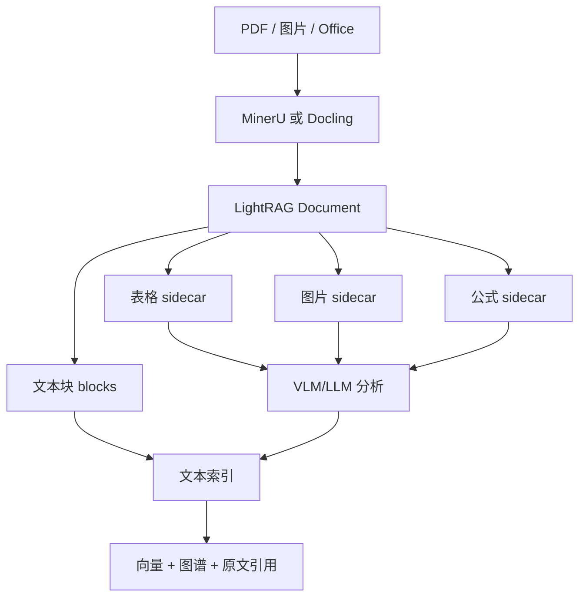

这里的重点不是“模型能看图片”这么简单，而是：

- 图片、表格、公式要能和原文位置关联。
- 分析结果要能进入 chunk、实体关系和问答上下文。
- 最终回答要尽量能追溯回原始文档。

### 5.7 查询时 LightRAG 怎么回答

用户提问后，LightRAG 不一定只查 chunk 向量。它会根据查询模式走不同路径。

| 模式 | 可以怎么理解 | 适合问题 |
|---|---|---|
| local | 围绕具体实体向外查 | “某个设备/模块/概念是什么？” |
| global | 从关系和全局主题查 | “整体流程是什么？有哪些主要关系？” |
| hybrid | local 和 global 结合 | 不确定问题类型时的稳妥选择。 |
| mix | 图谱检索 + chunk 向量检索 | 推荐配合 Reranker，用于综合问答。 |
| naive | 纯向量检索 | 快速验证基础 RAG 或不需要图谱时。 |
| bypass | 不检索，直接问模型 | 测试模型或普通聊天。 |

查询流程可以简化成：

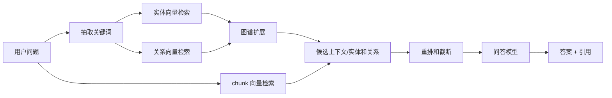

这也是 LightRAG 和基础 RAG 的明显差异：它有多路召回，不是只靠“问题向量和 chunk 向量相似”。

### 5.8 模型分工：为什么不一定要全程用最贵模型

LightRAG 支持按角色配置模型。可以把不同阶段交给不同模型：

| 角色 | 作用 | 选型思路 |
|---|---|---|
| EXTRACT | 实体和关系抽取 | 需要稳定结构化输出，但可以用成本较低的模型试起。 |
| KEYWORD | 查询关键词抽取 | 调用频繁，应该尽量轻量和稳定。 |
| QUERY | 最终回答 | 面向用户，通常用更强模型保证表达和推理质量。 |
| VLM | 图片、表格、公式分析 | 需要视觉理解能力，成本和延迟要重点关注。 |

这对成本控制很重要。比如一个大文档可能产生很多 chunk，每个 chunk 都可能触发实体关系抽取。如果抽取阶段使用非常贵的模型，索引成本会明显上升。更合理的策略通常是：

- 抽取阶段用较便宜、稳定、上下文够长的模型。
- 关键词阶段用轻量模型。
- 最终回答阶段用更强模型。
- 多模态分析只在确实需要图片/表格理解时启用。

官方文档也提醒：LightRAG 对 LLM 要求高于传统 RAG，因为它需要模型做实体关系抽取；推荐索引和查询阶段分开考虑模型能力与成本。

## 6. 结合本次调研的落地经验

### 6.1 从 Demo 到可用系统，主要差异在哪里

一个 RAG Demo 可能只需要：

```text
本地文件 + 本地 JSON 存储 + 一个 LLM Key + 一个向量库文件
```

但一个可持续维护的知识库通常需要：

| 能力 | 为什么重要 |
|---|---|
| 数据库化存储 | 避免所有数据散落在本地 JSON 文件，便于备份、迁移、状态查询。 |
| 独立向量数据库 | 支持更大规模向量检索和索引管理。 |
| 独立图数据库 | 图谱可视化、关系查询和后续治理更方便。 |
| 文档状态管理 | 能看到 pending、processing、failed、processed，不然失败很难排查。 |
| 多模态解析服务 | 真实文档里 PDF、图片、表格、扫描件很多。 |
| 日志和运维手段 | 能知道卡在解析、向量化、抽取还是写库。 |

### 6.2 推荐的工程组合

本次调研更倾向的组合是：

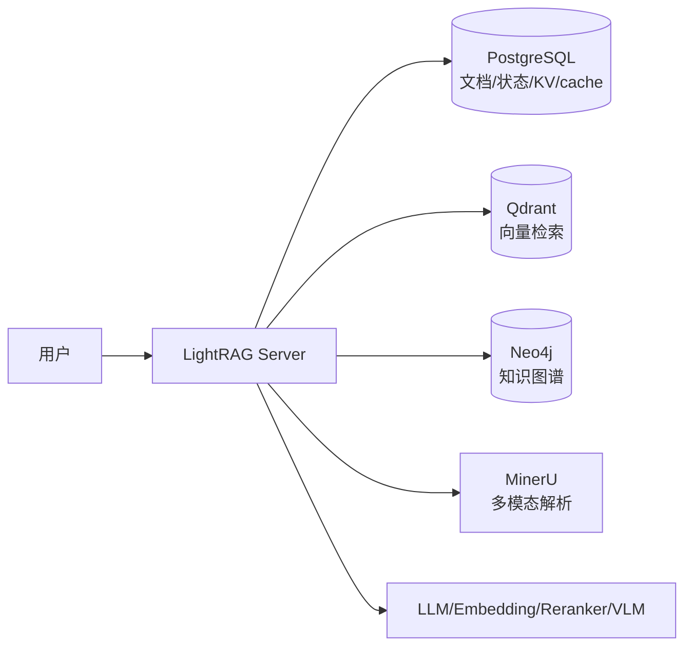

这个组合的好处：

- PostgreSQL 负责通用结构化持久化。
- Qdrant 专注向量检索。
- Neo4j 专注图谱和可视化。
- MinerU 处理复杂 PDF、图片、表格、OCR。
- LightRAG Server 统一提供 WebUI 和 API。

它的代价：

- 部署组件变多。
- GPU、CUDA、镜像版本要匹配。
- 多个模型服务的 API Key、并发、超时都要管理。
- 索引成本和解析成本都比基础 RAG 高。

### 6.3 关于成本的一点经验

知识库成本不只发生在用户问问题时，也发生在文档入库时。

| 阶段 | 可能产生的成本 |
|---|---|
| 文档解析 | MinerU / OCR / VLM 可能占 GPU 或调用外部服务。 |
| Embedding | 每个 chunk 都要向量化。 |
| 实体关系抽取 | 每批 chunk 调用 LLM 抽取 entity / relation。 |
| 关键词抽取 | 每次查询前可能调用模型。 |
| Reranker | 每次查询对候选 chunk 重排。 |
| 最终回答 | 面向用户的 LLM 生成。 |

因此实际选型不能只问“哪个模型效果最好”，还要问：

- 抽取阶段会调用多少次？
- 文档一次性导入多大？
- 是否每份文档都需要实体关系抽取？
- 是否所有文件都需要多模态分析？
- 是否可以对索引模型和问答模型分层？

### 6.4 关于 GPU 和多模态服务

MinerU 这类多模态解析服务通常不是轻量组件。它可能需要：

- CUDA 和 NVIDIA 驱动版本匹配。
- 大尺寸 Docker 镜像。
- 模型权重缓存。
- 足够显存。
- 合理的并发限制。

实际部署时要重点确认：

| 项目 | 说明 |
|---|---|
| 驱动和 CUDA | 宿主机驱动必须能支撑镜像要求的 CUDA 版本。 |
| 显存 | 图片、PDF、VLM 推理会占用显存。 |
| 端口 | LightRAG、PostgreSQL、Qdrant、Neo4j、MinerU 都有端口。 |
| 持久化卷 | 数据库、模型缓存、上传文件、解析产物都要持久化。 |
| 网络 | 大镜像和模型下载容易失败，服务器部署要考虑镜像源或离线导入。 |

## 7. 知识库面临的挑战

### 7.1 答案准确性

知识库最怕“回答得很像真的，但其实错了”。错误来源可能是：

- 文档解析错。
- chunk 切得不好。
- 检索召回错。
- 实体关系抽取错。
- 上下文太长被截断。
- 模型基于不完整上下文自行补全。

改进方向：

- 提供引用和原文片段。
- 使用 Reranker 提升上下文质量。
- 对高风险场景限制模型自由发挥。
- 建立评测集，用固定问题持续评估。

### 7.2 可追溯性

业务用户不会只关心答案，还会问“这个结论从哪里来的”。因此知识库需要：

- 文件名。
- 页码。
- 章节。
- chunk 原文。
- 图片/表格来源。
- 版本信息。

如果没有可追溯性，知识库很难进入生产流程，只能作为辅助搜索工具。

### 7.3 文档质量

知识库效果的上限往往由文档质量决定：

| 文档问题 | 对知识库的影响 |
|---|---|
| 扫描件模糊 | OCR 错误，后续检索和回答都会错。 |
| 表格结构复杂 | 表格转文本后语义丢失。 |
| 章节混乱 | chunk 切分不稳定。 |
| 版本混杂 | 新旧答案冲突。 |
| 图片没有说明 | VLM 需要额外理解，成本更高。 |

所以做知识库不能只调模型，也要治理文档。

### 7.4 权限和安全

企业知识库通常涉及权限：

- 谁能上传文档？
- 谁能看到某个知识库？
- 查询结果能不能跨部门泄露？
- 日志里是否会记录敏感内容？
- API Key、Token、数据库密码如何管理？

RAG 系统如果忽略权限，很容易变成“把原来分散的敏感文档集中暴露出来”。

### 7.5 更新和删除

知识库不是一次性导入。真实系统会遇到：

- 文档更新。
- 文档删除。
- 重复上传。
- Embedding 模型更换。
- chunk 策略调整。
- 图谱抽取策略调整。

需要特别注意：更换 Embedding 模型通常不能直接复用旧向量，因为旧向量和新向量不在同一个语义空间里，通常要重建索引。

### 7.6 评估体系

一个知识库不能只靠“感觉效果还行”上线。尤其不能只拿最终答案做主观判断，因为最终答案受多个环节共同影响：


如果答案错了，原因可能在任何一层：

- 文档解析错；
- chunk 切坏；
- embedding 模型不适合；
- 检索没召回正确片段；
- reranker 把正确片段排后面；
- 上下文太长被截断；
- LLM 没有忠实依据；
- 引用和答案不匹配。

所以知识库评估建议拆成三层：

| 层次 | 评估对象 | 典型问题 |
|---|---|---|
| 检索评估 | 返回的上下文是否正确 | 正确资料有没有被找出来？排序靠前吗？噪声多吗？ |
| 生成评估 | 最终答案是否正确 | 有没有答到问题？有没有编造？是否完整？ |
| 系统评估 | 工程运行是否可用 | 延迟、成本、失败率、权限、可追溯是否达标？ |

#### 回答准确率不能只看一个数字

很多人会问“这个知识库准确率多少”。但 RAG 系统的准确率不是单一指标，至少要拆成：

| 指标 | 含义 | 常见判断方式 |
|---|---|---|
| Answer Correctness | 答案事实是否正确 | 和标准答案或人工标注对比。 |
| Faithfulness | 答案是否忠实于召回上下文 | 检查答案中的事实是否都能被引用片段支持。 |
| Answer Relevance | 答案是否回答了用户问题 | 是否跑题、是否只答了一部分。 |
| Completeness | 答案是否完整 | 标准答案中的关键点是否覆盖。 |
| Citation Accuracy | 引用是否真的支持答案 | 引用片段能否证明答案。 |
| Hallucination Rate | 幻觉率 | 答案中无法从资料支持的内容占比。 |

如果要给业务方一个“总体通过率”，可以设计人工验收规则：

```text
通过 = 答案事实正确 + 关键点覆盖 + 引用能支撑 + 无明显幻觉
```

然后统计：

```text
人工通过率 = 通过的问题数 / 总测试问题数
```

但内部技术调优时，仍然要拆开看检索、重排、生成、引用。

#### RAGAS 常见指标

LightRAG 项目中已经集成了基于 RAGAS 的评估框架。RAGAS 是一个常用的 RAG 评估工具，它用 LLM 和 embedding 来评估问题、答案、上下文之间的关系。

常见指标包括：

| 指标 | 中文理解 | 关注点 |
|---|---|---|
| Faithfulness | 忠实度 | 答案是否基于召回上下文，而不是模型编造。 |
| Answer Relevance | 答案相关性 | 答案是否正面回应用户问题。 |
| Context Recall | 上下文召回率 | 标准答案所需的信息是否被召回。 |
| Context Precision | 上下文精确率 | 召回上下文中无关内容是否少。 |
| RAGAS Score | 综合分 | 通常是多个指标的综合参考值。 |

可以这样理解：

```text
Context Recall 低：正确资料没找出来。
Context Precision 低：找出来的资料里噪声太多。
Faithfulness 低：答案没有严格依据资料。
Answer Relevance 低：答案没答到用户问题。
```

这四个指标分别对应 RAG 的两个核心阶段：

| 阶段 | 主要指标 |
|---|---|
| 检索阶段 | Context Recall、Context Precision |
| 生成阶段 | Faithfulness、Answer Relevance |

#### 一个评估样例

假设测试问题是：

```text
设备开机没有反应时，应该先检查哪些项目？
```

标准答案：

```text
应检查电源线连接、保险丝状态、主控板指示灯；如果指示灯异常，再根据故障表判断原因。
```

系统召回的上下文：

```text
chunk 1：上电后设备初始化失败时，请检查电源线、保险丝和主控板指示灯。
chunk 2：设备支持 NMEA0183 和 NMEA2000 输出协议。
chunk 3：主控板指示灯红色常亮表示启动异常。
```

系统回答：

```text
应先检查电源线、保险丝和主控板指示灯。如果指示灯红色常亮，说明启动异常。
```

这个例子里：

| 指标 | 判断 |
|---|---|
| Context Recall | 较高，因为关键资料 chunk 1 和 chunk 3 被召回了。 |
| Context Precision | 中等，因为 chunk 2 和问题无关，是噪声。 |
| Faithfulness | 较高，因为回答内容都能被 chunk 1 和 chunk 3 支持。 |
| Answer Relevance | 较高，因为回答直接回应了“先检查哪些项目”。 |

如果系统回答：

```text
应先升级固件，然后重新校准天线。
```

即使语言很流畅，Faithfulness 也很低，因为召回上下文并没有支持这个结论。

#### 评估集怎么建设

建议评估集不要只从模型自动生成，最好结合真实业务问题。一个可用的评估样本至少包含：

| 字段 | 说明 |
|---|---|
| question | 用户真实会问的问题。 |
| expected_answer | 人工整理的标准答案或答案要点。 |
| evidence | 标准答案对应的文档、页码、章节、chunk。 |
| question_type | 问题类型，例如定义、步骤、故障排查、对比、总结。 |
| difficulty | 简单、跨章节、跨文档、多模态等。 |
| permission_scope | 需要时记录权限范围，避免评估时误召回不可见资料。 |

测试集可以分层：

| 类型 | 例子 | 用途 |
|---|---|---|
| 简单事实题 | 某设备支持哪些协议？ | 验证基础召回。 |
| 步骤题 | 如何完成初始化配置？ | 验证顺序和完整性。 |
| 故障排查题 | 开机无响应怎么办？ | 验证多片段综合。 |
| 对比题 | A 型号和 B 型号区别是什么？ | 验证跨章节和跨文档。 |
| 多模态题 | 图 3 中指示灯状态代表什么？ | 验证图片/表格解析和引用。 |
| 权限题 | 某部门私有文档是否会被其他用户召回？ | 验证安全边界。 |

#### 一套实用评估流程

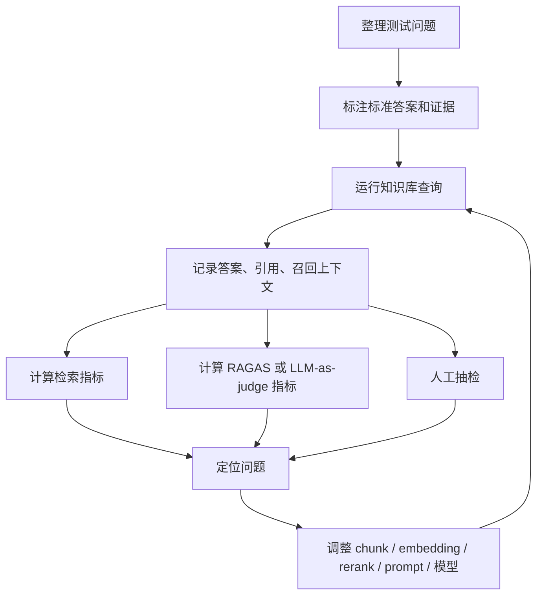

建议每次调整下面这些内容时，都跑一遍固定评估集：

- chunk 策略；
- chunk 大小和 overlap；
- Embedding 模型；
- Top-K；
- Reranker；
- 查询模式；
- 实体关系抽取模型；
- 最终回答模型；
- Prompt。

这样才能知道效果是变好了，还是只是某几个问题看起来变好了。

#### 工程指标也要评估

除了答案质量，还要评估工程可用性：

| 指标 | 含义 |
|---|---|
| P50 / P95 延迟 | 普通问题和慢问题分别要等多久。 |
| 首 token 时间 | 流式回答时用户多久能看到第一个字。 |
| 单次查询成本 | 关键词抽取、检索、rerank、回答模型总成本。 |
| 文档索引成本 | 解析、embedding、实体关系抽取、多模态分析成本。 |
| 失败率 | 上传失败、解析失败、模型超时、数据库错误比例。 |
| 可恢复性 | 失败任务能否重试，删除和重建是否可靠。 |
| 权限命中率 | 不该召回的文档是否被正确过滤。 |

对于生产知识库，质量指标和工程指标缺一不可。一个回答很准但每次等 2 分钟、成本很高、失败不可恢复的系统，也很难真正上线。

## 8. 怎么选择方案

可以按复杂度逐步升级：

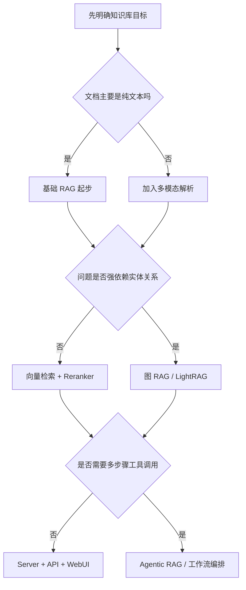

建议：

| 阶段 | 推荐做法 |
|---|---|
| 初期验证 | 先用基础 RAG 跑通一类文档和一组问题。 |
| 复杂知识 | 引入 LightRAG 这类图增强方案。 |
| 多模态文档 | 引入 MinerU / Docling 等解析服务。 |
| 生产部署 | 数据库化存储、权限、日志、评估、备份都要补齐。 |
| 长期优化 | 建立评测集，持续优化 chunk、模型、rerank、图谱质量。 |

## 9. 分享时可以强调的观点

1. 知识库不是“把文档喂给大模型”，而是一套文档解析、索引、检索、生成和治理系统。
2. 基础 RAG 能解决很多问题，但它主要依赖向量相似度，不擅长复杂关系。
3. LightRAG 的价值在于把文本片段、实体、关系和图谱结合起来，提升复杂知识检索能力。
4. 多模态不是锦上添花，很多企业真实资料本来就是 PDF、扫描件、表格和图片。
5. 索引阶段也会花钱，尤其是实体关系抽取和多模态分析，不要只盯着用户提问阶段。
6. 生产环境里，权限、追溯、评估、运维和成本控制，和模型效果一样重要。

## 10. 可能被问到的问题

### Q1：有了大模型，为什么还要知识库？

因为大模型不知道我们的内部资料，也不会自动跟随文档更新。知识库提供的是可控、可更新、可追溯的上下文。

### Q2：为什么不用全文直接塞给大模型？

全文太长，成本高、延迟高，而且模型上下文有限。RAG 的意义是先找最相关的资料，再让模型回答。

### Q3：向量库是不是知识库的全部？

不是。向量库只保存可相似度检索的向量。完整知识库还需要原文、文档状态、引用信息、图谱、权限和日志。

### Q4：图 RAG 一定比基础 RAG 好吗？

不一定。图 RAG 适合复杂关系和跨文档知识，但索引成本更高，抽取质量也需要治理。简单 FAQ 可能基础 RAG 更划算。

### Q5：为什么 LightRAG 处理大文档会慢？

因为它不只是切块和向量化，还可能做文档解析、OCR、多模态分析、实体关系抽取、关系合并、图谱写入。复杂 PDF 或长 Word 文档会显著增加处理时间。

### Q6：为什么同一套系统要用多个模型？

因为不同阶段任务不同。抽取、关键词、最终回答、图片理解对模型能力和成本的要求不同。分角色配置可以在效果和成本之间做平衡。

### Q7：多模态知识库最大的难点是什么？

不是“能不能调用视觉模型”，而是文档解析、版面结构、表格还原、图片来源追溯和结果质量评估。

### Q8：上线前最应该做什么？

建立一组真实问题和标准答案，持续评估召回、答案、引用、延迟和成本。没有评估集，优化很容易变成凭感觉调参数。

### Q9：chunk 越大是不是效果越好？

不是。chunk 大会保留更多上下文，但也会引入更多噪声，占用更多上下文窗口。chunk 小更容易精准召回，但可能缺少标题、前后条件和表格说明。好的 chunk 策略要结合文档结构和问题类型，不能只看大小。

### Q10：向量检索准确率高，最终答案就一定准吗？

不一定。向量检索只说明找到了语义接近的片段。最终答案还会受重排、上下文拼接、Prompt、模型能力和引用约束影响。检索准确率高是必要条件，但不是充分条件。

### Q11：为什么要区分检索评估和回答评估？

因为它们对应不同问题。检索评估回答“资料有没有找对”，回答评估回答“模型有没有基于资料正确表达”。如果不拆开看，答案错了就不知道该调 chunk、embedding、reranker，还是该调模型和 prompt。

## 11. 一句话总结

知识库系统的核心价值，是把分散、复杂、不断变化的企业资料，转成大模型可以可靠使用的上下文。基础 RAG 解决“找相似文本”，LightRAG 进一步解决“理解实体关系和复杂结构”，多模态能力则让系统更接近真实企业文档形态。真正落地时，技术选型只是开始，数据治理、成本控制、权限、安全、评估和运维才决定它能不能长期可用。

## 12. 参考资料和项目链接

下面这些资料可以作为后续继续深入的入口。本文没有逐条复述它们的实现细节，只把其中适合分享会的核心观点提炼出来。

### RAG 和 Modular RAG 论文

| 资料 | 链接 |
|---|---|
| Retrieval-Augmented Generation for Knowledge-Intensive NLP Tasks | https://arxiv.org/abs/2005.11401 |
| Modular RAG: Transforming RAG Systems into LEGO-like Reconfigurable Frameworks | https://arxiv.org/abs/2407.21059 |
| RAGLAB: A Modular and Research-Oriented Unified Framework for Retrieval-Augmented Generation | https://arxiv.org/abs/2408.11381 |

### 评估资料

| 资料 | 链接 |
|---|---|
| RAGAS Metrics | https://docs.ragas.io/en/stable/concepts/metrics/available_metrics/ |
| LightRAG RAGAS Evaluation | `lightrag/evaluation/README_EVALUASTION_RAGAS.md` |
| LightRAG Offline Retrieval Check | `lightrag/evaluation/offline_retrieval_check.py` |

### 开源项目

| 类型 | 项目 | 链接 |
|---|---|---|
| 基础 RAG | LangChain | https://github.com/langchain-ai/langchain |
| 基础 RAG | LlamaIndex | https://github.com/run-llama/llama_index |
| 基础 RAG | Haystack | https://github.com/deepset-ai/haystack |
| 知识库产品 | RAGFlow | https://github.com/infiniflow/ragflow |
| 图 RAG | Microsoft GraphRAG | https://github.com/microsoft/graphrag |
| 图 RAG | LightRAG | https://github.com/HKUDS/LightRAG |
| 图 RAG | Neo4j GraphRAG Python | https://github.com/neo4j/neo4j-graphrag-python |
| Agentic RAG | LangGraph | https://github.com/langchain-ai/langgraph |
| Agentic RAG / 应用平台 | Dify | https://github.com/langgenius/dify |
| Agent / 工具编排 | CrewAI | https://github.com/crewAIInc/crewAI |
| Agent / 多智能体 | AutoGen | https://github.com/microsoft/autogen |
| Modular RAG | Cognita | https://github.com/truefoundry/cognita |
| Modular RAG | OpenRAG | https://open-rag.ai/ |
| Modular RAG | RAGLAB | https://github.com/fate-ubw/RAGLAB |
| 多模态 RAG | RAG-Anything | https://github.com/HKUDS/RAG-Anything |
| 多模态 / 本地知识库 | QAnything | https://github.com/netease-youdao/QAnything |

### 向量检索和向量数据库

| 资料 | 链接 |
|---|---|
| Faiss | https://github.com/facebookresearch/faiss |
| Qdrant | https://github.com/qdrant/qdrant |
| Milvus | https://github.com/milvus-io/milvus |
| pgvector | https://github.com/pgvector/pgvector |
