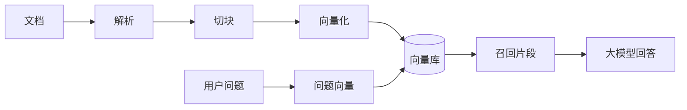
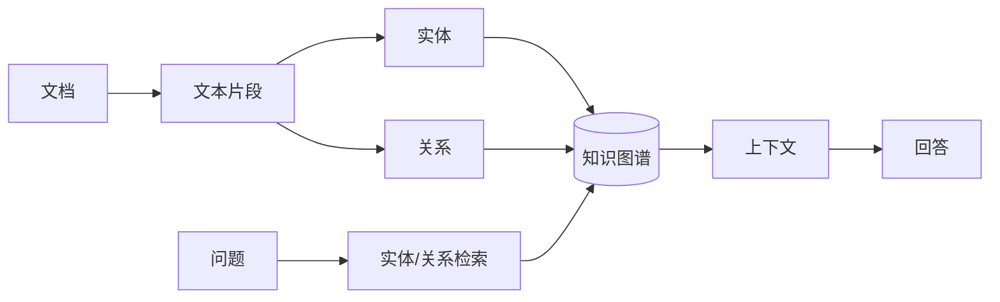
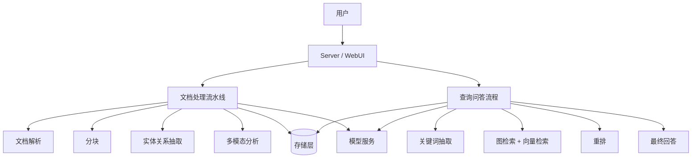
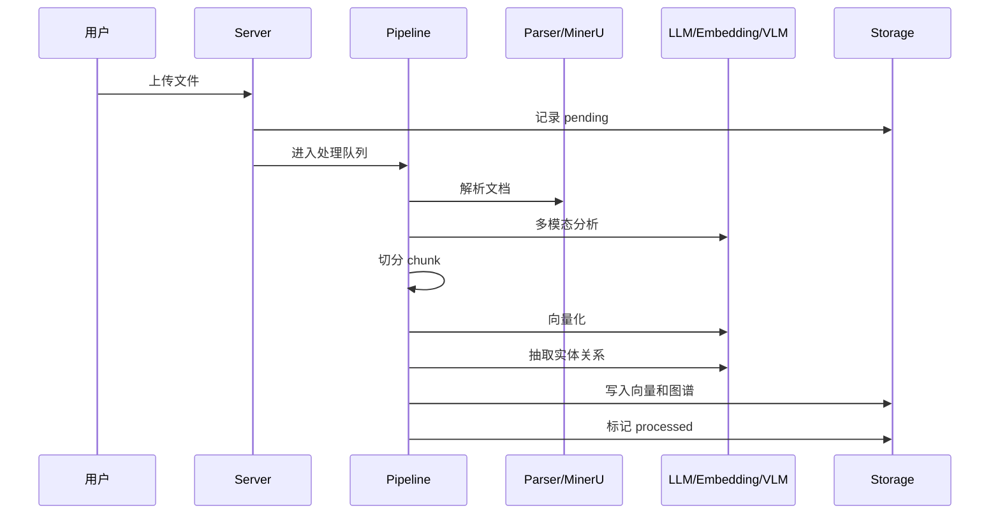
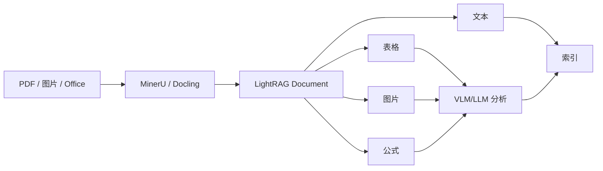
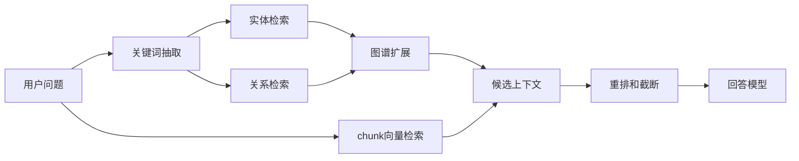
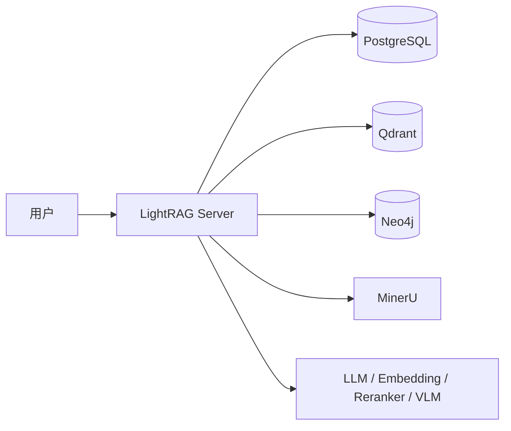
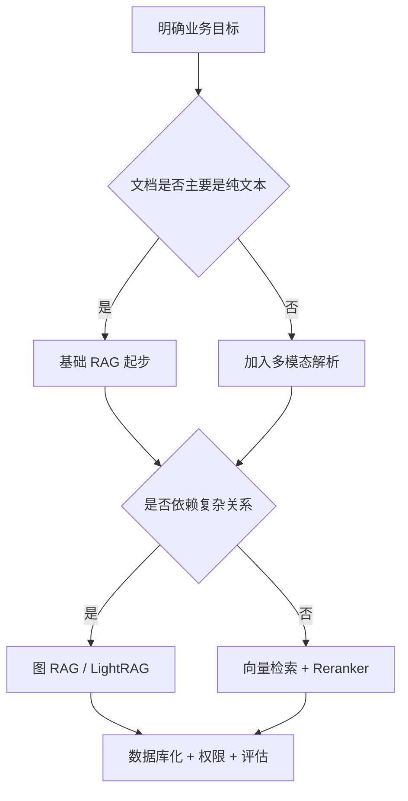

# 知识库调研分享

从基础 RAG 到 LightRAG，多模态知识库的工程化落地

<!--
讲稿提示：
这次分享不是源码培训，而是把知识库、RAG、LightRAG 和落地挑战讲清楚。
重点放在“为什么需要、常见方案怎么选、LightRAG 解决什么问题、后续怎么落地”。
-->

---

# 今天想讲清楚什么

1. 知识库到底解决什么问题
2. 常见 RAG 方案有什么差异
3. LightRAG 为什么不只是普通向量检索
4. 多模态知识库怎么进入工程落地
5. 知识库真正难的地方在哪里

<!--
讲稿提示：
先给大家一个路线图。今天不讲具体代码，也不讲模型论文细节。
目标是让没接触过 RAG 的技术同事，听完知道知识库系统大概怎么组成，为什么要这样设计。
-->

---

# 先用一句话定义知识库

知识库不是“把文件丢给大模型”。

它是一套把企业资料变成：

- 可检索
- 可问答
- 可追溯
- 可更新
- 可治理

的系统。

<!--
讲稿提示：
很多人第一次理解知识库，会把它等同于 ChatGPT 读文档。
实际工程里，知识库更像一个系统工程：有文档解析、索引、检索、生成、权限、日志、评估。
-->

---

# 为什么传统文档搜索不够

常见问题：

- 文档多，但分散在网盘、飞书、PDF、Word、图片里
- 搜索依赖关键词，不知道搜什么文件名
- 找到文件后还要自己读
- 同一个问题反复问人
- 老文档和新文档混在一起

<!--
讲稿提示：
传统搜索解决的是“我知道关键词，帮我找到文件”。
知识库问答想解决的是“我描述问题，系统帮我找依据并组织答案”。
-->

---

# 大模型为什么不能直接当知识库

| 问题 | 说明 |
|---|---|
| 不知道内部资料 | 企业文档没有进入模型训练 |
| 容易编造 | 没有依据时也可能生成答案 |
| 更新慢 | 文档今天更新，模型不会自动知道 |
| 权限难控 | 不同用户能看的文档不同 |
| 成本高 | 全文塞给模型不现实 |

<!--
讲稿提示：
大模型很擅长表达和总结，但它不是我们内部文档数据库。
所以需要一种方式，让模型在回答前先拿到相关资料。
-->

---

# RAG：先检索，再生成



<!--
讲稿提示：
RAG 的核心是 Retrieval-Augmented Generation，检索增强生成。
先从知识库里找相关资料，再让大模型基于资料回答。
-->

---

# 基础 RAG 能做什么

适合：

- FAQ
- 产品说明书
- 制度文档
- 问题比较直接的场景

优点：

- 实现简单
- 成本相对低
- 容易做出 Demo

<!--
讲稿提示：
基础 RAG 是知识库最常见起点。
如果文档结构简单、问题直接，它已经能解决很多问题。
-->

---

# 基础 RAG 的局限

它主要找“相似文本”，不一定理解“知识关系”。

典型问题：

- 相似不等于相关
- 跨章节、跨文档问题容易漏
- 表格、图片、扫描件处理弱
- 很难回答实体关系型问题

<!--
讲稿提示：
比如问“某个模块和哪些配置项有关”，普通向量检索可能找到了相关段落，但不一定能完整组织关系。
这就是图 RAG 的切入点。
-->

---

# 常见方案全景

| 方案 | 核心能力 | 适合场景 |
|---|---|---|
| 基础 RAG | 文本向量检索 | FAQ、普通文档问答 |
| 图 RAG | 实体关系图谱 | 复杂关系、跨文档知识 |
| Agentic RAG | 智能体规划和工具调用 | 多步骤任务、业务系统联动 |
| 多模态 RAG | 解析图片、表格、PDF | 扫描件、说明书、图文报告 |

<!--
讲稿提示：
这些方案不是互斥的。
真实系统里经常是组合：基础 RAG 打底，复杂关系引入图，多模态文档引入解析引擎，需要动作时再引入智能体。
-->

---

# 图 RAG：让知识有结构



<!--
讲稿提示：
图 RAG 会从文档里抽取实体和关系。
比如设备、模块、配置项、故障原因，这些都可以成为图谱里的节点和边。
-->

---

# 多模态 RAG：面对真实文档

真实企业资料不只是纯文本：

- PDF
- Word
- 扫描件
- 图片
- 表格
- 公式
- 图纸和截图

多模态 RAG 的关键是先把这些内容解析成可索引的结构。

<!--
讲稿提示：
很多知识库 Demo 用的是干净文本，但真实资料经常是 PDF 扫描件、图片、表格。
所以文档解析质量会直接决定后续问答效果。
-->

---

# LightRAG 是什么

LightRAG 是一个图增强 RAG 框架。

它不仅做：

```text
文档 -> chunk -> 向量 -> 检索 -> 回答
```

还会做：

```text
chunk -> 实体 / 关系 -> 知识图谱
```

查询时再组合图检索、向量检索、关键词抽取、重排和大模型回答。

<!--
讲稿提示：
这是今天的重点。
LightRAG 和普通 RAG 最大区别，是它在索引阶段额外构建实体关系图谱。
-->

---

# LightRAG 的整体架构



<!--
讲稿提示：
这里可以把 LightRAG 看成五部分：入口、流水线、查询核心、存储层、模型接入层。
它不是单个模型，而是一套知识库应用框架。
-->

---

# LightRAG 里存了哪些数据

| 数据类型 | 作用 | 典型存储 |
|---|---|---|
| 原文和 chunk | 保存文档内容和引用来源 | KV / PostgreSQL |
| chunk 向量 | 做文本相似检索 | Qdrant / Milvus 等 |
| entity / relation 向量 | 做实体和关系检索 | 向量数据库 |
| 知识图谱 | 保存实体节点和关系边 | Neo4j / NetworkX 等 |
| 文档状态 | 记录处理进度和失败原因 | PostgreSQL / JSON |

<!--
讲稿提示：
一个重要误区是：知识库数据都在向量库里。
LightRAG 至少有四类存储：KV、Vector、Graph、Document Status。
-->

---

# 文档上传后发生了什么



<!--
讲稿提示：
上传只是入口，真正耗时的是后台流水线。
复杂 PDF 会经历解析、OCR、多模态分析、向量化、实体关系抽取，所以比普通上传文件慢很多。
-->

---

# 文件处理能力

LightRAG 当前支持多种解析和分块方式。

| 类型 | 选项 |
|---|---|
| 内容抽取引擎 | legacy、native、mineru、docling |
| 分块方式 | Fix、Recursive、Vector、Paragraph |
| 多模态内容 | 图片、表格、公式 |
| 单文件控制 | 可对个别文件关闭实体关系抽取 |

<!--
讲稿提示：
legacy 可以理解成旧版解析，native 是内置结构化解析，MinerU 和 Docling 是外部文档解析服务。
这些能力说明 LightRAG 已经在处理真实企业文档，而不是只处理纯文本。
-->

---

# 多模态在 LightRAG 中的位置



<!--
讲稿提示：
多模态不是简单上传图片给大模型。
关键是把图片、表格、公式和原文位置关联起来，再进入统一索引。
-->

---

# 查询时怎么回答



<!--
讲稿提示：
LightRAG 查询时不是只做一次向量检索。
它可以从实体、关系、图邻域和 chunk 向量多路召回，再交给模型生成答案。
-->

---

# LightRAG 查询模式

| 模式 | 理解方式 | 适合问题 |
|---|---|---|
| local | 围绕具体实体查 | 某个设备/模块是什么 |
| global | 从关系和主题查 | 整体流程、全局总结 |
| hybrid | local + global | 问题类型不确定 |
| mix | 图谱 + chunk 向量 | 综合问答，适合配合 Reranker |
| naive | 纯向量检索 | 快速验证基础 RAG |

<!--
讲稿提示：
不需要让听众记住每个模式的实现，只要理解：不同问题适合不同检索路径。
mix 模式通常适合结合重排做综合问答。
-->

---

# 模型分工：不要全程用最贵模型

| 角色 | 作用 | 选型思路 |
|---|---|---|
| EXTRACT | 实体关系抽取 | 稳定、成本可控 |
| KEYWORD | 查询关键词抽取 | 轻量、调用快 |
| QUERY | 最终回答 | 能力更强、表达更好 |
| VLM | 图片/表格/公式分析 | 需要视觉理解 |

<!--
讲稿提示：
索引阶段也会大量调用模型，尤其是实体关系抽取。
所以实际落地时，常见策略是抽取和关键词用便宜模型，最终回答用更强模型。
-->

---

# 本次调研倾向的工程组合



| 组件 | 作用 |
|---|---|
| PostgreSQL | 文档、状态、KV、缓存 |
| Qdrant | 向量检索 |
| Neo4j | 知识图谱 |
| MinerU | PDF、图片、表格、OCR |
| LightRAG Server | API、WebUI、统一入口 |

<!--
讲稿提示：
这个组合不是最简单的，但比较接近生产可维护形态。
不同类型的数据交给不同专业组件。
-->

---

# 从 Demo 到生产，难在哪里

Demo 关注：

- 能不能上传文件
- 能不能问出答案
- 页面能不能展示

生产还要关注：

- 数据库化存储
- 文档状态和失败重试
- 权限和审计
- 日志和监控
- 模型成本
- 备份和迁移
- 版本更新和重新索引

<!--
讲稿提示：
知识库最容易低估的是工程部分。
真正上线不是跑通一次，而是持续稳定地处理文档、回答问题、排查失败。
-->

---

# 成本不只发生在提问时

| 阶段 | 成本来源 |
|---|---|
| 文档解析 | OCR、MinerU、VLM、GPU |
| 向量化 | 每个 chunk 都要 embedding |
| 实体关系抽取 | 每批 chunk 调用 LLM |
| 关键词抽取 | 每次查询前可能调用模型 |
| Reranker | 候选结果重排 |
| 最终回答 | 面向用户的大模型生成 |

<!--
讲稿提示：
很多人只计算用户问一次问题花多少钱。
但图 RAG 和多模态 RAG 的成本，大量发生在文档入库阶段。
-->

---

# 知识库的核心挑战

1. 准确性：答案是否真的基于文档
2. 召回：正确资料有没有被找出来
3. 追溯：能不能定位到文件、页码、片段
4. 权限：用户只能看到该看的内容
5. 更新：文档变化后索引如何同步
6. 成本：索引和查询是否可承受
7. 评估：效果不能只凭感觉

<!--
讲稿提示：
这些挑战决定知识库能不能从 Demo 走到生产。
特别是追溯、权限、评估，往往比模型本身更影响上线。
-->

---

# 怎么选择方案



<!--
讲稿提示：
不要一开始就追求最复杂架构。
应该根据文档形态、问题复杂度、业务风险逐步升级。
-->

---

# 总结

知识库的本质：

> 把分散、复杂、不断变化的企业资料，变成大模型可以可靠使用的上下文。

核心判断：

- 基础 RAG 解决“找相似文本”
- 图 RAG 解决“理解实体关系”
- 多模态 RAG 解决“真实文档形态”
- LightRAG 把图谱、向量、Server、多模态能力组合成可落地框架

<!--
讲稿提示：
最后收束到一句话：知识库不是模型能力单点问题，而是文档、检索、模型、存储、权限和评估共同组成的系统。
-->

---

# Q&A

可以讨论：

- 我们适合先做哪类文档？
- 是否需要图谱能力？
- 哪些文档必须支持多模态解析？
- 如何设计评测问题集？
- 成本和部署资源怎么估算？

<!--
讲稿提示：
结束时可以引导大家从业务场景反推技术方案。
不要一开始问用什么模型，而是先问解决哪类问题、有哪些文档、用户是谁、答案风险多高。
-->
