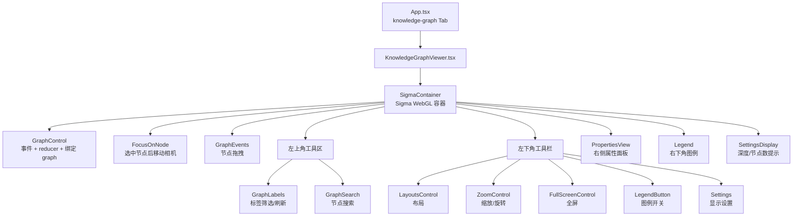
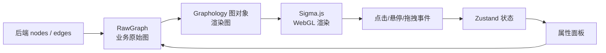
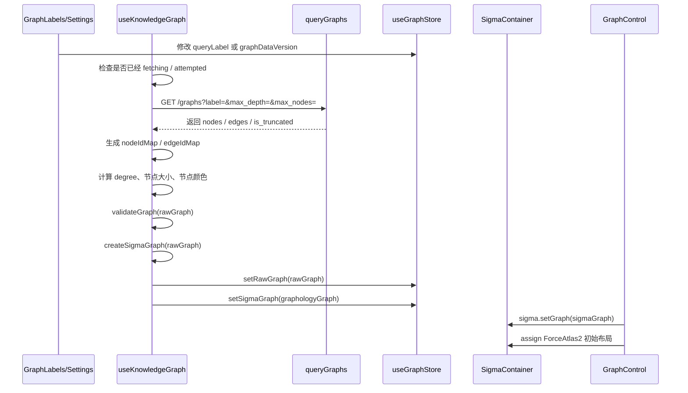
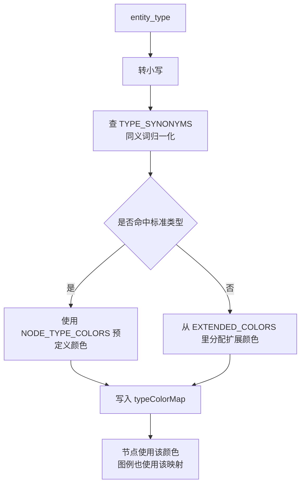
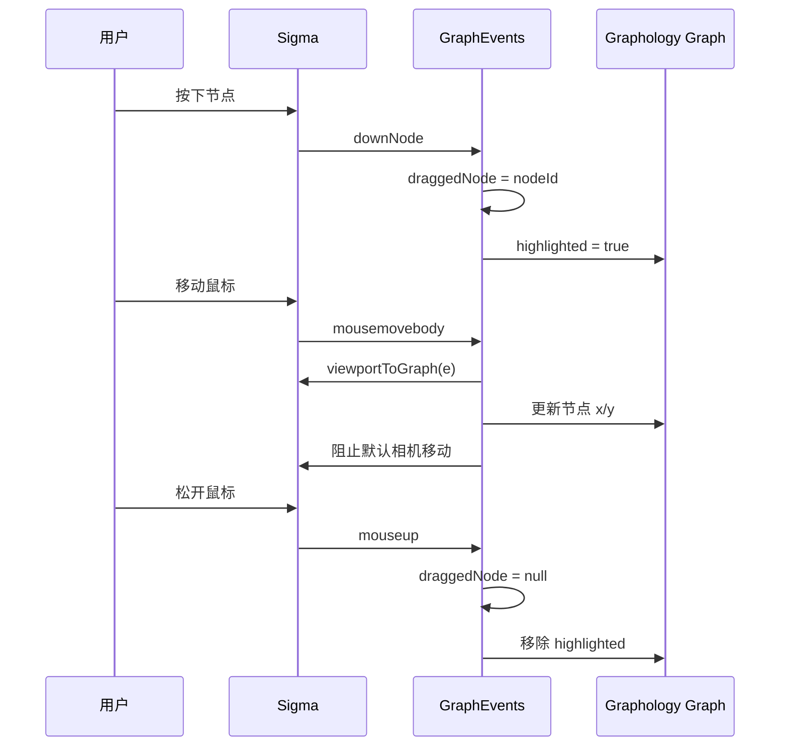
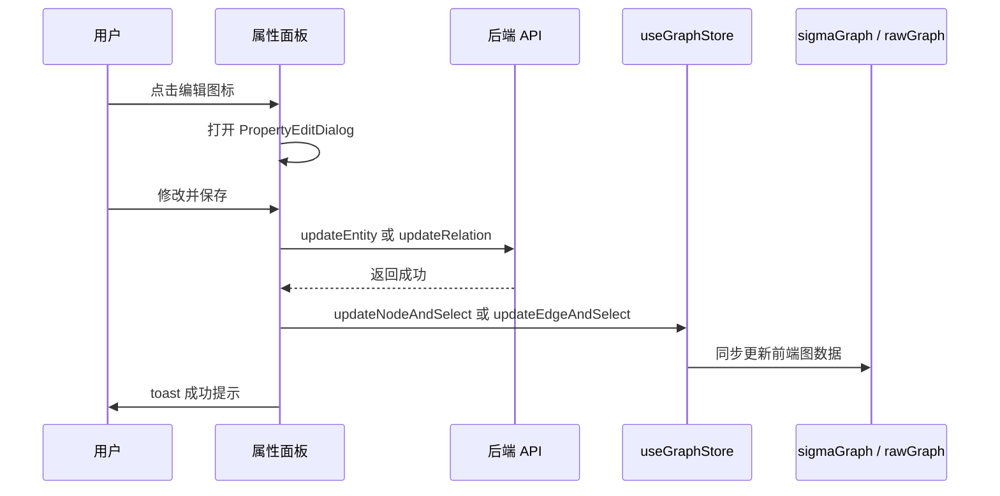
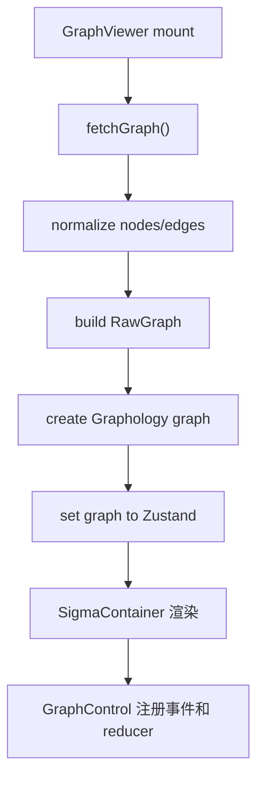
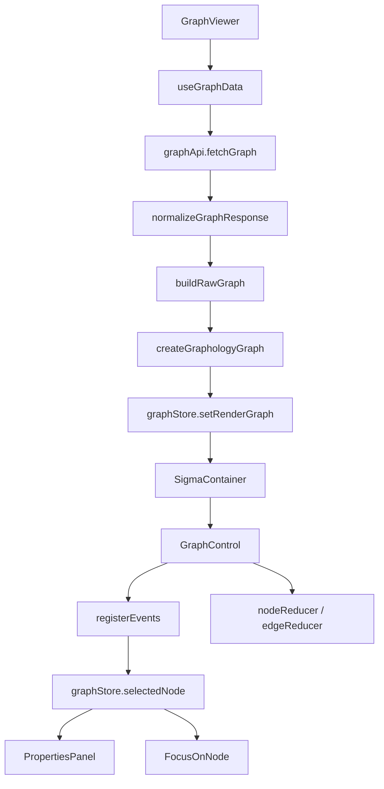
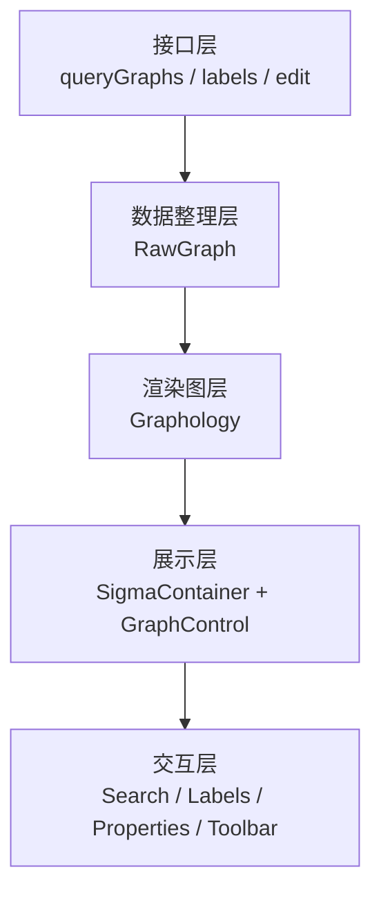

# WebUI 知识图谱展示与复刻指南

> 本文梳理一套通用“知识图谱展示”前端实现方案。它不讲后端如何抽取实体关系，也不讲问答流程。目标是让你后续在其他项目中参考这套实现思路，做出相近的知识图谱页面、图谱样式和交互体验。

## 1. 结论先看

知识图谱前端展示的核心实现可以概括为一句话：

> 后端返回 `nodes` 和 `edges` 数组，前端先整理成一份业务原始图数据 `RawGraph`，再转换成 `Graphology` 图对象，最后交给 `Sigma.js` 用 WebGL 渲染；页面交互通过 React 组件和 Zustand 状态管理串起来。

这套方案没有使用 React Flow、D3 SVG 或 Cytoscape，而是使用：

| 层次 | 使用内容 | 作用 |
|---|---|---|
| 图数据结构 | `graphology` | 在前端内存中维护节点、边、属性、邻居关系 |
| 图渲染 | `sigma`、`@react-sigma/core` | 用 WebGL 在画布上渲染大规模节点和边 |
| 布局算法 | `@react-sigma/layout-*` | 圆形、随机、ForceAtlas2、Force Directed、Noverlap 等布局 |
| 状态管理 | `zustand` | 保存图数据、选中节点、搜索引擎、设置项 |
| 节点搜索 | `minisearch` | 在前端对当前图节点做快速模糊搜索 |
| UI 组件 | Radix UI 风格组件、Tailwind、lucide-react | 浮层、按钮、下拉、设置面板、图标 |

如果要在其他项目中复刻，最重要的不是照抄所有代码，而是保留这几个关键设计：

1. **图谱区域全屏铺满容器**，工具栏和面板悬浮在图谱上。
2. **后端原始数据和渲染图数据分开保存**，避免业务属性和 Sigma 内部边 ID 混在一起。
3. **节点颜色、节点大小、边粗细用数据驱动**，不要写死。
4. **选中、高亮、弱化、隐藏边通过 Sigma reducer 实现**，不要频繁重建整张图。
5. **大图通过 max nodes、标签筛选、局部展开控制规模**。

## 2. 推荐组件拆分

如果要在其他项目中复刻，建议按下面方式拆分前端模块：

| 推荐文件 | 作用 |
|---|---|
| `src/features/KnowledgeGraphViewer.tsx` | 知识图谱页面主入口，创建 `SigmaContainer`，组织所有图谱控件 |
| `src/hooks/useKnowledgeGraph.ts` | 拉取图谱数据、转换数据、创建 Graphology 图、处理展开和剪枝 |
| `src/stores/graphStore.ts` | 图谱运行态 Zustand store，保存原始图、渲染图、选中状态、搜索引擎 |
| `src/stores/graphSettingsStore.ts` | 图谱显示设置，持久化在浏览器 localStorage |
| `src/components/graph/GraphControl.tsx` | 注册 Sigma 事件、绑定图对象、设置节点和边的动态渲染规则 |
| `src/components/graph/GraphLabels.tsx` | 左上角图谱标签筛选和刷新 |
| `src/components/graph/GraphSearch.tsx` | 当前图内节点搜索 |
| `src/components/graph/LayoutsControl.tsx` | 图布局切换和布局动画 |
| `src/components/graph/PropertiesView.tsx` | 右侧节点/边属性面板 |
| `src/components/graph/EditablePropertyRow.tsx` | 节点/边属性编辑 |
| `src/components/graph/FocusOnNode.tsx` | 选中节点后高亮并移动相机 |
| `src/components/graph/ZoomControl.tsx` | 缩放、旋转、重置视角 |
| `src/components/graph/FullScreenControl.tsx` | 图谱全屏切换 |
| `src/components/graph/Legend.tsx` | 图例展示 |
| `src/components/graph/Settings.tsx` | 图谱设置面板 |
| `src/api/graphApi.ts` | 图谱相关 API 请求封装 |
| `src/lib/graphConstants.ts` | 图谱颜色、节点大小、搜索限制等常量 |
| `src/utils/graphColor.ts` | 根据实体类型解析节点颜色 |

在业务应用中，知识图谱可以作为一个独立页面，也可以作为某个 Tab 出现：

```tsx
<TabsContent value="knowledge-graph">
  <KnowledgeGraphViewer />
</TabsContent>
```

真正的图谱页面入口建议命名为 `KnowledgeGraphViewer`。

## 3. 页面最终长什么样

推荐的知识图谱页不是传统“卡片式图表”，而是一个完整的图谱工作区：

```text
┌──────────────────────────────────────────────────────────────┐
│ 标签筛选 + 刷新按钮      节点搜索框                           │
│                                                              │
│                                                              │
│                   Sigma WebGL 图谱画布                       │
│                                                              │
│                                      ┌──────────────────┐    │
│                                      │ 节点/边属性面板  │    │
│                                      │ 可查看、编辑     │    │
│                                      └──────────────────┘    │
│                                                              │
│ 工具栏                                                       │
│ 布局/播放/缩放/旋转/全屏/图例/设置        图例面板           │
└──────────────────────────────────────────────────────────────┘
```

对应到 `KnowledgeGraphViewer.tsx`：

| 位置 | 组件 | 功能 |
|---|---|---|
| 图谱底层 | `SigmaContainer` | Sigma 渲染容器 |
| 内部控制 | `GraphControl` | 绑定图对象、注册点击悬停事件、设置 reducer |
| 左上角 | `GraphLabels` | 选择全局图或某个实体的子图 |
| 左上角 | `GraphSearch` | 在当前图内搜索节点 |
| 左下角 | `LayoutsControl` | 切换布局算法 |
| 左下角 | `ZoomControl` | 缩放、旋转、重置视角 |
| 左下角 | `FullScreenControl` | 全屏 |
| 左下角 | `LegendButton` | 打开或关闭图例 |
| 左下角 | `Settings` | 图谱设置 |
| 右上角 | `PropertiesView` | 展示节点/边属性 |
| 右下角 | `Legend` | 展示实体类型和颜色对应关系 |
| 中间浮层 | loading overlay | 加载图谱或切换主题时显示 |

组件结构可以画成这样：



## 4. 依赖和选择原因

推荐安装的图谱相关依赖如下：

| 依赖 | 当前用途 |
|---|---|
| `sigma` | 图谱 WebGL 渲染核心 |
| `@react-sigma/core` | 在 React 中使用 Sigma 的容器、事件、相机、全屏等 hook |
| `graphology` | 前端图数据结构 |
| `graphology-layout` | 图布局基础能力 |
| `graphology-layout-force` | Force Directed 布局 |
| `graphology-layout-forceatlas2` | ForceAtlas2 布局 |
| `graphology-layout-noverlap` | 防止节点重叠布局 |
| `@react-sigma/layout-circular` | 圆形布局 |
| `@react-sigma/layout-circlepack` | Circlepack 布局 |
| `@react-sigma/layout-random` | 随机布局 |
| `@react-sigma/layout-noverlap` | React 版 Noverlap 布局 hook |
| `@react-sigma/layout-force` | React 版 Force Directed 布局 hook |
| `@react-sigma/layout-forceatlas2` | React 版 ForceAtlas2 布局 hook |
| `@sigma/edge-curve` | 曲线边渲染 |
| `@sigma/node-border` | 带边框节点渲染 |
| `@react-sigma/graph-search` | 图搜索相关类型和辅助组件 |
| `minisearch` | 当前图节点前端搜索 |
| `zustand` | 图谱状态管理 |

这套选择适合以下场景：

| 场景 | 是否适合 |
|---|---|
| 几百到几千节点的交互式图谱 | 适合 |
| 需要平移、缩放、拖拽、悬停高亮 | 适合 |
| 节点/边样式需要动态变化 | 适合 |
| 需要复杂流程编排、连线编辑器 | 不一定适合，React Flow 更合适 |
| 需要大量自定义 SVG 节点 DOM | 不适合，Sigma 主要是 Canvas/WebGL |
| 需要在大图中流畅浏览 | 比 SVG 方案更适合 |

## 5. 后端数据格式：前端最少需要什么

虽然本文不讲后端实现，但要复刻前端图谱，必须知道前端需要什么数据。

建议在 `src/api/graphApi.ts` 中定义图谱节点和边：

```ts
export type GraphNodeType = {
  id: string
  labels: string[]
  properties: Record<string, any>
}

export type GraphEdgeType = {
  id: string
  source: string
  target: string
  type: string
  properties: Record<string, any>
}

export type KnowledgeGraphType = {
  nodes: GraphNodeType[]
  edges: GraphEdgeType[]
}
```

前端调用接口：

| 函数 | 请求 | 用途 |
|---|---|---|
| `queryGraphs(label, maxDepth, maxNodes)` | `GET /graphs?label=...&max_depth=...&max_nodes=...` | 获取图谱数据 |
| `getPopularLabels(limit)` | `GET /graph/label/popular?limit=...` | 获取热门实体标签 |
| `searchLabels(query, limit)` | `GET /graph/label/search?q=...&limit=...` | 搜索实体标签 |
| `updateEntity(...)` | `POST /graph/entity/edit` | 编辑节点属性 |
| `updateRelation(...)` | `POST /graph/relation/edit` | 编辑边属性 |
| `checkEntityNameExists(...)` | `GET /graph/entity/exists?name=...` | 修改实体名时检查重名 |

如果只想复刻“展示图谱”，最少只需要实现：

```http
GET /graphs?label=*&max_depth=3&max_nodes=1000
```

返回示例：

```json
{
  "nodes": [
    {
      "id": "数据库设计",
      "labels": ["数据库设计"],
      "properties": {
        "entity_id": "数据库设计",
        "entity_type": "concept",
        "description": "数据库表结构、字段、关系和约束的设计说明"
      }
    },
    {
      "id": "用户表",
      "labels": ["用户表"],
      "properties": {
        "entity_id": "用户表",
        "entity_type": "artifact",
        "description": "保存用户基础信息的数据表"
      }
    }
  ],
  "edges": [
    {
      "id": "数据库设计-用户表",
      "source": "数据库设计",
      "target": "用户表",
      "type": "RELATED",
      "properties": {
        "keywords": "包含,设计对象",
        "description": "数据库设计中包含用户表设计",
        "weight": 3
      }
    }
  ],
  "is_truncated": false
}
```

字段使用说明：

| 字段 | 前端用途 |
|---|---|
| `node.id` | Graphology/Sigma 节点 ID，必须唯一 |
| `node.labels` | 节点显示文本，最终会 `join(', ')` |
| `node.properties.entity_id` | 属性面板展示和编辑实体名 |
| `node.properties.entity_type` | 决定节点颜色和图例 |
| `node.properties.description` | 属性面板展示和编辑说明 |
| `edge.id` | 后端边 ID，保存在 `RawGraph.edgeIdMap` |
| `edge.source` | 源节点 ID |
| `edge.target` | 目标节点 ID |
| `edge.properties.keywords` | 边标签文本 |
| `edge.properties.weight` | 边粗细映射依据 |
| `is_truncated` | 后端截断大图时前端弹提示 |

## 6. 为什么要有 RawGraph 和 SigmaGraph 两份图

这是这类前端图谱实现中最值得复用的设计。

建议在 `src/stores/graphStore.ts` 中定义：

```ts
export class RawGraph {
  nodes: RawNodeType[] = []
  edges: RawEdgeType[] = []
  nodeIdMap: Record<string, number> = {}
  edgeIdMap: Record<string, number> = {}
  edgeDynamicIdMap: Record<string, number> = {}
}
```

同时 Zustand store 中保存：

```ts
rawGraph: RawGraph | null
sigmaGraph: DirectedGraph | null
sigmaInstance: any | null
```

这里的职责分工是：

| 数据 | 作用 | 谁使用 |
|---|---|---|
| `RawGraph` | 保存后端原始业务数据，节点属性、边属性、后端 ID 映射 | 属性面板、编辑、搜索、展开、剪枝 |
| `sigmaGraph` | Graphology 图对象，保存 Sigma 渲染需要的节点坐标、颜色、大小、边样式 | Sigma 渲染、事件、布局、相机 |
| `sigmaInstance` | Sigma 实例 | 相机移动、全局刷新、WebGL 清理 |

为什么不能只用一份图？

1. **Graphology 的边 ID 不一定等于后端边 ID**  
   `graph.addEdge(source, target, attrs)` 会返回一个动态边 ID。这个 ID 是 Sigma 交互事件里拿到的 ID，但后端更新接口需要的是原始边信息。

2. **业务属性和渲染属性不一样**  
   后端节点有 `entity_type`、`description`、`source_id`，而 Sigma 节点需要 `x`、`y`、`size`、`color`、`borderColor`。

3. **属性面板需要原始属性**  
   点击节点后，属性面板展示的是业务属性，不是只展示渲染属性。

4. **局部展开和剪枝会同时影响两份数据**  
   展开节点时要把新节点加入 `sigmaGraph`，也要把原始节点加入 `rawGraph.nodes`，并更新索引表。

可以把它理解为：



复刻时建议保留这个分层。即使你不用 Zustand，也建议保留“原始图数据”和“渲染图对象”两份结构。

## 7. 图谱加载完整流程

图谱数据加载主要建议在 `src/hooks/useKnowledgeGraph.ts` 中完成。

触发条件来自：

| 状态 | 来源 | 作用 |
|---|---|---|
| `queryLabel` | `useSettingsStore` | 当前要看的实体标签，默认 `*` |
| `graphQueryMaxDepth` | `useSettingsStore` | 查询深度，默认 3 |
| `graphMaxNodes` | `useSettingsStore` | 最大节点数，默认 1000 |
| `graphDataVersion` | `useGraphStore` | 手动刷新时递增，强制重新拉取 |
| `graphDataFetchAttempted` | `useGraphStore` | 防止 React/Vite 开发模式重复拉取 |

核心流程：



伪代码如下：

```ts
async function loadGraph() {
  setIsFetching(true)

  const rawData = await queryGraphs(queryLabel, maxDepth, maxNodes)

  for each node:
    node.x = random()
    node.y = random()
    node.degree = 0
    node.size = 10
    nodeIdMap[node.id] = index

  for each edge:
    edgeIdMap[edge.id] = index
    source.degree += 1
    target.degree += 1

  for each node:
    node.size = scaleByDegree(node.degree)
    node.color = resolveNodeColor(node.properties.entity_type)

  rawGraph = new RawGraph(nodes, edges, maps)
  validateGraph(rawGraph)

  sigmaGraph = createSigmaGraph(rawGraph)
  rawGraph.buildDynamicMap()

  store.setRawGraph(rawGraph)
  store.setSigmaGraph(sigmaGraph)
  setIsFetching(false)
}
```

## 8. RawGraph 如何变成 Sigma 图

转换函数建议放在 `useKnowledgeGraph.ts` 中，例如 `createSigmaGraph(rawGraph)`。

它做了几件事：

### 8.1 创建图对象

推荐示例使用：

```ts
const graph = new UndirectedGraph()
```

也就是说，前端展示时把关系当作无向图渲染。即使后端边有 `source` 和 `target`，当前渲染默认用的是无箭头曲线边。

### 8.2 添加节点

每个节点被添加为：

```ts
graph.addNode(rawNode.id, {
  label: rawNode.labels.join(', '),
  color: rawNode.color,
  x,
  y,
  size: rawNode.size,
  borderColor: Constants.nodeBorderColor,
  borderSize: 0.2
})
```

这些字段的含义：

| 字段 | 作用 |
|---|---|
| `label` | 节点显示文本 |
| `color` | 节点颜色 |
| `x` / `y` | 初始位置 |
| `size` | 节点大小 |
| `borderColor` | 节点边框颜色 |
| `borderSize` | 节点边框粗细 |

### 8.3 添加边

每条边被添加为：

```ts
rawEdge.dynamicId = graph.addEdge(rawEdge.source, rawEdge.target, {
  label: rawEdge.properties?.keywords || undefined,
  size: weight,
  originalWeight: weight,
  type: 'curvedNoArrow'
})
```

注意 `dynamicId` 很重要。它是 Graphology 返回的边 ID，后续 Sigma 点击边时拿到的是这个 ID，而不是后端 `rawEdge.id`。

所以 `RawEdgeType` 中有：

```ts
dynamicId: string
```

并通过：

```ts
rawGraph.buildDynamicMap()
```

生成：

```ts
edgeDynamicIdMap[dynamicId] = edgeIndex
```

这样属性面板才能通过 Sigma 事件里的边 ID 找回后端原始边。

## 9. 节点大小如何计算

示例方案使用节点度数来计算节点大小。

在 `fetchGraph()` 中：

1. 先统计每个节点连接了多少条边，保存为 `degree`。
2. 找出最小度数和最大度数。
3. 把度数映射到 `minNodeSize` 到 `maxNodeSize`。

常量建议放在 `src/lib/graphConstants.ts`：

```ts
export const minNodeSize = 4
export const maxNodeSize = 20
```

映射公式是平方根缩放：

```ts
node.size = minNodeSize
  + (maxNodeSize - minNodeSize)
  * sqrt((degree - minDegree) / (maxDegree - minDegree))
```

为什么用平方根？

| 线性缩放 | 平方根缩放 |
|---|---|
| 高连接节点会变得特别大 | 大节点仍然突出，但不会压制其他节点 |
| 低连接节点差异不明显 | 中低连接节点仍能看出差异 |
| 大图容易视觉失衡 | 更适合知识图谱 |

复刻建议：

```ts
function scaleNodeSize(degree, minDegree, maxDegree) {
  if (maxDegree === minDegree) return 10
  const ratio = (degree - minDegree) / (maxDegree - minDegree)
  return 4 + (20 - 4) * Math.sqrt(ratio)
}
```

## 10. 节点颜色如何计算

颜色逻辑建议放在 `src/utils/graphColor.ts`。

核心函数：

```ts
resolveNodeColor(nodeType, currentMap)
```

它的输入是节点属性：

```ts
node.properties?.entity_type
```

处理流程：



当前预置颜色主要覆盖：

| 标准类型 | 示例颜色 |
|---|---|
| `person` | 蓝色 |
| `organization` | 绿色 |
| `location` | 橙色 |
| `event` | 青绿色 |
| `concept` | 红色 |
| `method` | 深红色 |
| `content` | 深蓝色 |
| `data` | 蓝色 |
| `artifact` | 紫色 |
| `unknown` | 灰色 |

这里还有一个重要设计：`typeColorMap` 保存在 `useGraphStore` 中。

作用是：

1. 当前图里出现过哪些实体类型，图例就显示哪些类型。
2. 未知类型也能稳定分配颜色。
3. 刷新图谱时可以清空颜色缓存，重新生成图例。

复刻时建议：

```ts
const COLOR_BY_TYPE = {
  person: '#4169E1',
  organization: '#00cc00',
  location: '#cf6d17',
  event: '#00bfa0',
  concept: '#e3493b',
  data: '#0000ff',
  unknown: '#b0b0b0'
}
```

如果你做企业知识库，可以把类型改成：

| 类型 | 含义 |
|---|---|
| `system` | 系统 |
| `module` | 模块 |
| `table` | 数据表 |
| `field` | 字段 |
| `api` | 接口 |
| `document` | 文档 |
| `process` | 流程 |
| `role` | 角色 |

## 11. 边粗细如何计算

边的粗细使用：

```ts
edge.properties.weight
```

如果没有 `weight`，默认是 1。

在 `createSigmaGraph()` 中，先保存：

```ts
originalWeight: weight
```

然后根据当前图中最小和最大的 weight 映射到：

```ts
minEdgeSize
maxEdgeSize
```

这两个设置来自 `useSettingsStore`，默认值当前都是 1：

```ts
minEdgeSize: 1
maxEdgeSize: 1
```

这意味着默认情况下所有边看起来一样粗。用户可以在设置面板里调整边粗细范围。

复刻建议：

| 场景 | 建议 |
|---|---|
| 初学者演示 | 默认边粗细固定，避免画面杂乱 |
| 需要表达关系强弱 | 开启 weight 映射，例如 1 到 5 |
| 关系很多的大图 | 边尽量细，配合悬停高亮 |

## 12. Sigma 渲染配置

`GraphViewer.tsx` 中的 `createSigmaSettings(isDarkTheme)` 负责创建 Sigma 配置。

关键配置：

| 配置 | 当前值/逻辑 | 作用 |
|---|---|---|
| `allowInvalidContainer` | `true` | 避免容器尺寸初始化问题 |
| `defaultNodeType` | `default` | 默认节点类型 |
| `defaultEdgeType` | `curvedNoArrow` | 默认边为无箭头曲线 |
| `renderEdgeLabels` | `false` | 默认不显示边标签 |
| `edgeProgramClasses.arrow` | `EdgeArrowProgram` | 箭头边渲染程序 |
| `edgeProgramClasses.curvedArrow` | `EdgeCurvedArrowProgram` | 曲线箭头边 |
| `edgeProgramClasses.curvedNoArrow` | `createEdgeCurveProgram()` | 曲线无箭头边 |
| `nodeProgramClasses.default` | `NodeBorderProgram` | 默认节点带边框 |
| `labelGridCellSize` | `60` | 标签碰撞和显示控制 |
| `labelRenderedSizeThreshold` | `12` | 节点足够大才显示标签 |
| `enableEdgeEvents` | `true` | 允许边事件 |
| `edgeLabelSize` | `8` | 边标签字号 |
| `labelSize` | `12` | 节点标签字号 |

深色和浅色主题的标签颜色不同：

```ts
labelColor: {
  color: isDarkTheme ? labelColorDarkTheme : labelColorLightTheme,
  attribute: 'labelColor'
}
```

注意：Sigma 配置里开启了 `enableEdgeEvents`，但真正是否注册边点击/悬停事件，还要看 `Settings` 里的 `enableEdgeEvents`。默认设置中 `enableEdgeEvents` 是 `false`，所以边事件默认不处理。

## 13. 动态样式：nodeReducer 和 edgeReducer

图谱的高亮、弱化、隐藏关系，不是靠 CSS 控制，而是靠 Sigma 的 reducer。

位置建议放在 `src/components/graph/GraphControl.tsx`

### 13.1 nodeReducer

`nodeReducer` 根据当前状态决定每个节点的最终渲染样式。

相关状态：

```ts
selectedNode
focusedNode
selectedEdge
focusedEdge
```

逻辑可以简化成：

```ts
nodeReducer(node, data) {
  if 当前有 focusedNode 或 selectedNode:
    if node 是当前节点或它的邻居:
      高亮
      如果是 selectedNode，边框改成选中色
    else:
      颜色改成灰色

  else if 当前有 focusedEdge 或 selectedEdge:
    if node 是这条边的两端:
      高亮
    else:
      保持普通状态
}
```

当前用到的颜色常量：

| 常量 | 颜色 | 用途 |
|---|---|---|
| `nodeColorDisabled` | `#E2E2E2` | 非相关节点弱化 |
| `nodeBorderColor` | `#EEEEEE` | 普通边框 |
| `nodeBorderColorSelected` | `#F57F17` | 选中节点边框 |
| `LabelColorHighlightedDarkTheme` | `#000000` | 深色主题下高亮节点标签 |

### 13.2 edgeReducer

`edgeReducer` 根据当前状态决定每条边是否隐藏、是否变色。

简化逻辑：

```ts
edgeReducer(edge, data) {
  if 当前有 selectedNode 或 focusedNode:
    if hideUnselectedEdges:
      不连接该节点的边 hidden = true
    else:
      连接该节点的边改成高亮色

  else if 当前有 selectedEdge 或 focusedEdge:
    if edge 是选中边:
      改成选中色
    else if edge 是悬停边:
      改成高亮色
    else if hideUnselectedEdges:
      hidden = true
}
```

边相关颜色：

| 常量 | 颜色 | 用途 |
|---|---|---|
| `edgeColorDarkTheme` | `#888888` | 深色主题默认边 |
| `edgeColorSelected` | `#F57F17` | 选中边 |
| `edgeColorHighlightedDarkTheme` | `#F57F17` | 深色主题高亮边 |
| `edgeColorHighlightedLightTheme` | `#F57F17` | 浅色主题高亮边 |

这套 reducer 是复刻图谱样式的核心。

优点：

1. 不需要手动遍历所有节点改属性。
2. 状态变更后 Sigma 自动按 reducer 重新计算显示效果。
3. 适合做“选中某个节点，只突出它和邻居”的知识图谱浏览体验。

## 14. 事件交互是如何注册的

事件注册在 `GraphControl.tsx`。

使用：

```ts
const registerEvents = useRegisterEvents<NodeType, EdgeType>()
```

注册的节点事件：

| 事件 | 行为 |
|---|---|
| `enterNode` | 鼠标进入节点，设置 `focusedNode` |
| `leaveNode` | 鼠标离开节点，清空 `focusedNode` |
| `clickNode` | 点击节点，设置 `selectedNode`，清空 `selectedEdge` |
| `clickStage` | 点击空白区域，清空所有选择 |

边事件只有在 `enableEdgeEvents` 为 true 时注册：

| 事件 | 行为 |
|---|---|
| `clickEdge` | 选中边 |
| `enterEdge` | 鼠标进入边，设置 `focusedEdge` |
| `leaveEdge` | 鼠标离开边，清空 `focusedEdge` |

节点拖拽在 `GraphViewer.tsx` 内部的 `GraphEvents` 组件中实现。

拖拽流程：



设置项 `enableNodeDrag` 控制是否渲染 `GraphEvents`：

```tsx
{enableNodeDrag && <GraphEvents />}
```

## 15. 标签筛选和刷新

左上角标签筛选建议由 `src/components/graph/GraphLabels.tsx` 实现。

它不是当前图内搜索，而是控制“从后端取哪张图”。

### 15.1 默认标签

`src/lib/graphConstants.ts`：

```ts
export const defaultQueryLabel = '*'
```

`*` 表示全局图谱。

### 15.2 标签候选来源

候选来源有两个：

| 情况 | 数据来源 |
|---|---|
| 输入为空或 `*` | 本地搜索历史 `SearchHistoryManager` |
| 输入具体文本 | 后端 `searchLabels(query, limit)` |

组件初始化时，如果本地历史为空，会调用：

```ts
getPopularLabels(popularLabelsDefaultLimit)
```

并把热门标签写入搜索历史。

### 15.3 选择标签后发生什么

选择一个标签后：

```ts
useGraphStore.getState().setGraphDataFetchAttempted(false)
useSettingsStore.getState().setQueryLabel(newLabel)
useGraphStore.getState().incrementGraphDataVersion()
```

意思是：

1. 允许重新请求图谱。
2. 更新当前查询标签。
3. 增加图数据版本号，触发 `useKnowledgeGraph` 重新执行。

### 15.4 刷新按钮

刷新按钮会：

1. 清空图例颜色缓存。
2. 如果当前是具体标签，重新加载当前标签子图。
3. 如果当前是 `*`，重新拉热门标签和全局图。
4. 设置 `graphDataFetchAttempted=false`。
5. `incrementGraphDataVersion()`。

复刻时建议保留“刷新按钮”，因为图谱数据通常来自后端异步索引，用户需要手动刷新看到新实体。

## 16. 当前图内节点搜索

节点搜索建议由 `src/components/graph/GraphSearch.tsx` 实现。

它搜索的是“当前已经加载到浏览器里的图”，不是请求后端搜索整库。

### 16.1 搜索引擎

使用 `MiniSearch`：

```ts
const newSearchEngine = new MiniSearch({
  idField: 'id',
  fields: ['label'],
  searchOptions: {
    prefix: true,
    fuzzy: 0.2,
    boost: {
      label: 2
    }
  }
})
```

搜索字段只有节点 `label`。

### 16.2 为什么搜索引擎放在 store

`useGraphStore` 中有：

```ts
searchEngine: MiniSearch | null
```

这样做的好处是：

1. 当前图不变时不用重复构建索引。
2. 图变化后调用 `resetSearchEngine()`，下一次搜索再重建。
3. 搜索组件不用自己持有复杂状态。

### 16.3 搜索策略

当用户没有输入：

```ts
graph.nodes().slice(0, searchResultLimit)
```

返回前 50 个节点。

当用户输入时：

1. 先用 MiniSearch 做前缀和模糊搜索。
2. 如果结果少于 5 个，再做一次 `includes()` 中间匹配。
3. 最多显示 `searchResultLimit = 50` 条。
4. 如果结果超出限制，追加一条 message 提示还有更多。

选择搜索结果后：

```ts
useGraphStore.getState().setSelectedNode(value.id, true)
```

其中第二个参数 `true` 表示需要移动相机到这个节点。

## 17. 相机、聚焦、缩放和旋转

### 17.1 聚焦节点

`src/components/graph/FocusOnNode.tsx` 建议做两件事：

1. 设置节点 `highlighted=true`。
2. 如果 `move=true`，调用 `gotoNode(node)` 移动相机。

如果没有节点但 `move=true`，会重置视图：

```ts
sigma.setCustomBBox(null)
sigma.getCamera().animate({ x: 0.5, y: 0.5, ratio: 1 }, { duration: 0 })
```

### 17.2 缩放和旋转

`ZoomControl.tsx` 使用：

```ts
const { zoomIn, zoomOut, reset } = useCamera({ duration: 200, factor: 1.5 })
```

功能包括：

| 按钮 | 行为 |
|---|---|
| 顺时针旋转 | 相机角度加 `Math.PI / 8` |
| 逆时针旋转 | 相机角度减 `Math.PI / 8` |
| 重置视角 | 清空 custom bbox，移动到中心 |
| 放大 | `zoomIn()` |
| 缩小 | `zoomOut()` |

### 17.3 全屏

`FullScreenControl.tsx` 使用：

```ts
const { isFullScreen, toggle } = useFullScreen()
```

图标在全屏和非全屏之间切换。

## 18. 布局算法

布局控制建议放在 `src/components/graph/LayoutsControl.tsx`。

当前支持：

| 布局名 | 来源 | 特点 |
|---|---|---|
| `Circular` | `useLayoutCircular` | 节点排成圆形，适合快速看整体 |
| `Circlepack` | `useLayoutCirclepack` | 按结构聚集成块 |
| `Random` | `useLayoutRandom` | 随机散布，适合重排 |
| `Noverlaps` | `useLayoutNoverlap` | 处理节点重叠 |
| `Force Directed` | `useLayoutForce` | 力导向布局，适合关系网络 |
| `Force Atlas` | `useLayoutForceAtlas2` | 常用网络图布局，适合知识图谱 |

在 `GraphControl.tsx` 中，图谱绑定到 Sigma 后会自动跑一次 ForceAtlas2：

```ts
sigma.setGraph(sigmaGraph)
assignLayout()
```

手动选择布局时：

```ts
const pos = positions()
animateNodes(graph, pos, { duration: 400 })
```

也就是说，布局不是瞬间跳过去，而是有动画过渡。

### 18.1 布局播放按钮

对于带 worker 的布局，`WorkerLayoutControl` 会显示播放/暂停按钮。

它的逻辑是：

1. 立即计算一次 positions。
2. 每 200ms 更新一次节点位置。
3. 使用 `animateNodes(graph, positions, { duration: 300 })` 做平滑动画。
4. 默认 3 秒后自动停止。

复刻建议：

| 图规模 | 推荐默认布局 |
|---|---|
| 小图，几十个节点 | Circular 或 ForceAtlas2 |
| 中图，几百个节点 | ForceAtlas2 |
| 节点重叠明显 | Noverlap |
| 需要演示动态效果 | Force Directed 播放 2 到 3 秒 |

## 19. 右侧属性面板

属性面板建议放在 `src/components/graph/PropertiesView.tsx`。

它根据当前状态决定展示什么：

```ts
focusedNode > selectedNode > focusedEdge > selectedEdge
```

优先级是：

1. 鼠标悬停节点。
2. 点击选中节点。
3. 鼠标悬停边。
4. 点击选中边。

### 19.1 节点属性

节点面板展示：

| 区域 | 内容 |
|---|---|
| 基础信息 | id、labels、degree |
| properties | 后端节点属性，隐藏 `created_at` 和 `truncate` |
| relationships | 当前子图中的邻居节点 |

邻居关系不是后端直接返回的字段，而是在 `refineNodeProperties()` 中从当前 `sigmaGraph.edges(node.id)` 计算出来。

### 19.2 边属性

边面板展示：

| 区域 | 内容 |
|---|---|
| 基础信息 | id、type、source、target |
| properties | 后端边属性，隐藏 `created_at` 和 `truncate` |

source 和 target 会尽量从 `rawGraph` 中找到节点 label，用更友好的文本展示。

### 19.3 可编辑字段

当前允许编辑：

| 对象 | 字段 |
|---|---|
| 节点 | `description`、`entity_id`、`entity_type` |
| 边 | `description`、`keywords` |

编辑流程在 `EditablePropertyRow.tsx`：



如果修改 `entity_id`，还会检查是否重名。允许 merge 时，会弹出 `MergeDialog`，让用户选择刷新方式。

如果只是复刻展示页，可以先不实现编辑能力。只保留属性面板查看即可。

## 20. 节点展开和剪枝

这是知识图谱浏览页比较实用的功能。

### 20.1 节点展开

属性面板中节点标题右侧有一个展开按钮，点击后调用：

```ts
useGraphStore.getState().triggerNodeExpand(node.id)
```

`useKnowledgeGraph.ts` 监听 `nodeToExpand`，然后：

1. 找到当前节点。
2. 使用该节点 label 调用：

```ts
queryGraphs(label, 2, 1000)
```

3. 后端返回以该节点为起点的更大子图。
4. 前端只添加和当前节点直接相连的新节点。
5. 新节点放在当前节点周围的圆形区域。
6. 新边加入 `sigmaGraph` 和 `rawGraph`。
7. 重新计算边动态 ID 映射。
8. 重置搜索引擎。
9. 更新节点和边大小。

新节点位置计算思路：

```ts
spreadFactor = max(
  sqrt(selectedNode.size) * 4,
  sqrt(newNodeCount) * 3
) / cameraRatio

x = selectedNode.x + cos(angle) * spreadFactor
y = selectedNode.y + sin(angle) * spreadFactor
```

这个设计让展开出来的新节点围绕原节点出现，不会一下子散到画布远处。

### 20.2 节点剪枝

剪枝按钮调用：

```ts
useGraphStore.getState().triggerNodePrune(node.id)
```

剪枝逻辑：

1. 删除当前节点。
2. 如果某些邻居节点只连接当前节点，删除后会变成孤立节点，也一起删除。
3. 如果这次删除会删完整张图，则拒绝。
4. 同时更新 `sigmaGraph` 和 `rawGraph`。
5. 重建 `edgeDynamicIdMap`。
6. 重置搜索引擎。

复刻建议：

| 功能 | 是否建议第一版实现 |
|---|---|
| 点击节点查看属性 | 建议 |
| 点击节点居中 | 建议 |
| 节点搜索 | 建议 |
| 节点展开 | 如果后端支持子图查询，建议 |
| 节点剪枝 | 可后置 |
| 属性编辑 | 可后置 |

## 21. 图例如何实现

图例在 `Legend.tsx`。

数据来自：

```ts
const typeColorMap = useGraphStore.use.typeColorMap()
```

只要当前图中出现某种 `entity_type`，`resolveNodeColor()` 就会把类型和颜色写入 `typeColorMap`。图例遍历这个 map：

```tsx
Array.from(typeColorMap.entries()).map(([type, color]) => ...)
```

图例样式：

| 元素 | 样式 |
|---|---|
| 容器 | `Card`，半透明背景，最大宽度 |
| 列表 | `ScrollArea`，最大高度 |
| 色块 | `w-4 h-4 rounded-full` |
| 文本 | 小字号，超长截断 |

图例开关由 `LegendButton.tsx` 控制：

```ts
showLegend
setShowLegend(!showLegend)
```

## 22. 设置面板

设置面板在 `Settings.tsx`，配置保存在 `useSettingsStore`，并通过 `zustand/persist` 写入 localStorage。

图谱相关设置：

| 设置项 | 默认值 | 作用 |
|---|---:|---|
| `showPropertyPanel` | `true` | 是否显示属性面板 |
| `showNodeSearchBar` | `true` | 是否显示节点搜索框 |
| `showLegend` | `false` | 是否显示图例 |
| `showNodeLabel` | `true` | 是否显示节点标签 |
| `enableNodeDrag` | `true` | 是否允许拖拽节点 |
| `showEdgeLabel` | `false` | 是否显示边标签 |
| `enableHideUnselectedEdges` | `true` | 选中节点/边时是否隐藏不相关边 |
| `enableEdgeEvents` | `false` | 是否启用边点击/悬停事件 |
| `minEdgeSize` | `1` | 边最小粗细 |
| `maxEdgeSize` | `1` | 边最大粗细 |
| `graphQueryMaxDepth` | `3` | 后端子图查询深度 |
| `graphMaxNodes` | `1000` | 后端最多返回节点数 |
| `backendMaxGraphNodes` | `null` | 后端允许的最大节点上限 |
| `graphLayoutMaxIterations` | `15` | 布局算法迭代次数 |

这些设置会影响三个地方：

| 设置类别 | 影响位置 |
|---|---|
| 显隐设置 | `GraphViewer.tsx` 是否渲染对应组件 |
| 渲染设置 | `GraphControl.tsx` 的 Sigma settings/reducer |
| 查询设置 | `useKnowledgeGraph.ts` 请求后端参数 |

## 23. 空图和加载态

### 23.1 加载态

`GraphViewer.tsx` 中：

```tsx
{(isFetching || isThemeSwitching) && (
  <div className="absolute inset-0 ...">
    Loading Graph Data...
  </div>
)}
```

当图谱正在拉取，或者切换主题时，会显示居中的 loading 浮层。

### 23.2 空图

如果后端没有返回节点，前端会创建一个只有一个节点的图：

```ts
emptyGraph.addNode('empty-graph-node', {
  label: t('graphPanel.emptyGraph'),
  color: '#5D6D7E',
  x: 0.5,
  y: 0.5,
  size: 15
})
```

这样画布不会完全空白，用户能明确知道“当前图为空”。

复刻时建议保留这个机制。空白画布很容易让用户误以为页面坏了。

## 24. 主题切换和 WebGL 清理

`GraphViewer.tsx` 中有一个主题切换保护：

1. 记录上一个主题。
2. 检测主题变化。
3. 显示 150ms 的 loading。
4. 避免切换主题时出现未完成重绘的闪烁。

组件卸载时会清理 Sigma：

```ts
const sigma = useGraphStore.getState().sigmaInstance
if (sigma) {
  sigma.kill()
  useGraphStore.getState().setSigmaInstance(null)
}
```

这对 WebGL 很重要。如果页面反复进入/退出图谱 Tab，不清理可能导致 WebGL context 泄漏。

## 25. 可复刻的最小版本

如果在其他项目中复刻，不建议一开始就照搬完整高级功能。建议先做一个最小版本。

### 25.1 最小目录结构

```text
src/
  features/
    KnowledgeGraphViewer.tsx
  components/
    graph/
      GraphCanvas.tsx
      GraphControl.tsx
      GraphSearch.tsx
      GraphToolbar.tsx
      GraphPropertiesPanel.tsx
      GraphLegend.tsx
  hooks/
    useKnowledgeGraph.ts
  stores/
    graphStore.ts
    graphSettingsStore.ts
  api/
    graphApi.ts
  utils/
    graphColor.ts
```

### 25.2 最小依赖

```bash
bun add sigma @react-sigma/core graphology zustand minisearch lucide-react
```

如果需要布局控制，再加：

```bash
bun add @react-sigma/layout-forceatlas2 @react-sigma/layout-circular @react-sigma/layout-noverlap
```

如果需要曲线边和节点边框，再加：

```bash
bun add @sigma/edge-curve @sigma/node-border
```

### 25.3 最小数据类型

```ts
type GraphNode = {
  id: string
  label: string
  type?: string
  description?: string
  properties?: Record<string, unknown>
}

type GraphEdge = {
  id: string
  source: string
  target: string
  label?: string
  weight?: number
  properties?: Record<string, unknown>
}

type GraphResponse = {
  nodes: GraphNode[]
  edges: GraphEdge[]
  is_truncated?: boolean
}
```

### 25.4 最小实现流程



最小伪代码：

```ts
function KnowledgeGraphViewer() {
  const graph = useGraphStore(s => s.sigmaGraph)
  const selectedNode = useGraphStore(s => s.selectedNode)

  useKnowledgeGraph()

  return (
    <div className="relative h-full w-full overflow-hidden">
      <SigmaContainer settings={settings} className="h-full w-full">
        <GraphControl />
        <GraphSearch />
        <GraphToolbar />
        {selectedNode && <GraphPropertiesPanel />}
      </SigmaContainer>
    </div>
  )
}
```

## 26. 复刻页面的视觉规范

如果希望做出类似的图谱页面，可以参考下面这些视觉规则。

### 26.1 容器

```tsx
<div className="relative h-full w-full overflow-hidden">
  <SigmaContainer className="!bg-background !size-full overflow-hidden">
    ...
  </SigmaContainer>
</div>
```

要点：

| 规则 | 原因 |
|---|---|
| 图谱容器占满可用区域 | 图谱是主体验，不要压在小卡片里 |
| 外层 `relative` | 方便工具栏和面板绝对定位 |
| `overflow-hidden` | 防止画布和浮层造成滚动条 |
| 背景使用主题色 | 适配深色/浅色主题 |

### 26.2 浮层

推荐常用风格：

```tsx
className="bg-background/60 rounded-xl border-2 backdrop-blur-lg"
```

视觉效果是：

1. 面板半透明。
2. 背景轻微模糊。
3. 控件悬浮在图谱上。
4. 不遮挡太多图谱内容。

### 26.3 工具栏

左下角工具栏：

```tsx
<div className="bg-background/60 absolute bottom-2 left-2 flex flex-col rounded-xl border-2 backdrop-blur-lg">
  ...
</div>
```

按钮使用图标，不用长文本。推荐使用 `lucide-react`：

| 功能 | 图标 |
|---|---|
| 布局 | `GripIcon` |
| 播放布局 | `PlayIcon` / `PauseIcon` |
| 缩放 | `ZoomInIcon` / `ZoomOutIcon` |
| 旋转 | `RotateCwIcon` / `RotateCcwIcon` |
| 全屏 | `MaximizeIcon` / `MinimizeIcon` |
| 设置 | `SettingsIcon` |
| 图例 | `BookOpenIcon` |
| 展开节点 | `GitBranchPlus` |
| 剪枝节点 | `Scissors` |

复刻时建议所有图标按钮都加 tooltip。

### 26.4 属性面板

右侧属性面板：

```tsx
<div className="bg-background/80 max-w-xs rounded-lg border-2 p-2 text-xs backdrop-blur-lg">
```

属性面板不宜太宽，否则会遮挡图谱。推荐使用 `max-w-xs` 和 `text-xs`，信息密度比较高。

## 27. 大图性能注意事项

这套图谱页面已经做了一些大图保护。

| 机制 | 位置 | 作用 |
|---|---|---|
| `max_nodes` | 请求参数 | 限制后端返回节点数 |
| `is_truncated` | 后端返回字段 | 超限时前端提示 |
| `labelRenderedSizeThreshold=12` | Sigma settings | 小节点不显示标签，减少文字渲染 |
| 默认不显示边标签 | `renderEdgeLabels=false` | 避免大图文字过多 |
| 默认隐藏不相关边 | `enableHideUnselectedEdges=true` | 选中节点后减少视觉干扰 |
| 搜索结果限制 | `searchResultLimit=50` | 避免下拉卡顿 |
| 图内搜索缓存 | `searchEngine` | 避免每次输入都重建索引 |
| 局部展开 | `triggerNodeExpand` | 不必一次性加载超大图 |
| WebGL 渲染 | Sigma | 比 DOM/SVG 更适合大图 |

复刻时建议：

1. 第一版不要允许无限节点。
2. 后端接口必须支持 `max_nodes`。
3. 大图默认不显示边标签。
4. 节点标签可以只在放大后显示。
5. 搜索结果限制在 50 到 100 条。
6. 布局迭代次数不要太高，默认 10 到 30。

## 28. 当前实现中需要注意的细节

这些不是严重问题，但复刻时要知道。

### 28.1 `RawGraph` 和 `sigmaGraph` 都会被原地修改

展开、剪枝、属性编辑时，源码会直接修改 `rawGraph.nodes`、`rawGraph.edges` 和 `sigmaGraph`。

为了让 React 组件重新渲染，store 中有：

```ts
graphDataVersion: number
incrementGraphDataVersion: () => void
```

属性面板依赖 `graphDataVersion` 更新。

如果你在其他项目中使用不可变数据风格，可以改成每次生成新对象。但如果图很大，原地修改性能更好。

### 28.2 `sigmaGraph` 类型声明和实际对象不完全一致

`stores/graph.ts` 中声明：

```ts
sigmaGraph: DirectedGraph | null
```

但示例 hook 实际创建的是：

```ts
new UndirectedGraph()
```

复刻时建议直接声明成更宽泛的 `Graph` 或明确用 `UndirectedGraph`，避免类型理解混乱。

### 28.3 `dynamicId` 很关键

后端边 ID 和 Graphology 边 ID 是两套 ID。

如果你复刻时忘了保存 `dynamicId`，会导致：

1. 点击边后找不到后端边。
2. 属性面板无法展示正确边属性。
3. 编辑边时不知道该更新哪条关系。

### 28.4 不要盲目复制函数命名

参考实现中可能存在一些命名不够统一的地方。复刻时建议使用更通用的命名：

```ts
useKnowledgeGraph()
getGraph()
createRenderGraph()
```

### 28.5 随机位置生成可以优化

当前代码里使用了 `seedrandom(..., { global: true })`，这会影响全局 `Math.random()`。

复刻时更推荐：

```ts
const rng = seedrandom(node.id)
const x = rng()
const y = rng()
```

这样不会修改全局随机函数。

### 28.6 边事件默认关闭

虽然 Sigma settings 中 `enableEdgeEvents: true`，但 `GraphControl` 只有在 `enableEdgeEvents` 为 true 时才注册边点击和悬停事件。

默认值在 `settings.ts`：

```ts
enableEdgeEvents: false
```

如果你的业务强依赖点击边看详情，建议默认打开。

## 29. 适合其他项目的实现顺序

建议按下面顺序实现，不要一开始就做完整功能。

### 第一步：只显示图

目标：

1. 后端返回 `nodes/edges`。
2. 前端转 Graphology。
3. Sigma 渲染出来。

必要功能：

| 功能 | 是否必须 |
|---|---|
| `SigmaContainer` | 必须 |
| `Graphology graph` | 必须 |
| 节点 label/color/size | 必须 |
| 边 source/target | 必须 |
| 布局 | 必须 |

### 第二步：做选中和高亮

目标：

1. 点击节点选中。
2. 悬停节点高亮。
3. 非邻居节点弱化。
4. 右侧展示属性。

必要功能：

| 功能 | 是否必须 |
|---|---|
| `selectedNode` | 必须 |
| `focusedNode` | 建议 |
| `nodeReducer` | 必须 |
| `PropertiesPanel` | 必须 |

### 第三步：做搜索和视角控制

目标：

1. 搜索节点。
2. 选择后移动相机。
3. 缩放、旋转、重置。

必要功能：

| 功能 | 是否必须 |
|---|---|
| `MiniSearch` | 建议 |
| `FocusOnNode` | 建议 |
| `ZoomControl` | 建议 |

### 第四步：做筛选和局部图

目标：

1. 支持选择某个实体作为起点。
2. 后端返回子图。
3. 支持刷新。

必要功能：

| 功能 | 是否必须 |
|---|---|
| 标签下拉 | 建议 |
| 热门标签接口 | 可选 |
| 标签搜索接口 | 可选 |
| `max_depth` / `max_nodes` | 建议 |

### 第五步：做高级功能

包括：

1. 节点展开。
2. 节点剪枝。
3. 边点击。
4. 属性编辑。
5. 图例。
6. 多布局切换。
7. 设置持久化。

这些都可以后置。

## 30. 复刻用数据流模板

下面是一套适合其他项目使用的简化数据流：



推荐 store：

```ts
type GraphStore = {
  rawGraph: RawGraph | null
  renderGraph: Graph | null
  sigma: Sigma | null

  selectedNode: string | null
  hoveredNode: string | null
  selectedEdge: string | null
  hoveredEdge: string | null

  isLoading: boolean
  isEmpty: boolean

  setRawGraph(raw: RawGraph | null): void
  setRenderGraph(graph: Graph | null): void
  selectNode(id: string | null): void
  hoverNode(id: string | null): void
  clearSelection(): void
}
```

推荐数据转换函数：

```ts
function createRenderGraph(rawGraph: RawGraph): Graph {
  const graph = new UndirectedGraph()

  for (const node of rawGraph.nodes) {
    graph.addNode(node.id, {
      label: node.label,
      color: resolveColor(node.type),
      size: scaleNodeSize(node.degree),
      x: node.x,
      y: node.y,
      borderColor: '#EEEEEE',
      borderSize: 0.2
    })
  }

  for (const edge of rawGraph.edges) {
    edge.dynamicId = graph.addEdge(edge.source, edge.target, {
      label: edge.label,
      originalWeight: edge.weight ?? 1,
      size: scaleEdgeSize(edge.weight ?? 1),
      type: 'curvedNoArrow'
    })
  }

  rawGraph.buildDynamicMap()
  return graph
}
```

## 31. 复刻时后端接口建议

如果是新项目，建议后端不要一开始就实现所有高级接口，先实现这些：

### 31.1 获取图谱

```http
GET /api/knowledge-graph?label=*&depth=3&limit=1000
```

返回：

```ts
type GraphResponse = {
  nodes: {
    id: string
    label: string
    type?: string
    properties?: Record<string, unknown>
  }[]
  edges: {
    id: string
    source: string
    target: string
    label?: string
    type?: string
    weight?: number
    properties?: Record<string, unknown>
  }[]
  is_truncated?: boolean
}
```

### 31.2 搜索图谱起点

```http
GET /api/knowledge-graph/labels/search?q=xxx&limit=50
```

返回：

```json
["用户表", "用户权限", "用户登录流程"]
```

### 31.3 热门起点

```http
GET /api/knowledge-graph/labels/popular?limit=300
```

返回：

```json
["数据库设计", "用户管理", "权限系统"]
```

### 31.4 编辑能力可选

如果需要编辑节点：

```http
POST /api/knowledge-graph/node/edit
```

如果需要编辑边：

```http
POST /api/knowledge-graph/edge/edit
```

第一版展示页可以不做编辑。

## 32. 推荐页面配置

如果你想做出接近本文参考方案的样式，可以采用以下默认配置：

```ts
const graphDefaults = {
  showPropertyPanel: true,
  showNodeSearchBar: true,
  showLegend: false,
  showNodeLabel: true,
  enableNodeDrag: true,
  showEdgeLabel: false,
  enableHideUnselectedEdges: true,
  enableEdgeEvents: false,
  minNodeSize: 4,
  maxNodeSize: 20,
  minEdgeSize: 1,
  maxEdgeSize: 1,
  maxDepth: 3,
  maxNodes: 1000,
  layoutIterations: 15
}
```

Sigma settings：

```ts
const sigmaSettings = {
  allowInvalidContainer: true,
  defaultNodeType: 'default',
  defaultEdgeType: 'curvedNoArrow',
  renderEdgeLabels: false,
  labelGridCellSize: 60,
  labelRenderedSizeThreshold: 12,
  enableEdgeEvents: true,
  edgeLabelSize: 8,
  labelSize: 12
}
```

UI 布局：

```tsx
<div className="relative h-full w-full overflow-hidden">
  <SigmaContainer className="!bg-background !size-full overflow-hidden">
    <GraphControl />

    <div className="absolute top-2 left-2 flex items-start gap-2">
      <GraphLabels />
      <GraphSearch />
    </div>

    <div className="bg-background/60 absolute bottom-2 left-2 flex flex-col rounded-xl border-2 backdrop-blur-lg">
      <LayoutsControl />
      <ZoomControl />
      <FullScreenControl />
      <LegendButton />
      <Settings />
    </div>

    <div className="absolute top-2 right-2 z-10">
      <PropertiesView />
    </div>
  </SigmaContainer>
</div>
```

## 33. 检查清单

复刻时可以按这个清单检查。

### 33.1 数据检查

| 检查项 | 是否完成 |
|---|---|
| 节点 ID 唯一 |  |
| 边 source/target 一定能找到节点 |  |
| 节点有 label |  |
| 节点有 type 或默认 unknown |  |
| 边有 id |  |
| 边有 weight 或默认 1 |  |
| 后端支持 max_nodes |  |
| 空图有明确返回或前端兜底 |  |

### 33.2 渲染检查

| 检查项 | 是否完成 |
|---|---|
| SigmaContainer 能铺满页面 |  |
| Graphology 图成功绑定到 Sigma |  |
| 初始布局能执行 |  |
| 节点颜色按类型区分 |  |
| 节点大小按度数区分 |  |
| 边能显示出来 |  |
| 大图不默认显示所有边标签 |  |
| 深色/浅色主题下文字可读 |  |

### 33.3 交互检查

| 检查项 | 是否完成 |
|---|---|
| 点击节点能选中 |  |
| 点击空白处能取消选择 |  |
| 悬停节点能高亮邻居 |  |
| 搜索节点后能移动到节点 |  |
| 缩放和旋转正常 |  |
| 属性面板展示正确 |  |
| 图例颜色和节点颜色一致 |  |
| 刷新后图谱能重新加载 |  |

### 33.4 性能检查

| 检查项 | 是否完成 |
|---|---|
| 1000 节点内交互可接受 |  |
| 搜索不会卡住页面 |  |
| 切换图谱会清理旧状态 |  |
| 组件卸载会释放 Sigma |  |
| 布局动画能停止 |  |
| 不会无限重复请求后端 |  |

## 34. 总结

通用前端知识图谱展示可以拆成五层：



复刻时最应该学习的是：

1. **用 Sigma + Graphology 承担图谱渲染和图结构计算**。
2. **用 Zustand 管理图谱运行态，避免组件之间层层传参**。
3. **用 `RawGraph` 保存业务数据，用 `sigmaGraph` 保存渲染数据**。
4. **用 reducer 做高亮和弱化效果，而不是手动批量改样式**。
5. **把图谱页面做成一个工作区，而不是普通图表卡片**。

如果只做一个可用版本，建议先实现：

1. 全屏 Sigma 画布。
2. 后端 `nodes/edges` 转 Graphology。
3. 节点颜色和大小映射。
4. 点击节点查看属性。
5. 搜索节点并移动相机。
6. 标签筛选和刷新。

等这些跑通后，再加布局切换、图例、节点展开、剪枝和属性编辑。
