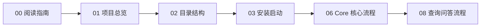
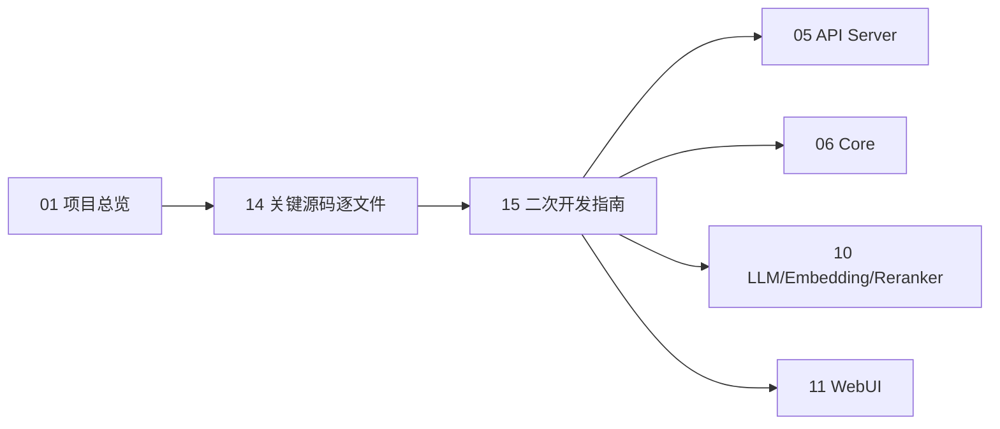
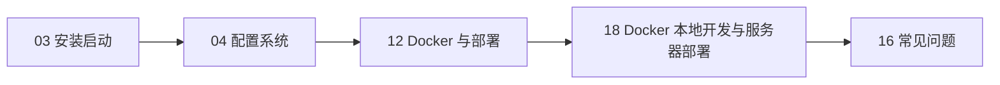

# LightRAG 中文学习文档入口

这套文档是基于当前工作目录 `/home/cjy/LightRAG` 的源码、`README`、`docs/`、`env.example`、`Makefile`、Docker Compose、后端核心包、API Server、WebUI、examples、tests 扫描后整理的中文学习资料。文档只引用模板配置与源码结构，不包含 `.env` 中的真实密钥。

## 文档列表

| 文件 | 作用 |
|---|---|
| `00_阅读指南.md` | 说明这套文档怎么读，不同目标的推荐阅读顺序。 |
| `01_项目总览.md` | 从产品与系统角度理解 LightRAG、普通 RAG 差异、整体架构。 |
| `02_目录结构详解.md` | 解释根目录、后端、前端、docs、examples、tests 与运行时目录。 |
| `03_安装启动与运行流程.md` | 说明源码启动、Docker Compose、`uv`、`bun`、`make dev`、Server 启动过程。 |
| `04_配置系统详解.md` | 按 `env.example` 分类解释配置项、模型、存储、DashScope/Ollama 示例。 |
| `05_API_Server架构详解.md` | 说明 FastAPI 入口、路由注册、静态 WebUI、主要接口与调用链。 |
| `06_Core核心流程详解.md` | 说明 `LightRAG` 核心类、初始化、插入、查询、抽取、缓存与检索模式。 |
| `07_文档处理与索引流程.md` | 从上传文件到索引落库的状态机、队列、解析、chunk、entity/relation、写库。 |
| `08_查询问答流程详解.md` | 从 WebUI 输入问题到后端检索、拼接上下文、调用 LLM、流式返回。 |
| `09_存储层详解.md` | KV、Vector、Graph、DocStatus 存储抽象与本地/外部后端。 |
| `10_LLM_Embedding_Reranker集成详解.md` | Provider 抽象、OpenAI-compatible、Ollama、Azure、Gemini、Bedrock、角色模型与新增 Provider。 |
| `11_WebUI前端结构详解.md` | React WebUI 的路由、状态、API 封装、文档/查询/图谱页面和构建挂载。 |
| `12_Docker与部署详解.md` | Dockerfile、compose、卷、端口、环境变量、安全与部署更新。 |
| `13_Examples示例代码解读.md` | examples 目录示例按场景解读，推荐初学者运行顺序。 |
| `14_关键源码逐文件解读.md` | 重要源码文件职责、关键类/函数、依赖关系和优先阅读建议。 |
| `15_二次开发指南.md` | 新增 API、解析器、存储、Provider、Prompt、WebUI 页面等开发入口。 |
| `16_常见问题与排查.md` | 启动、端口、上传、processing、维度、LLM、Rerank、Docker、WSL 等排查命令。 |
| `17_源码调用链路索引.md` | 按启动、上传、查询、WebUI、LLM、Embedding 等链路索引文件和函数。 |
| `18_Docker本地开发与服务器部署手册.md` | 完整部署手册：PostgreSQL/Qdrant/Neo4j/MinerU 多模态栈、本地开发、服务器部署、镜像与 MinerU 模型清单、日志和运维。 |

## 推荐阅读路径

### 第一次接触 LightRAG

### 目标是二次开发

### 目标是部署运行

## 学习路线建议

1. 先看 `01_项目总览.md`，建立 Server/Core/WebUI/Storage/LLM Provider 的整体概念。
2. 再看 `03_安装启动与运行流程.md` 和 `04_配置系统详解.md`，确认本机如何跑起来。
3. 跑通后读 `06_Core核心流程详解.md`、`07_文档处理与索引流程.md`、`08_查询问答流程详解.md`。
4. 准备改代码时读 `14_关键源码逐文件解读.md`、`15_二次开发指南.md`、`17_源码调用链路索引.md`。
5. 遇到问题时直接跳到 `16_常见问题与排查.md`。

## 重要安全说明

- 本文档没有读取或引用真实 `.env` 内容。
- 所有 API Key、Token、密码只使用占位符，例如 `<你的 API Key>`。
- 不要把 `.env`、运行数据、缓存目录、真实日志中的密钥提交到 Git。
